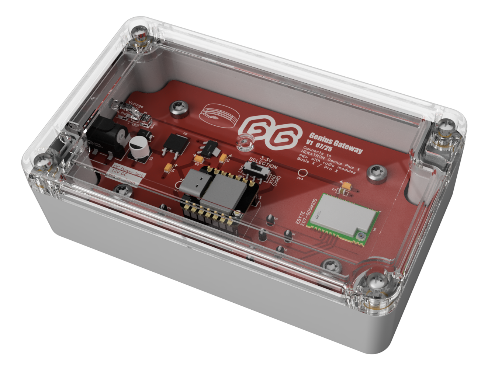

# Genius Gateway



## 🔥 What is the Genius Gateway?

The **Genius Gateway** is a reverse-engineered interface for [Hekatron Genius Plus X](https://www.hekatron-brandschutz.de/produkte/rauchmelder/produkte/genius-plus-x) smoke detection systems. It enables real-time monitoring, MQTT integration, and web-based management of Genius smoke detectors without requiring proprietary Hekatron gateways.

### Key Features

- Manage smoke detectors
- Manage alarm lines
- Capture, visualize and analyze packets
- Manage gateway settings
- MQTT and WebSocket support
- Home Assistant integration

## ⚠️ Important Disclaimer

> **⚠️ USE AT YOUR OWN RISK**
>
> This is a reverse-engineered implementation **NOT AFFILIATED** with Hekatron.
> 
> **You are solely responsible for ensuring compliance with all local regulations regarding RF communication and fire safety systems. The authors assume no liability for any damages or safety issues.**

## 📄 License

This project uses multiple licenses for different components:

| Component | License | Description |
|-----------|---------|-------------|
| **Hardware Design** | [CC BY-NC-SA 4.0](https://creativecommons.org/licenses/by-nc-sa/4.0/) | PCB designs, schematics, CAD files |
| **Software** | [AGPL-3.0 + Commons Clause](LICENSE) | ESP32 firmware, web interface, all code |
| **Documentation** | [CC BY-NC-SA 4.0](https://creativecommons.org/licenses/by-nc-sa/4.0/) | All documentation, guides, images |
| **Third-Party** | Various (LGPL, MIT) | ESP32 SvelteKit, Arduino libraries |

> **⚠️ COMMERCIAL USE IS PROHIBITED**
>
> Commercial use is prohibited without explicit permission. All components are licensed for personal and educational purposes only.

For complete license details, see:
- [LICENSE](LICENSE) file in this repository
- [License Documentation](https://hmbacher.github.io/genius-gateway/license/) on GitHub Page

## 🔭 System Architecture


The gateway monitors RF communications between Hekatron smoke detectors and forwards fire alarms to home automation systems via standard protocols (MQTT, HTTP, WebSocket).

## 📖 Documentation Overview

➡️ **Complete documentation is available at [https://hmbacher.github.io/genius-gateway/](https://hmbacher.github.io/genius-gateway/)** ⬅️

The documentation includes:

### Background
- **[Background](https://hmbacher.github.io/genius-gateway/background/)** - Motivation and Introduction

### Reverse Engineering
- **[FM Basis X - PCB](https://hmbacher.github.io/genius-gateway/reverse-engineering/fm-basis-x-pcb/)** - Radio module PCB analysis
- **[FM Basis X - RF](https://hmbacher.github.io/genius-gateway/reverse-engineering/fm-basis-x-rf/)** - Radio module RF transceiver analysis
- **[Protocol Analysis](https://hmbacher.github.io/genius-gateway/reverse-engineering/protocol-analysis/)** - RF communication details
- **[Protocol Captures](https://hmbacher.github.io/genius-gateway/reverse-engineering/protocol-captures/)** - Packet examples and analysis

### Hardware
- **[Hardware](https://hmbacher.github.io/genius-gateway/hardware/)** - PCB design, schematics, and components

### Setup & Installation
- **[General Setup](https://hmbacher.github.io/genius-gateway/setup/general-setup/)** - Hardware assembly, firmware flashing and basic connectivity settings
- **[Configure Gateway](https://hmbacher.github.io/genius-gateway/setup/configure-gateway/)** - Smoke detectors and alarm lines

### Features & Usage
- **[System Overview](https://hmbacher.github.io/genius-gateway/features/overview/)** - Dashboard and alarm status
- **[Gateway Settings](https://hmbacher.github.io/genius-gateway/features/gateway-settings/)** - Configuration and behavior control
- **[Device Management](https://hmbacher.github.io/genius-gateway/features/device-management/)** - Smoke detector management
- **[Packet Visualizer](https://hmbacher.github.io/genius-gateway/features/packet-visualizer/)** - RF packet analysis
- **[Alarm Lines Management](https://hmbacher.github.io/genius-gateway/features/alarm-lines-management/)** - Alarm line configuration
- **[WebSocket Interface](https://hmbacher.github.io/genius-gateway/features/websocket-interface/)** - Real-time logging
- **[Smart Home Integration](https://hmbacher.github.io/genius-gateway/features/smart-home-integration/)** - Home Assistant setup

### API Reference
- **[HTTP API](https://hmbacher.github.io/genius-gateway/api/websocket-events/)** - HTTP endpoints for frontend and monitoring
- **[WebSocket API](https://hmbacher.github.io/genius-gateway/api/websocket-events/)** - Real-time event and packet streaming
- **[MQTT Topics](https://hmbacher.github.io/genius-gateway/api/mqtt-topics/)** - Published MQTT topics

## 🚀 Getting Started

1. **[Review Documentation](https://hmbacher.github.io/genius-gateway/)** - Understand the system architecture
2. **[General Setup](https://hmbacher.github.io/genius-gateway/setup/general-setup/)** - Hardware assembly, firmware installation and basic connectivity
3. **[Configure Gateway](https://hmbacher.github.io/genius-gateway/setup/configure-gateway/)** - Add smoke detectors and alarm lines
4. **[Smart Home Integration](https://hmbacher.github.io/genius-gateway/features/smart-home-integration/)** - Connect to Home Assistant and other Smart Home systems

## 🔧 Development

### Technology Stack

- **Backend**: C++ with Arduino framework and ESP-IDF via PlatformIO
- **Frontend**: SvelteKit with TypeScript and Vite
- **Hardware**: [EasyEDA Pro](https://pro.easyeda.com) for Schematics, PCB design and manufacturing
- **Documentation**: MkDocs with Material theme

### Project Structure

```
genius-gateway/
├── src/                 # C++ backend source code
├── interface/           # SvelteKit frontend application
├── lib/                 # Arduino libraries and dependencies
│   ├── framework/       # ESP32 SvelteKit framework
│   └── PsychicHttp/     # Async HTTP server
├── docs/                # Documentation source (MkDocs)
└── scripts/             # Build and utility scripts
```