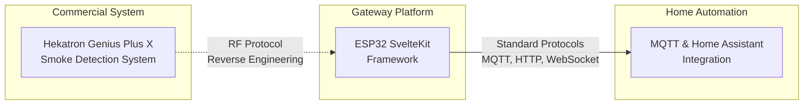
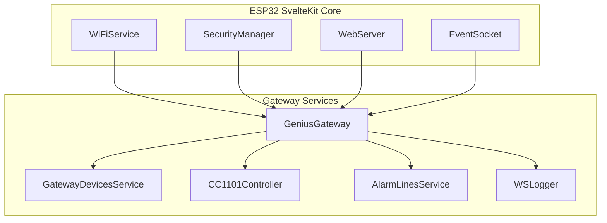

# Background

Understanding the technologies and systems that the Genius Gateway interfaces with.

## Architecture Overview

The Genius Gateway bridges three main technology domains:

## Key Technologies

The gateway leverages several established technologies and interfaces with proprietary systems:

### Integration Philosophy

The Genius Gateway acts as a **protocol translator**, converting proprietary Hekatron communications into standard protocols like MQTT and HTTP. This enables:

- **Interoperability**: Connect Hekatron devices to any MQTT-compatible system
- **Modern Interface**: Web-based management instead of proprietary apps
- **Automation**: Real-time integration with home automation systems
- **Monitoring**: Detailed logging and analysis of device communications

### Technical Approach

The project combines several methodologies:

**Reverse Engineering**
: RF protocol analysis to understand Hekatron communication

**Open Source Hardware**
: Complete schematics and PCB designs for reproducible builds  

**Standard Protocols**
: MQTT, HTTP, WebSocket for maximum compatibility

**Modern Web Technologies**
: Responsive Svelte-based interface for optimal user experience

## Hekatron Genius Plus X System

The Genius Gateway interfaces with Hekatron's Genius Plus X smoke detection ecosystem through reverse-engineered RF communication.

### System Overview

The Genius Plus X is a professional wireless smoke detection system designed for commercial and residential applications. Key characteristics include:

- **Wireless Communication**: 868 MHz RF using FM Basis Radio Modules
- **Distributed Intelligence**: Each detector operates independently while communicating with the network
- **Professional Grade**: Designed to meet stringent fire safety standards
- **Proprietary Protocol**: Uses custom communication protocols for device coordination

### FM Basis Radio Module

The wireless communication is handled by integrated FM Basis Radio Modules:

**Technical Specifications**
- Frequency: 868.35 MHz (European SRD band)
- Modulation: FSK (Frequency Shift Keying)
- Output Power: ≤ 25mW ERP
- Communication Range: Typically 30-100m (depending on environment)
- Protocol: Proprietary Hekatron format

**Integration**
- Factory-integrated into smoke detectors
- Handles device discovery, alarm propagation, and status reporting
- Manages mesh-like communication between devices
- Implements timing and collision avoidance algorithms

### Device Types

The Genius Plus X ecosystem includes various detector types:

**Smoke Detectors**
- Optical smoke detection with integrated radio
- Battery-powered with 10+ year lithium cells
- Local sounder and visual indicators
- Status LED and test button

**Accessories** 
- Remote indicators and sounders
- Isolation modules for system segmentation
- Programming and testing tools

### Communication Patterns

The system implements several communication patterns that the gateway monitors:

**Alarm Propagation**
- Immediate alarm transmission when smoke is detected
- Cascade activation of connected detectors
- Acknowledgment and status confirmation messages

**System Monitoring**
- Periodic status heartbeats
- Battery level reporting
- Communication quality metrics

**Commissioning**
- Device discovery and network joining
- Configuration parameter distribution
- Test mode activation and results

### Official Resources

For complete technical specifications and official documentation:

- **[Hekatron Official Website](https://www.hekatron.de/)**  
  Main product information and specifications

- **[Genius Plus X Product Page](https://www.hekatron.de/genius-plus-x)**  
  Detailed product lineup and technical data

- **[Technical Documentation](https://www.hekatron.de/downloads)**  
  Official installation guides and specifications

- **[Hekatron Partner Portal](https://partner.hekatron.de/)**  
  Professional resources and support materials

### Gateway Integration Approach

!!! info "Reverse Engineering Approach"
    The Genius Gateway does not use official Hekatron interfaces or APIs. Instead, it monitors and decodes the RF communications between devices using reverse-engineered protocol knowledge.

The gateway provides:

**Passive Monitoring**
- Non-intrusive monitoring of device communications
- Real-time alarm detection and status updates  
- Historical logging of all network activity

**Protocol Translation**
- Conversion of proprietary formats to standard MQTT messages
- Web-based visualization of device states and communications
- Integration with home automation systems

**Enhanced Functionality**
- Device discovery and automatic configuration
- Custom alarm filtering and notification rules
- Advanced packet analysis and protocol debugging

### Compliance & Safety

!!! warning "Important Safety Information"
    The Genius Gateway is designed for monitoring purposes only and does not replace official Hekatron controllers or interfaces. For life safety applications, always follow official Hekatron installation and maintenance guidelines.

**Regulatory Considerations**
- The gateway operates as a receive-only monitor (no RF transmission)
- Complies with European 868 MHz SRD regulations for monitoring devices
- Does not interfere with normal Hekatron system operation

**Installation Guidelines**  
- Position gateway within range of Hekatron devices (typically 10-50m)
- Ensure clear line of sight when possible for optimal reception
- Avoid RF interference sources (WiFi routers, microwave ovens, etc.)

## ESP32 SvelteKit Framework

The Genius Gateway is built on the ESP32 SvelteKit framework, which provides the foundational architecture for IoT applications.

### Framework Overview

ESP32 SvelteKit is a comprehensive framework for building IoT projects with:

- **Backend Services**: REST APIs, WebSocket communication, configuration management
- **Frontend Interface**: Modern Svelte-based responsive web application  
- **System Services**: WiFi management, OTA updates, user authentication
- **Data Persistence**: JSON-based configuration storage and state management

### Architecture Benefits

The framework provides several advantages for the Genius Gateway:

**Rapid Development**
- Pre-built services for common IoT functionality
- Standardized patterns for REST APIs and WebSocket communication
- Built-in web interface components and styling

**Professional Features**
- User authentication and authorization
- Over-the-air (OTA) firmware updates
- Comprehensive system monitoring and logging
- Mobile-responsive web interface

**Extensibility** 
- Plugin architecture for custom services
- Event-driven communication between services
- Easy integration of new hardware peripherals

### Gateway-Specific Implementation

The Genius Gateway extends the framework with custom services:

**Custom Services Added:**
- `GeniusGateway` - Main service coordinating RF communication and device management
- `GatewayDevicesService` - Manages discovered smoke detectors and their states
- `CC1101Controller` - Handles low-level RF communication with CC1101 radio
- `AlarmLinesService` - Manages alarm zones and escalation logic
- `WSLogger` - Provides real-time packet logging via WebSocket

### Development Workflow

The framework provides integrated tooling:

**Backend Development**
- C++ services using Arduino framework
- PlatformIO build system with dependency management
- Integrated debugging and monitoring tools

**Frontend Development**  
- Svelte with TypeScript for type safety
- Vite build system with hot module reloading
- TailwindCSS and DaisyUI for styling

**Deployment**
- Single firmware binary containing both backend and frontend
- Compressed web assets embedded in flash memory
- OTA update capability for remote maintenance

### Official Resources

For framework documentation and examples:

- **[ESP32 SvelteKit Documentation](https://theelims.github.io/ESP32-sveltekit/)**  
  Complete framework documentation with tutorials and API reference

- **[GitHub Repository](https://github.com/theelims/ESP32-sveltekit)**  
  Source code, examples, and issue tracking

- **[API Reference](https://theelims.github.io/ESP32-sveltekit/backend/statefulservice/)**  
  Detailed documentation of backend service APIs

- **[Getting Started Guide](https://theelims.github.io/ESP32-sveltekit/build-tools/gettingstarted/)**  
  Step-by-step setup instructions for new projects

### Framework vs Gateway Features

!!! tip "Documentation Focus"
    This documentation focuses specifically on Genius Gateway functionality. For general ESP32 SvelteKit features like WiFi configuration, user management, and OTA updates, refer to the official framework documentation.

**Framework Provides:**
- WiFi setup and management
- User authentication and authorization  
- System status monitoring
- OTA firmware updates
- Basic web interface structure

**Gateway Adds:**
- Hekatron device discovery and management
- CC1101 radio integration and RF packet handling
- Alarm state management and MQTT publishing  
- Real-time packet visualization
- Protocol analysis and debugging tools

### Configuration Integration

The gateway leverages the framework's configuration system:

**Settings Services**
- `GatewaySettingsService` - Gateway-specific configuration options
- `GatewayMqttSettingsService` - MQTT broker and topic configuration
- `WSLoggerSettingsService` - Packet logging preferences

**Data Persistence**
- Device configurations stored in JSON files
- Alarm history and statistics
- User preferences and interface customizations

**REST API Integration**
- All settings accessible via standard REST endpoints
- Real-time updates through WebSocket events
- Configuration validation and error handling

## Next Steps

Understanding these background technologies provides the foundation for exploring the gateway's capabilities:

- **[Protocol Analysis](../reverse-engineering/protocol-analysis.md)** - Learn how the Hekatron communication protocol was reverse-engineered
- **[Hardware Design](../hardware/index.md)** - Understand the gateway's RF reception capabilities and PCB design
- **[System Architecture](../reverse-engineering/index.md)** - See how gateway services work together
- **[Device Management](../features/device-management.md)** - Explore how discovered devices are managed
- **[API Reference](../api/index.md)** - Review gateway-specific REST endpoints and WebSocket events