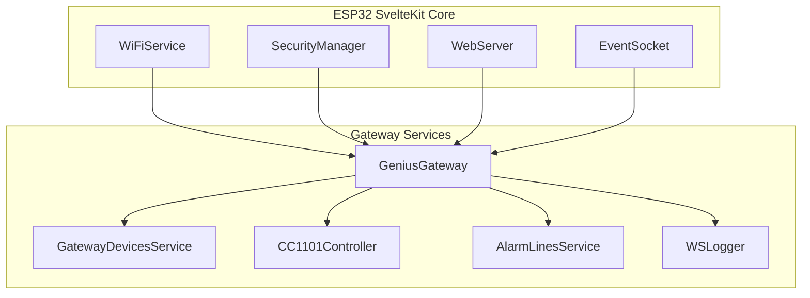

# ESP32 SvelteKit Framework

The Genius Gateway is built on the ESP32 SvelteKit framework, which provides the foundational architecture for IoT applications.

## Framework Overview

ESP32 SvelteKit is a comprehensive framework for building IoT projects with:

- **Backend Services**: REST APIs, WebSocket communication, configuration management
- **Frontend Interface**: Modern Svelte-based responsive web application  
- **System Services**: WiFi management, OTA updates, user authentication
- **Data Persistence**: JSON-based configuration storage and state management

## Architecture Benefits

The framework provides several advantages for the Genius Gateway:

**Rapid Development**
- Pre-built services for common IoT functionality
- Standardized patterns for REST APIs and WebSocket communication
- Built-in web interface components and styling

**Professional Features**
- User authentication and authorization
- Over-the-air (OTA) firmware updates
- Comprehensive system monitoring and logging
- Mobile-responsive web interface

**Extensibility** 
- Plugin architecture for custom services
- Event-driven communication between services
- Easy integration of new hardware peripherals

## Gateway-Specific Implementation

The Genius Gateway extends the framework with custom services:

**Custom Services Added:**
- `GeniusGateway` - Main service coordinating RF communication and device management
- `GatewayDevicesService` - Manages discovered smoke detectors and their states
- `CC1101Controller` - Handles low-level RF communication with CC1101 radio
- `AlarmLinesService` - Manages alarm zones and escalation logic
- `WSLogger` - Provides real-time packet logging via WebSocket

## Development Workflow

The framework provides integrated tooling:

**Backend Development**
- C++ services using Arduino framework
- PlatformIO build system with dependency management
- Integrated debugging and monitoring tools

**Frontend Development**  
- Svelte with TypeScript for type safety
- Vite build system with hot module reloading
- TailwindCSS and DaisyUI for styling

**Deployment**
- Single firmware binary containing both backend and frontend
- Compressed web assets embedded in flash memory
- OTA update capability for remote maintenance

## Official Resources

For framework documentation and examples:

- **[ESP32 SvelteKit Documentation](https://theelims.github.io/ESP32-sveltekit/)**  
  Complete framework documentation with tutorials and API reference

- **[GitHub Repository](https://github.com/theelims/ESP32-sveltekit)**  
  Source code, examples, and issue tracking

- **[API Reference](https://theelims.github.io/ESP32-sveltekit/backend/statefulservice/)**  
  Detailed documentation of backend service APIs

- **[Getting Started Guide](https://theelims.github.io/ESP32-sveltekit/build-tools/gettingstarted/)**  
  Step-by-step setup instructions for new projects

## Framework vs Gateway Features

!!! tip "Documentation Focus"
    This documentation focuses specifically on Genius Gateway functionality. For general ESP32 SvelteKit features like WiFi configuration, user management, and OTA updates, refer to the official framework documentation.

**Framework Provides:**
- WiFi setup and management
- User authentication and authorization  
- System status monitoring
- OTA firmware updates
- Basic web interface structure

**Gateway Adds:**
- Hekatron device discovery and management
- CC1101 radio integration and RF packet handling
- Alarm state management and MQTT publishing  
- Real-time packet visualization
- Protocol analysis and debugging tools

## Configuration Integration

The gateway leverages the framework's configuration system:

**Settings Services**
- `GatewaySettingsService` - Gateway-specific configuration options
- `GatewayMqttSettingsService` - MQTT broker and topic configuration
- `WSLoggerSettingsService` - Packet logging preferences

**Data Persistence**
- Device configurations stored in JSON files
- Alarm history and statistics
- User preferences and interface customizations

**REST API Integration**
- All settings accessible via standard REST endpoints
- Real-time updates through WebSocket events
- Configuration validation and error handling

## Next Steps

- **[System Architecture](../reverse-engineering/index.md)** - Understand how gateway services work together
- **[Hardware Integration](../hardware/index.md)** - See how the framework interfaces with CC1101 hardware
- **[API Reference](../api/index.md)** - Explore gateway-specific REST endpoints and WebSocket events