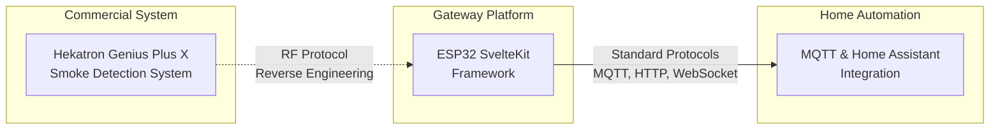

# Background

Understanding the technologies and systems that the Genius Gateway interfaces with.

## Architecture Overview

The ESP32 Genius Gateway bridges three main technology domains:

## Key Technologies

The gateway leverages several established technologies and interfaces with proprietary systems:

### Hekatron Genius Plus X System
Professional smoke detection system with wireless communication capabilities. The gateway reverse-engineers the proprietary RF protocol to enable monitoring and integration.

[Learn more about Hekatron system →](hekatron-system.md){ .md-button }

### ESP32 SvelteKit Framework  
Modern IoT development framework providing the backend services, web interface, and device management capabilities that power the gateway.

[Learn more about ESP32 SvelteKit →](esp32-sveltekit.md){ .md-button }

## Integration Philosophy

The Genius Gateway acts as a **protocol translator**, converting proprietary Hekatron communications into standard protocols like MQTT and HTTP. This enables:

- **Interoperability**: Connect Hekatron devices to any MQTT-compatible system
- **Modern Interface**: Web-based management instead of proprietary apps
- **Automation**: Real-time integration with home automation systems
- **Monitoring**: Detailed logging and analysis of device communications

## Technical Approach

The project combines several methodologies:

**Reverse Engineering**
: RF protocol analysis to understand Hekatron communication

**Open Source Hardware**
: Complete schematics and PCB designs for reproducible builds  

**Standard Protocols**
: MQTT, HTTP, WebSocket for maximum compatibility

**Modern Web Technologies**
: Responsive Svelte-based interface for optimal user experience