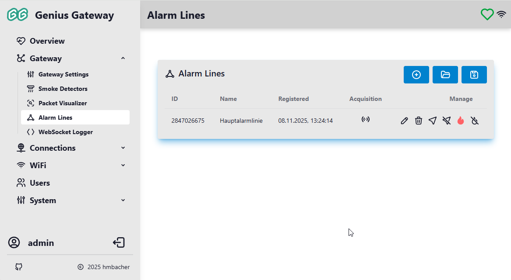
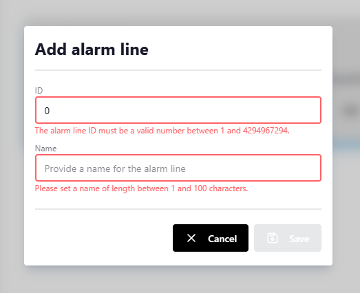
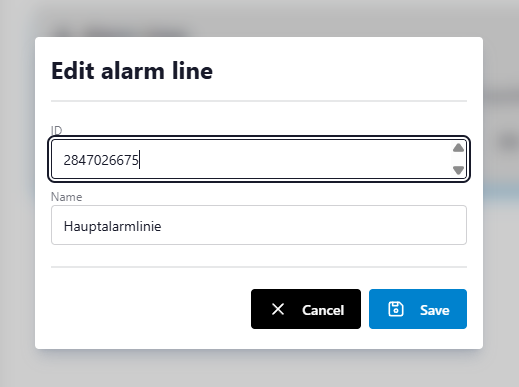

# Alarm Lines Management

The Alarm Lines Management page provides a centralized interface for configuring and managing alarm lines in your Genius system. Alarm lines represent logical groupings of smoke detectors that communicate using the same radio ID, enabling coordinated alarm behavior across connected devices. This page allows you to add, edit, delete, and test alarm lines, as well as manage configurations via export/import functionality.

!!! info "Access Requirements"
    Alarm Lines Management is only accessible to users with administrator privileges.

## Understanding Alarm Lines

In Genius smoke detector systems, an **alarm line** is a communication channel identified by a unique numeric ID (`1` to `4294967294`). All smoke detectors configured for the same alarm line ID will:

- Receive and relay alarm signals from any detector on that line
- Trigger coordinated alarm responses (sirens activate simultaneously)
- Participate in line tests and system diagnostics

Each alarm line in your system must be registered in the gateway to enable proper monitoring and control.

## Alarm Lines List Overview

The alarm lines table displays all registered alarm lines with the following columns:

#### ID
The unique numeric identifier for the alarm line (1-4294967294). This ID must match the configuration in your smoke detectors for proper communication.

#### Name
A descriptive label for the alarm line (e.g., "First Floor", "Building A"). This helps identify the line in the interface and notifications.

#### Registered
The date and time when the alarm line was first added to the gateway, displayed in DD.MM.YYYY HH:MM:SS format.

#### Acquisition
Indicates how the alarm line was added to the system:

- :tabler-forms: **Manual**: Alarm line was manually configured by an administrator
- :tabler-access-point: **Automatic**: Alarm line was automatically registered when the gateway received a Genius packet with a new alarm line ID

#### Manage
Action buttons for alarm line operations (described in detail below).

## Initial Setup

When you first access the Alarm Lines Management page with no alarm lines configured, you'll see a helpful message:

> **No alarm lines registered yet.**
>
> Click the "+" button to manually add an alarm line or start the commissioning procedure of your smoke detectors.

You can proceed to [add a new alarm line](#adding-a-new-alarm-line) by either:

1. **Manual Registration**: Explicitly add alarm line IDs you've configured in your smoke detectors (recommended for planned installations)
2. **Automatic Discovery**: Enable automatic alarm line registration in [Gateway Settings](gateway-settings.md#automatically-register-new-alarm-lines), then trigger any smoke detector—the gateway will automatically register the alarm line when it receives the packet

## Adding a New Alarm Line

### Manually Registering a New Alarm Line

!!! danger "For Advanced Users Only"
    Manual alarm line registration is only recommended for experienced and knowledgeable users and should only be performed for testing and development purposes. The alarm line ID must be known or determined beforehand.

    When using Genius Gateway to integrate an existing Genius smoke detector network into a home automation system, packet-based [automatic discovery of existing alarm lines](../setup/configuring-gateway.md#adding-alarm-lines) should always be preferred.

To manually register a new alarm line:

1. Click the :tabler-circle-plus: **Add alarm line** button in the top-right corner
2. The "Add alarm line" dialog opens with empty fields

    

3. Configure the alarm line as follows:

    ***ID***  
    Enter the alarm line ID (`1 - 4294967294`) that matches the configuration in your smoke detectors. This ID must be unique—the gateway will display an error if you attempt to register an ID that already exists.

    !!! warning "ID Validation"
        - The ID must be between `1` and `4294967294`
        - The ID must not already exist in your alarm lines list
        - The ID must match the alarm line configuration in your physical smoke detectors

    ***Name***  
    Enter a descriptive name (1-100 characters) to identify this alarm line. Use meaningful names like "First Floor", "East Wing", or "Building A - Zone 1" to help distinguish between multiple alarm lines.

4. Click **Save** to register the alarm line

The new alarm line will immediately appear in the table and is ready to receive and process alarm packets.

### Automatic Alarm Line Discovery

When [automatic alarm line registration](gateway-settings.md#alarm-lines) is enabled in Gateway Settings, the gateway will automatically create new alarm line entries when it receives Genius packets with previously unknown alarm line IDs.

**Discovery Process:**

1. A smoke detector transmits a packet (alarm, line test, or status)
2. The gateway extracts the alarm line ID from the received packet
3. If the ID is not registered, the gateway automatically creates a new entry with:
    - **ID**: Extracted from the packet
    - **Name**: Auto-generated as "Alarm Line [ID]"
    - **Acquisition**: Marked as "Automatic" (:tabler-access-point:)
4. A success notification appears: "New alarm line detected."

You can later edit automatically discovered alarm lines to assign meaningful names.

!!! tip "Discover during Commissioning"
    Enable [automatic registration during smoke detector commissioning](gateway-settings.md#add-alarm-line-id-of-received-commissioning-packets-automatically) to quickly discover the alarm line that is currently set up in a commissioning process. After commissioning, assign meaningful names to each discovered line.

## Editing an Alarm Line

To modify an existing alarm line:

1. Click the :tabler-pencil: **Edit alarm line** button in the alarm line's row
2. The "Edit alarm line" dialog opens with current values

    

3. Modify the **ID** and/or **Name** fields as needed

    !!! danger "Changing the ID"
        If you change an alarm line's ID, ensure your physical smoke detectors are reconfigured to match. Mismatched IDs will prevent proper alarm communication.
    
4. Click **Save** to apply changes

## Deleting an Alarm Line

To remove an alarm line from the system:

1. Click the :tabler-trash: **Delete alarm line** button in the alarm line's row
2. A confirmation dialog appears asking you to verify the deletion
3. Click **Yes** to permanently remove the alarm line

!!! warning "Consequences"
    Deleting an alarm line does not affect the physical smoke detector configuration — devices will continue operating on their configured alarm line ID.

## Import and Export

### Exporting Alarm Lines to File

To save your current alarm lines configuration:

1. Click the :tabler-device-floppy: **Save alarm lines to file** button in the top-right corner
2. Rename and save the file to the desired location

This file contains all alarm line configurations and can be used for backup or migration to another gateway.

### Importing Alarm Lines from File

!!! warning "Import Replaces All Alarm Lines"
    Importing alarm lines **replaces** the current configuration entirely. All existing alarm lines will be overwritten with the imported data.

To restore alarm lines from a previously exported file:

1. Click the :tabler-folder-open: **Load alarm lines from file** button in the top-right corner
2. Select a valid alarm lines file from your computer
3. The gateway validates and imports the configuration
4. All existing alarm lines are replaced with the imported ones

## Alarm Line Actions

Each alarm line supports several test and diagnostic actions. These actions transmit RF commands to all smoke detectors configured for that alarm line.

!!! info "Action Behavior"
    - Only one action can be triggered at a time across all alarm lines
    - While the Genius Gateway is actively transmitting RF packets for the triggered action, a spinner icon is shown 

### :tabler-location: Start Line Test

Initiates a line test on the selected alarm line. This command triggers all smoke detectors on the line to perform a coordinated test sequence.

1. Click the :tabler-location: **Start line test** button
2. A confirmation dialog appears
3. Click **Yes** to proceed
4. The gateway transmits the appropriate commands [repetitively](../reverse-engineering/protocol-analysis.md#repetition) via RF
5. The button displays a spinner while RF transmission is in progress

### :tabler-location-off: Stop Line Test

Stops an active line test on the selected alarm line.

1. Click the :tabler-location-off: **Stop line test** button
2. The gateway immediately transmits the appropriate commands [repetitively](../reverse-engineering/protocol-analysis.md#repetition) via RF
3. The button displays a spinner while RF transmission is in progress

### :tabler-flame-filled: Trigger Fire Alarm

Manually triggers a fire alarm on the selected alarm line. This activates all smoke detectors on the line as if smoke were detected.

!!! danger "Fire Alarm Warning"
    Triggering a fire alarm will activate sirens on all connected smoke detectors (i.e., all smoke detectors belonging to the corresponding alarm line).
    
    **Only use this feature for testing purposes in controlled conditions.**

!!! warning "Fire Alarm Detection"
    Self-triggered fire alarms are ignored by the gateway.

1. Click the :tabler-flame-filled: **Trigger fire alarm** button
2. A confirmation dialog appears
3. Click **Yes** to proceed
4. The gateway transmits the appropriate commands [repetitively](../reverse-engineering/protocol-analysis.md#repetition) via RF
5. The button displays a spinner while RF transmission is in progress

### :tabler-flame-off: Stop Fire Alarm

Stops an active fire alarm on the selected alarm line.

1. Click the :tabler-flame-off: **Stop fire alarm** button
2. The gateway immediately transmits the appropriate commands [repetitively](../reverse-engineering/protocol-analysis.md#repetition) via RF
3. The button displays a spinner while RF transmission is in progress

## Action Notifications

When an action is triggered, an initial notification confirms the action was sent. The gateway then monitors for completion and displays one of two notifications:

- **Success**: "The triggered action finished successfully." (action completed normally)
- **Timeout**: "The triggered action timed out." (no response received from Genius Gateway within timeout period)

## Related Documentation

- [Gateway Settings](gateway-settings.md) - Configure automatic alarm line registration and packet processing behavior
- [Overview](overview.md) - View real-time alarm status across all alarm lines and devices
- [Device Management](device-management.md) - Configure individual smoke detector devices

