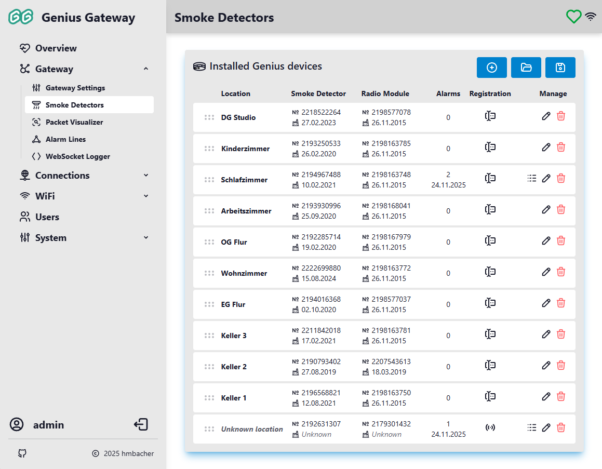
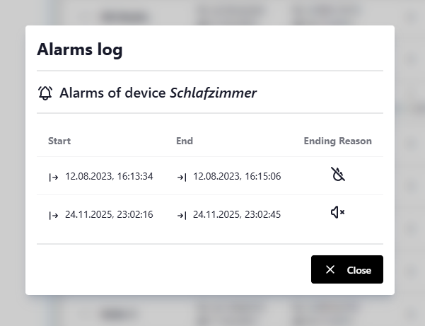
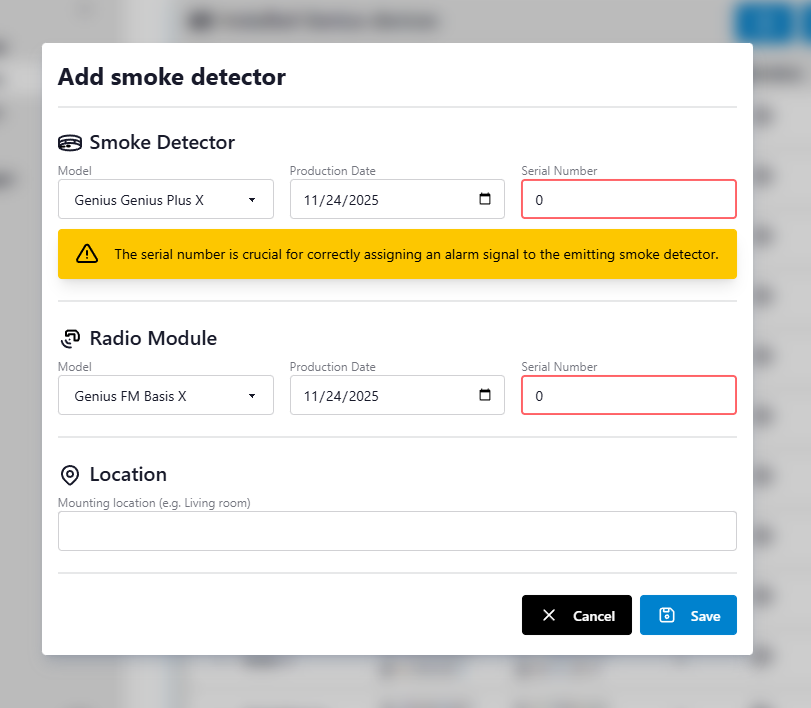
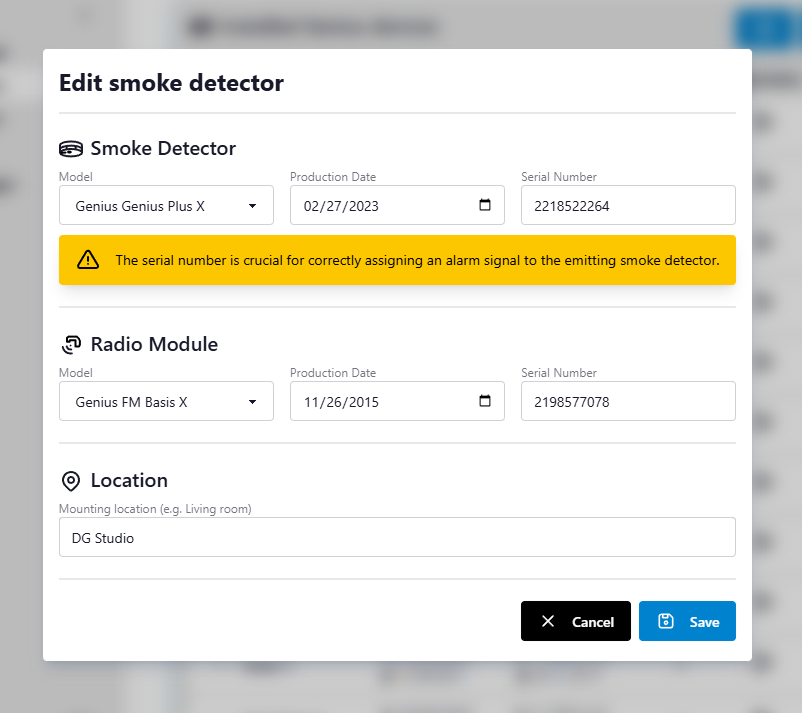

# Device Management

The Device Management page provides a centralized interface for configuring and monitoring all Genius smoke detector devices connected to your gateway. This page allows you to add, edit, and delete smoke detectors, view their alarm history, organize them through drag-and-drop, and manage device configurations via export/import functionality.

!!! info "Access Requirements"
    Device Management is only accessible to users with administrator privileges. The gateway must be connected to at least one Genius smoke detector to display device information.

## Device List Overview

The device list displays all registered Genius smoke detectors in a structured table format with the following columns:

#### Location
The assigned location name for each detector (e.g., "Living Room", "Bedroom"). If no location has been assigned, the device shows "Unknown location" in italicized gray text.

#### Smoke Detector
Information about the smoke detector component:

- :tabler-number: **Serial Number**: The unique identifier of the smoke detector unit
- :tabler-building-factory-2: **Production Date**: Manufacturing date displayed in DD.MM.YYYY format, or "Unknown" if not available

#### Radio Module
Information about the radio communication module:

- :tabler-number: **Serial Number**: The unique identifier of the radio module
- :tabler-building-factory-2: **Production Date**: Manufacturing date displayed in DD.MM.YYYY format, or "Unknown" if not available

#### Alarms
Alarm statistics for the device:

- **Count**: Total number of recorded alarms
- **Last Alarm**: Date of the most recent alarm event (displayed if any alarms exist)

#### Registration
Indicates how the device was added to the system:

- :tabler-forms: **Manual**: Device was manually configured by an administrator
- :tabler-access-point: **Automatic**: Device was automatically registered after receiving an alert packet

#### Manage
Action buttons for device operations:

- :tabler-logs: **Alarm Log**: View detailed alarm history (only visible if alarms exist)
- :tabler-pencil: **Edit**: Modify device configuration
- :tabler-trash: **Delete**: Remove device from the system

## Initial Setup

When you first access the Device Management page with no smoke detectors configured, you'll see a helpful message:

> **No smoke detectors configured yet.**
>
> Click the "+" button to add your first smoke detector.

You can proceed to [add a new smoke detector](#adding-a-new-detector) by either:

1. **Manual Registration**: Explicitly add smoke detectors you've configured (recommended for planned installations)
2. **Automatic Discovery**: Enable automatic device registration in [Gateway Settings](gateway-settings.md#process-alerts-from-unknown-smoke-detectors), then trigger any smoke detector—the gateway will automatically register the device when it receives an alarm packet

## Reordering Devices

You can change the display order of devices using drag-and-drop functionality:

1. Click and hold the grip icon (:tabler-grip-horizontal:) on the left side of any device row
2. Drag the device to the desired position in the list
3. Release to drop the device in its new position
4. The new order is automatically saved to the gateway

This feature is useful for organizing devices by floor level, room priority, or any custom arrangement that suits your needs.

## Viewing Alarm History

Each device maintains a log of all alarm events. To view the alarm history:

1. Click the :tabler-logs: **Alarm Log** button in the device's row
2. The Alarm Log dialog displays a table with the following information for each alarm:

    { .off-glb }

    - :tabler-arrow-bar-right: **Start**: Date and time when the alarm was triggered
    - :tabler-arrow-bar-to-right: **End**: Date and time when the alarm ended (only for resolved alarms)
    - **Ending Reason**: How the alarm was resolved:
        - :tabler-flame-off: **Automatic**: Smoke detector no longer detected smoke
        - :tabler-volume-3: **Manual**: User manually stopped the alarm

Active alarms show "No data" for the end time and no ending reason icon.

## Adding a New Detector

### Manually adding a new Detector

To register a new Genius smoke detector:

1. Click the :tabler-circle-plus: **Add smoke detector** button in the top-right corner
2. The "Add smoke detector" dialog opens with empty fields

    

3. Fill in the required information as follows:

    ***Location***  
    Enter a descriptive name for the detector's location (1-40 characters). This helps identify the device in the list and alarm notifications.

    ***Smoke Detector Component***

    - **Model**: Select the smoke detector model (currently *Genius Plus X*)
    - **Serial Number**: Enter the unique serial number (`1 - 4294967294`)
    - **Production Date**: Select the manufacturing date from the date picker

    ***Radio Module Component***

    - **Model**: Select the radio module model (currently *FM Basis X*)
    - **Serial Number**: Enter the unique serial number (`1 - 4294967294`)
    - **Production Date**: Select the manufacturing date from the date picker

4. Click :tabler-device-floppy: **Save** to add the device

The system validates all inputs and prevents duplicate serial numbers for both smoke detectors and radio modules.

### Automatic Device Discovery

In addition to manually adding devices, the Genius Gateway can automatically discover and register smoke detectors when they trigger an alarm. This feature requires the "Process alerts from unknown smoke detectors" setting to be enabled in [Gateway Settings](gateway-settings.md#process-alerts-from-unknown-smoke-detectors).

#### How Automatic Discovery Works

When an unknown smoke detector triggers an alarm:

1. The gateway receives the alarm packet containing the detector's serial number and radio module serial number
2. If automatic discovery is enabled, the gateway creates a new device entry with:
    - Smoke detector serial number from the alarm packet
    - Radio module serial number from the alarm packet
    - Location set to "Unknown location"
    - Model type set to "Unknown" for both components
    - Production dates unset (shown as "Unknown")
    - Registration type marked as :tabler-access-point: **Automatic**
3. The alarm is immediately processed and displayed in the system
4. MQTT notifications are published for the new device (if MQTT is enabled)

#### Updating Automatically Discovered Devices

Automatically discovered devices appear in the device list with "Unknown location" and can be edited like any other device (see [Editing a Detector](#editing-a-detector)). When editing these devices:

- **Location**: Replace "Unknown location" with a descriptive name for proper alarm identification
- **Model Types**: Will be automatically set to the default models (Genius Plus X and FM Basis X) when opening the edit dialog
- **Production Dates**: Add the actual manufacturing dates if known
- **Serial Numbers**: Verify the automatically captured values are correct (if possible)

!!! tip "Best Practice"
    Review and update automatically discovered devices promptly to ensure proper identification during future alarms. A descriptive location name is especially important for alarm notifications.

!!! info "Device Registration Type"
    The registration type indicator (:tabler-forms: Manual vs :tabler-access-point: Automatic) shows how each device was originally added and persists even after editing the device details.

## Editing a Detector

To modify an existing detector's configuration:

1. Click the :tabler-pencil: **Edit smoke detector** button in the device's row
2. The "Edit smoke detector" dialog opens with the current device information

    

3. Modify any fields as needed:
    - Location name
    - Smoke detector serial number or production date
    - Radio module serial number or production date
4. Click :tabler-device-floppy: **Save** to apply changes

!!! tip "Unique Serial Numbers"
    The system ensures that modified serial numbers remain unique across all devices.

## Deleting a Detector

To remove a detector from the system:

1. Click the :tabler-trash: **Delete smoke detector** button in the device's row
2. A confirmation dialog appears showing the device's serial number and location
3. Click **Yes** to confirm deletion, or **Abort** to cancel

!!! warning "Deletion is Permanent"
    Deleting a device removes all associated data including alarm history. This action cannot be undone. Consider exporting your configuration before deleting devices.

## Exporting Configuration

You can export your complete device configuration to a JSON file:

1. Click the :tabler-device-floppy: **Save smoke detector configuration to file** button in the top-right corner
2. Rename and save the file to the desired location

The export includes all device information and alarm history. This feature is useful for:

- Creating backups before making configuration changes
- Migrating device configurations to a new gateway
- Archiving alarm history for documentation purposes

## Importing Configuration

!!! warning "Import Replaces All Devices"
    Importing a configuration file completely replaces your current device list. Export your current configuration before importing if you want to preserve it.

You can import a previously exported device configuration:

1. Click the :tabler-folder-open: **Load smoke detector configuration from file** button in the top-right corner
2. Select a valid configuration file from your computer
3. The system validates the file format and imports all devices
4. All existing devices are replaced with the imported configuration

## Related Documentation

- [Gateway Settings](gateway-settings.md) - Configure alarming behavior and alarm line topology
- [MQTT Integration](../setup/connections.md#mqtt) - Monitor device status and alarms via MQTT
- [System Status](../setup/system.md) - View overall gateway health and connectivity