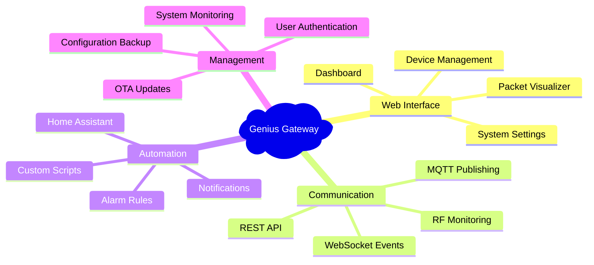

# Gateway Features

Comprehensive overview of the ESP32 Genius Gateway's capabilities and user interface.

## Feature Overview

The Genius Gateway provides a complete suite of tools for monitoring and managing Hekatron Genius Plus X smoke detection systems:

## Core Capabilities

### Real-time Monitoring
- **Live Device Status**: Monitor all discovered smoke detectors in real-time
- **Alarm Detection**: Immediate notification of alarm conditions
- **Battery Monitoring**: Track battery levels and low-battery alerts
- **Communication Quality**: RF signal strength and connectivity metrics

### Device Management
- **Automatic Discovery**: Devices are discovered automatically when they transmit
- **Manual Registration**: Add devices manually with serial number entry  
- **Location Assignment**: Assign meaningful names and locations to each device
- **Status History**: Track device status changes and alarm events over time

### Protocol Analysis
- **Packet Visualization**: Real-time display of RF packets with decode information
- **Protocol Debugging**: Detailed packet analysis for troubleshooting
- **Statistics**: Communication statistics and error rate monitoring
- **Export Capabilities**: Save packet captures for offline analysis

### Integration & Automation
- **MQTT Publishing**: Real-time device states published to MQTT broker
- **Home Assistant**: Native integration with Home Assistant discovery
- **REST API**: Complete REST API for custom integrations
- **WebSocket Events**: Real-time event streaming for responsive applications

## Web Interface Tour

The gateway provides a modern, responsive web interface accessible from any device:

### [System Overview](overview.md)
Complete tour of the web-based management interface with screenshots and feature explanations.

### [Device Management](device-management.md)
Detailed guide to discovering, configuring, and monitoring smoke detectors through the web interface.

### [Packet Visualizer](packet-visualizer.md)
Real-time packet monitoring and analysis tools for protocol debugging and system optimization.

### [Alarm Lines Management](alarm-lines-management.md)
Alarm detection, notification, and management features including custom alarm rules and escalation.

### [Smart Home Integration](smart-home-integration.md)  
Complete MQTT integration guide including Home Assistant setup and custom automation examples.

### [Gateway Settings](settings.md)
System configuration options, user management, and advanced settings for power users.

### [WebSocket Interface](websocket-interface.md)
WebSocket logging interface for real-time communication and debugging capabilities.

## Feature Matrix

| Feature Category | Basic | Advanced | Developer |
|------------------|-------|----------|-----------|
| **Device Monitoring** | ✅ | ✅ | ✅ |
| Real-time device status | ✅ | ✅ | ✅ |
| Automatic device discovery | ✅ | ✅ | ✅ |
| Manual device registration | ✅ | ✅ | ✅ |
| Battery level monitoring | ✅ | ✅ | ✅ |
| **Alarm Management** | | | |
| Alarm detection & notification | ✅ | ✅ | ✅ |
| Alarm history tracking | ✅ | ✅ | ✅ |
| Custom alarm rules | | ✅ | ✅ |
| Alarm filtering/blocking | | ✅ | ✅ |
| **Integration** | | | |
| Basic MQTT publishing | ✅ | ✅ | ✅ |
| Home Assistant integration | ✅ | ✅ | ✅ |
| REST API access | | ✅ | ✅ |
| WebSocket events | | ✅ | ✅ |
| **Analysis Tools** | | | |
| Basic packet viewing | ✅ | ✅ | ✅ |
| Packet visualizer | | ✅ | ✅ |
| Protocol debugging | | | ✅ |
| Packet capture export | | | ✅ |

## User Roles & Permissions

The gateway supports multiple user access levels:

**Guest Access**
- View device status and basic system information
- Monitor alarm states and current device conditions
- Access read-only dashboard and device lists

**User Access**  
- All guest permissions plus:
- Acknowledge alarms and manage alarm states
- View packet visualizer and communication logs
- Export basic reports and statistics

**Administrator Access**
- All user permissions plus:
- Add, modify, and delete device configurations
- Modify system settings and network configuration
- Access advanced debugging tools and packet analysis
- Manage user accounts and access permissions

## Performance Characteristics

**System Capacity**
- **Maximum Devices**: 50 smoke detectors per gateway
- **Update Rate**: Sub-second alarm detection and status updates
- **Web Interface**: Supports multiple concurrent users
- **Data Storage**: 1000+ alarm events with timestamps

**Network Performance**
- **WiFi Connectivity**: 802.11 b/g/n (2.4 GHz)
- **RF Range**: 30-100m typical (depending on environment)
- **MQTT Publishing**: Configurable QoS levels and retain flags
- **Web Interface**: Optimized for mobile and desktop browsers

**Real-time Capabilities**
- **Alarm Detection**: <1 second from RF packet to notification
- **Status Updates**: Real-time WebSocket events for all state changes  
- **Packet Visualization**: Live packet decode with <100ms latency
- **MQTT Publishing**: Near-instantaneous device state updates

## Mobile & Responsive Design

The web interface is fully optimized for mobile devices:

**Responsive Layout**
- Adaptive design that works on phones, tablets, and desktops
- Touch-optimized controls and navigation
- Optimized data tables and visualizations for small screens

**Progressive Web App (PWA)**
- Install as native app on mobile devices
- Offline capability for viewing cached device states
- Push notification support for critical alarms

**Cross-Platform Compatibility**
- Works with all modern browsers (Chrome, Firefox, Safari, Edge)
- No plugins or additional software required
- Consistent experience across different devices and platforms

## Security Features

**Authentication & Authorization**
- User account management with role-based permissions
- Secure session management with JWT tokens
- Protection against common web vulnerabilities

**Network Security**
- WPA2/WPA3 WiFi security support
- HTTPS support for secure web interface access
- MQTT authentication and SSL/TLS encryption support

**System Security**
- Regular security updates through OTA firmware updates
- Input validation and sanitization on all interfaces
- Secure default configurations and settings

## Extensibility

The gateway is designed to be easily extended:

**Software Extensions**
- Plugin architecture for custom device types
- Extensible REST API for third-party integrations
- Event-driven architecture for custom automation

**Hardware Extensions**
- GPIO expansion headers for additional sensors
- I2C/SPI interfaces for peripheral devices
- External antenna connections for improved RF performance

**Integration Capabilities**
- Standard protocols (MQTT, HTTP, WebSocket) for maximum compatibility
- Well-documented APIs for custom application development
- Open-source codebase for community contributions

## Next Steps

- **[System Overview](overview.md)** - Take a guided tour of the web interface
- **[Device Management](device-management.md)** - Learn how to configure and monitor your devices
- **[Smart Home Integration](smart-home-integration.md)** - Set up home automation integration