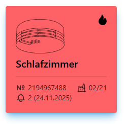
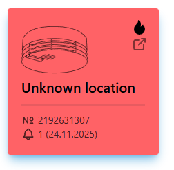
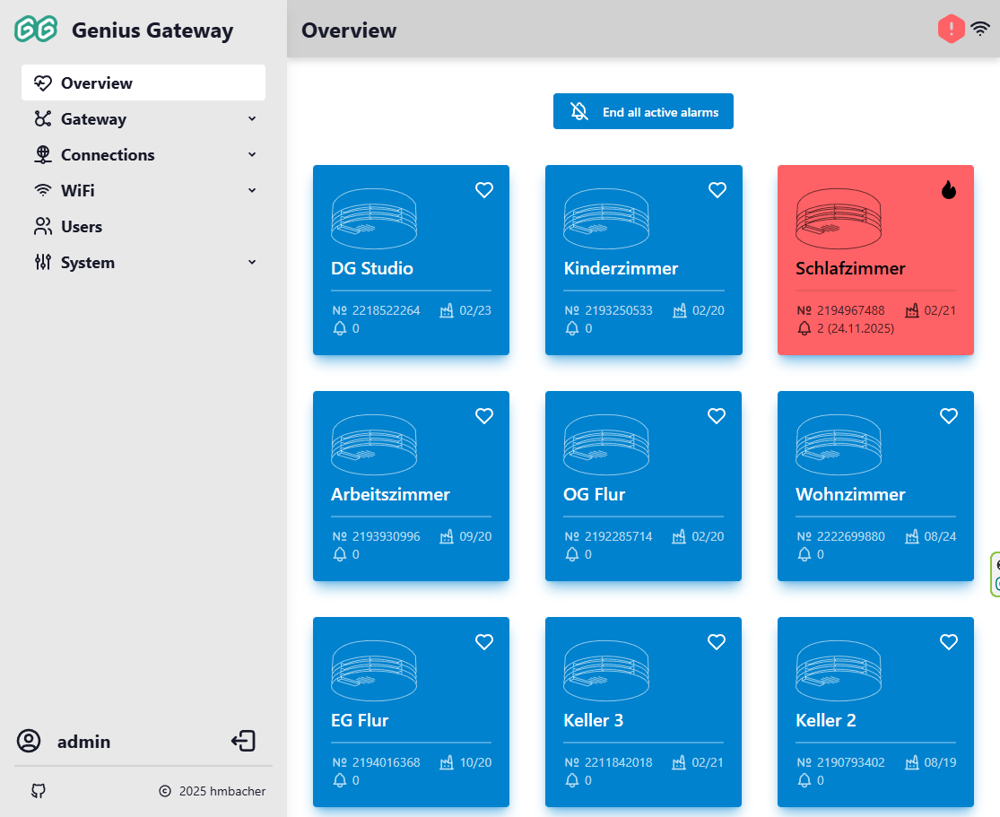
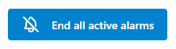
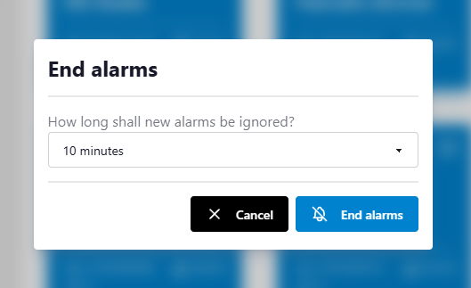
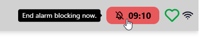
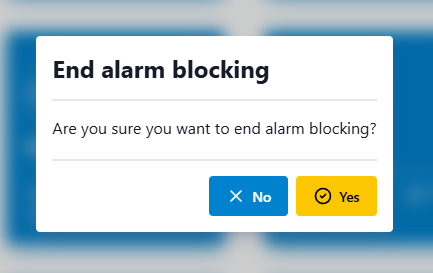

# Overview

The Overview page serves as the main dashboard of the Genius Gateway web interface, providing an at-a-glance view of all registered smoke detectors and their current status. This page is the default landing page after login and offers quick access to alarm management functions.

## Device Status Grid

The Overview page displays all registered smoke detectors in a responsive grid layout. Each device is represented by a status card showing:

#### Device Information
- **Location**: The assigned location name for easy identification
- :tabler-number: **Smoke Detector Serial Number**: Unique identifier of the smoke detector unit
- :tabler-buildung-factory-2: **Production Date**: Manufacturing date (if configured)
- :tabler-bell: **Alarm Counter and Last Alarm Date**: Total number of recorded alarms and date of the most recent alarm event (if any alarms exist)

#### Visual States
Status cards change appearance based on the device state:

- :tabler-heart: **Normal Mode**: Blue/primary color scheme indicating standby operation

    { .off-glb }

- :tabler-flame: **Alarm Mode**: Red/error color scheme with fire icon for active alarms

    { .off-glb }

- :tabler-external-link: **Foreign Detector**: External link icon for detectors from other alarm lines

    { .off-glb } 
    { .off-glb }

!!! info "Foreign Detectors"
    Devices marked as "foreign" are smoke detectors from neighboring alarm lines that are received by your gateway but not part of your currently configured system.  
    To process alarms from foreign "Process alerts from unknown smoke detectors" setting to be enabled in [Gateway Settings](gateway-settings.md#process-alerts-from-unknown-smoke-detectors). 

## Alarm Management

When one or more smoke detectors are actively alarming, the Overview page displays an alarm management section at the top of the device grid.

### End All Active Alarms

The **End all active alarms** button (:tabler-bell-off:) becomes visible when any device is in alarm state.

{ .off-glb }

Clicking this button opens a dialog where you can:

{ .off-glb }

1. Specify an alarm blocking time (0-600 seconds)
2. Confirm the action to end all active alarms
3. Temporarily prevent new alarms during the blocking period

#### Alarm Blocking Counter

When an alarm blocking time is active, a countdown is displayed showing the remaining seconds:

You can press the counter button to immediately end the blocking period and resume normal alarm processing:

{ .off-glb }

A confirmation dialog will appear to verify the action:

{ .off-glb }

This feature is useful for:

- Silencing false alarms after investigation
- Stopping alarm propagation during testing
- Managing nuisance alarms while addressing the root cause

!!! warning "Alarm Blocking Time"
    Setting a blocking time prevents the gateway from processing new alarm signals during the specified period. Use this feature carefully to avoid missing genuine fire alerts.

## Empty State

If no smoke detectors are configured, the Overview page displays an informational message with a link to the [Device Management](device-management.md) page, guiding users to add their first devices.

## Related Documentation

- [Device Management](device-management.md) - Add, edit, and configure smoke detectors
- [Gateway Settings](gateway-settings.md) - Configure alarming behavior and system settings
- [Alarm Lines](alarm-lines-management.md) - Manage alarm line topology and foreign detector behavior
