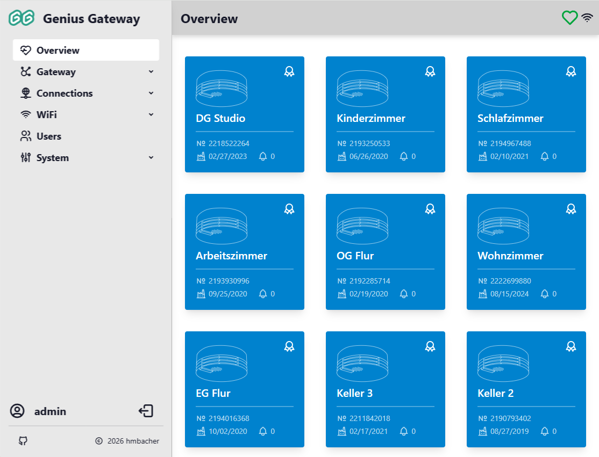
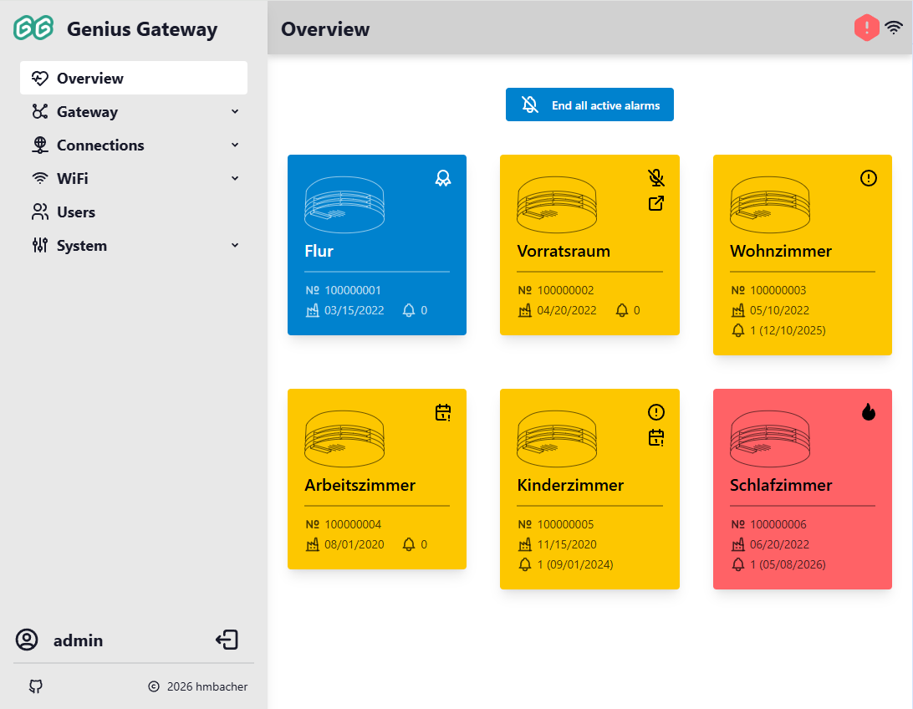
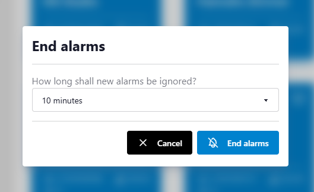
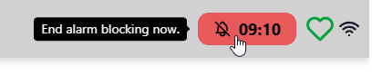
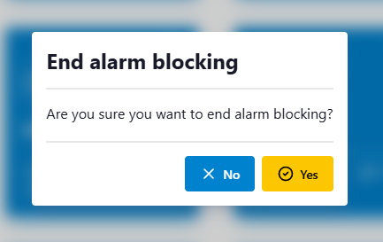

# Overview

The Overview page serves as the main dashboard of the Genius Gateway web interface, providing an at-a-glance view of all registered smoke detectors and their current status. This page is the default landing page after login and offers quick access to alarm management functions.

## Top-Bar Health Indicator

The health indicator icon in the navigation bar reflects the overall system state at a glance and links back to the Overview page from anywhere in the interface:

| Icon | Meaning |
|------|---------|
| :tabler-heart:{ style="color: currentColor; opacity: 0.5" } | No smoke detectors configured yet |
| :tabler-heart:{ style="color: #4caf50" } | All detectors healthy — readout present and up to date, no faults |
| :tabler-heart-exclamation:{ style="color: #ff9800" } | At least one detector needs attention (see [warning conditions](#yellow-warning) below) |
| :tabler-alert-hexagon-filled:{ style="color: #f44336" } | At least one detector is actively alarming |

## Device Status Grid

The Overview page displays all registered smoke detectors in a responsive grid layout. Each card is a link to the [Device Management](device-management.md) page. Clicking any card opens the full device list.

### Card Color States

Cards use a three-level health-driven color scheme:

#### Healthy (Primary theme color) {#healthy}

All of the following are true:

- Device has an acoustic readout on record
- Readout was performed within the last year
- No fault conditions detected

A :tabler-award:{ style="color: #4caf50" } icon appears in the top-right corner of these cards.

#### Needs Attention (Warning theme color) {#warning}

One or more of the following apply:

- **No readout data** — the device has never had an acoustic readout performed. A :tabler-microphone-off: icon is shown.
- **Faults detected** — at least one fault condition is active (battery low, device fault, drift defect or warning, dirt forecast negative, warranty flags set, radio network fault). A :tabler-alert-circle: icon is shown.
- **Stale readout** — the last acoustic readout is more than one year old. A :tabler-calendar-exclamation: icon is shown.

Multiple icons can appear together when more than one condition applies (e.g. both faults and a stale readout). A :tabler-external-link: foreign-detector indicator is appended last when applicable, independent of the health state.

#### Alarming (Error theme color) {#alarming}

The device has an active alarm (`isAlarming` is set). A :tabler-flame-filled: flame icon appears in the top-right corner.

### Card Information

Each card displays:

- **Location** — the assigned location name
- :tabler-number: **Serial Number** — smoke detector unit identifier
- :tabler-building-factory-2: **Production Date** — manufacturing date (if available)
- :tabler-bell: **Alarm count and last alarm date** — total recorded alarms and date of the most recent event (if any)

### Foreign Detectors

A :tabler-external-link: icon marks cards for detectors from neighboring alarm lines that are received by the gateway but not part of your configured system.

!!! info "Foreign Detectors"
    To process alarms from foreign detectors, enable "Process alerts from unknown smoke detectors" in [Gateway Settings](gateway-settings.md#process-alerts-from-unknown-smoke-detectors).

## Alarm Management

When one or more smoke detectors are actively alarming, the Overview page displays an alarm management section at the top of the device grid.

### End All Active Alarms

The **End all active alarms** button (:tabler-bell-off:) becomes visible when any device is in alarm state.

{ .off-glb }

Clicking this button opens a dialog where you can:

{ .off-glb }

1. Specify an alarm blocking time (0-600 seconds)
2. Confirm the action to end all active alarms
3. Temporarily prevent new alarms during the blocking period

#### Alarm Blocking Counter

When an alarm blocking time is active, a countdown is displayed showing the remaining seconds:

You can press the counter button to immediately end the blocking period and resume normal alarm processing:

{ .off-glb }

A confirmation dialog will appear to verify the action:

{ .off-glb }

This feature is useful for:

- Silencing false alarms after investigation
- Stopping alarm propagation during testing
- Managing nuisance alarms while addressing the root cause

!!! warning "Alarm Blocking Time"
    Setting a blocking time prevents the gateway from processing new alarm signals during the specified period. Use this feature carefully to avoid missing genuine fire alerts.

## Empty State

If no smoke detectors are configured, the Overview page displays an informational message with a link to the [Device Management](device-management.md) page, guiding users to add their first devices.

## Related Documentation

- [Device Management](device-management.md) - Add, edit, and configure smoke detectors
- [Gateway Settings](gateway-settings.md) - Configure alarming behavior and system settings
- [Alarm Lines](alarm-lines-management.md) - Manage alarm line topology and foreign detector behavior
