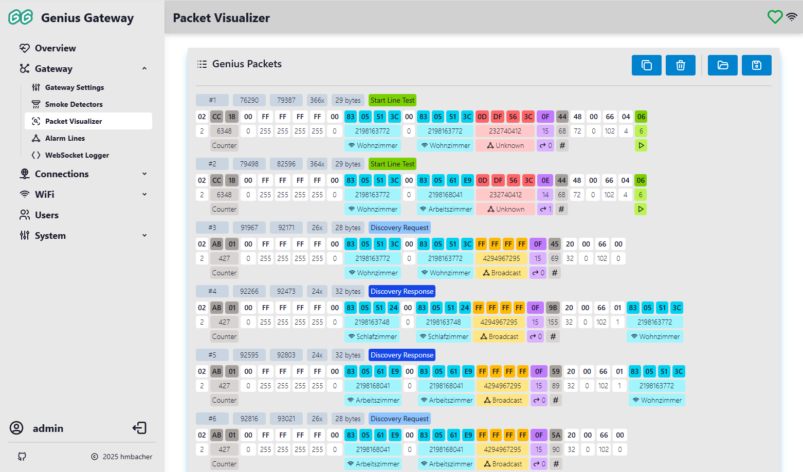

# Packet Visualizer

The Packet Visualizer provides real-time monitoring and analysis of RF communication packets from Hekatron Genius Plus X smoke detectors. This powerful diagnostic tool allows you to observe the wireless communication in your smoke detector network, helping with troubleshooting, protocol analysis, and system verification.

!!! info "WebSocket Logger Required"
    The Packet Visualizer requires the WebSocket Logger to be enabled. If disabled, you'll see an informational message with a link to enable it in the [WebSocket Logger Settings](websocket-interface.md).

## Overview

The Packet Visualizer displays captured RF packets in real-time with intelligent deduplication, detailed interpretation, and visual highlighting. Each packet type is automatically identified and decoded to show meaningful information about detector communication, alarms, commissioning activities, and network topology.

## :tabler-adjustments-alt: Visualizer Settings

The Visualizer Settings card allows you to customize how packets are displayed:

### Show packet details (data interpretation and highlighting)

**Default:** Enabled

When enabled, the visualizer interprets packet data and highlights important fields with color coding and labels:

- **Packet type identification:** Automatic detection of packet types (alarm, commissioning, discovery, etc.)
- **Field highlighting:** Important bytes are color-coded and labeled
- **Data interpretation:** Serial numbers, line IDs, timestamps, and other fields are decoded
- **Location mapping:** Serial numbers are matched to configured device locations

When disabled, packets are shown in raw hexadecimal format without interpretation.

### Show meta data of packets

**Default:** Enabled

When enabled, displays metadata information for each packet:

- **Packet number:** Sequential ID for tracking packet order
- **Receive timestamps:** System time (microseconds) of first and last repetition of this packet  

    !!! info "Timestamp Behavior"
        Timestamps represent system time in microseconds with the following behavior:
        
        - **With NTP configured:** Actual Unix epoch timestamps (microseconds since January 1, 1970 UTC)
        - **Without NTP:** Time since gateway boot in microseconds
        
        Timestamps are consistent and monotonically increasing within a session, making them suitable for packet timing analysis regardless of NTP availability.

- **Repetition counter:** Number of times an identical packet was received
- **Packet length:** How many data bytes the packet contains

When disabled, only the packet data itself is shown without metadata headers.

## :tabler-logs: Genius Packets Display

The main packet display area shows all captured RF packets with real-time updates. Packets are automatically deduplicated using hash-based detection - identical packets increment a counter [instead of creating duplicate entries](#packet-deduplication).

### Packet Information

Each displayed packet shows general information and packet-specific details based on the packet type. For complete field descriptions and packet structure details, see the [Protocol Analysis](../reverse-engineering/protocol-analysis.md) documentation.

### Packet Actions

The toolbar provides several actions for managing captured packets:

#### :tabler-copy: Copy packet data to clipboard

Copies all captured packet data to the system clipboard in JSON format. Useful for:

- Sharing packet logs for troubleshooting
- External analysis with other tools
- Documentation and reporting

#### :tabler-trash: Clear packet logs

Clears all captured packets from the display. A confirmation dialog appears to prevent accidental deletion.

#### :tabler-folder-open: Load packets log from file

Imports previously saved packet logs from a file.

!!! tip "Re-analyzing Imported Packets"
    After loading a file, you'll be prompted whether to re-analyze the packets using your current device and alarm line configurations. Choosing "No" displays the originally saved interpreted information, while "Yes" re-interprets the packets based on your current configuration.

This is useful for:

- Reviewing historical packet captures
- Analyzing packets offline
- Comparing packet behavior across different time periods

#### :tabler-device-floppy: Save packet logs to file

Exports all captured packets to a file. The file includes:

- Complete packet data in serialized format
- Timestamps and metadata
- All interpreted information

## Packet Deduplication

The visualizer uses intelligent hash-based deduplication to prevent display clutter from repeated packet transmissions. When an identical packet is received:

- The repetition counter increments
- The "last seen" timestamp updates
- No new packet entry is created

This is essential because smoke detectors transmit important packets [multiple times](../reverse-engineering/protocol-analysis.md#repetition) to ensure reliable delivery across the mesh network.

## Related Documentation

- [WebSocket Logger](websocket-interface.md) - Enable real-time packet streaming
- [Protocol Analysis](../reverse-engineering/protocol-analysis.md) - Detailed packet structure documentation
- [Device Management](device-management.md) - Configure detector locations for packet interpretation
- [Alarm Lines](alarm-lines-management.md) - Configure alarm line names for better packet labeling