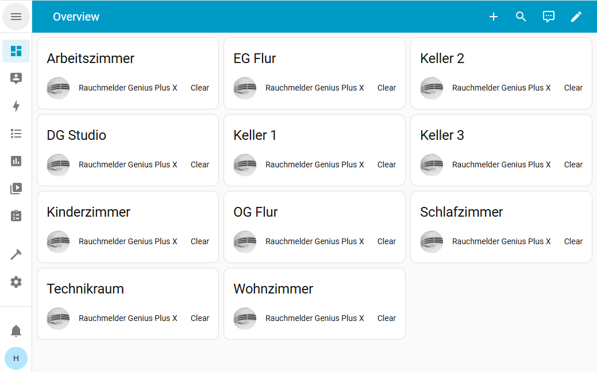
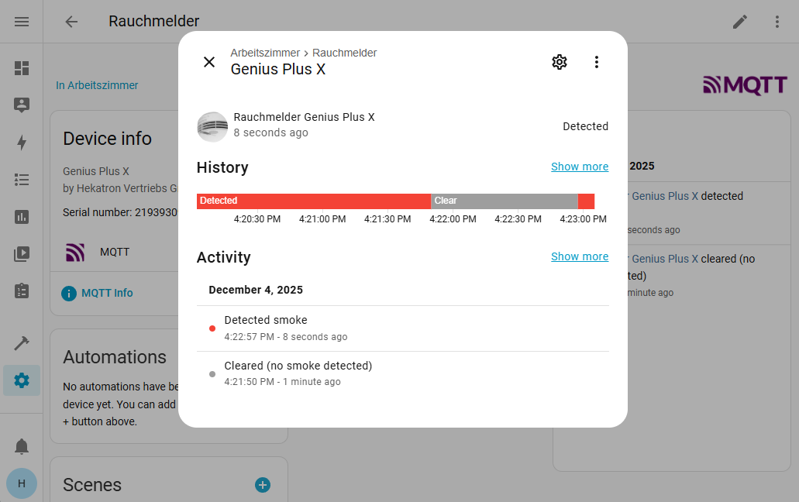

# Smart Home Integration

Genius Gateway offers two levels of smart home integration via MQTT, allowing you to choose between simple alarm notifications and full Home Assistant device integration with comprehensive automation capabilities.

| Approach | Description | Best for |
|----------|-------------|----------|
| [Simple Alarm Publishing](#simple-alarm-publishing) | Basic fire alarm notifications forwarded to your smart home system without individual device tracking. | Quick setup, simple alarm notifications for all smart home systems with MQTT interface |
| [Home Assistant Integration](#home-assistant-integration) |Full device integration with automatic discovery, individual detector tracking, and rich automation possibilities. | Home Assistant users, detailed monitoring, advanced automation scenarios |

| Feature | Simple Alarm Publishing | Home Assistant Integration |
|---------|:-----------------------:|:--------------------------:|
| **Setup Complexity** | :material-star::material-star::material-star:<br>Minimal - one topic | :material-star:<br>Moderate - add detectors |
| **Detector Configuration** | :material-star::material-star::material-star:<br>Not required | :material-star:<br>Required |
| **Device Tracking** | :material-close: | **:material-check:**<br>Individual Entities |
| **Location Information** | :material-close: | **:material-check:**<br>Customizable |
| **Automation Capabilities** | :material-star:<br>Basic - single trigger | :material-star::material-star::material-star:<br>Advanced - per detector |
| **Platform Support** | :material-star::material-star::material-star:<br>Any MQTT platform | :material-star::material-star:<br>Home Assistant optimized |
| **Unknown Detectors** | **:material-check:**<br>Supported | **:material-check:**<br>Supported |
| **Historical Data**<br>(besides Genius Gateway) | :material-star:<br>Limited | :material-star::material-star::material-star:<br>Full Home Assistant history |

## Simple Alarm Publishing

### Overview

Simple alarm publishing provides a straightforward way to integrate fire alarm detection into your smart home system. When any smoke detector in range triggers an alarm, Genius Gateway publishes a message to a central MQTT topic.

**Key Characteristics:**

- **Single topic** for all alarm events
- **No device configuration** required in Genius Gateway
- **Detects unknown detectors** within radio range (if enabled)
- **System agnostic** - compatible with any MQTT-capable smart home platform

### How It Works

1. **Detection**: Genius Gateway continuously monitors 868 MHz radio traffic for Genius Plus X alarm signals
2. **Processing**: When an alarm packet is detected, the gateway processes the alarm state
3. **Publishing**: Alarm information is published to the configured MQTT topic
4. **Counter**: The message includes how many detectors are currently in alarm state

See the [MQTT API - Global Alarm State Topic](../api/mqtt-topics.md#global-alarm-state-topic) for detailed payload format and examples.

### Configuration Requirements

To enable simple alarm publishing:

1. **[Configure MQTT broker connection](../setup/connections.md#mqtt)** - Set up connection to your MQTT broker
2. **[Enable Simple Alarm Publishing](../setup/connections.md#simple-alarm-publishing)** - Configure the alarm topic and enable publishing
3. **[(Optional) Enable unknown detector processing](gateway-settings.md#process-alerts-from-unknown-smoke-detectors)** - Allow detection of detectors not explicitly configured

!!! gg "Works with Known and Unknown Detectors"
    Simple Alarm Publishing works with or without smoke detectors configured in Genius Gateway. However, if no smoke detectors are configured, [processing alarms from unknown smoke detectors](gateway-settings.md#process-alerts-from-unknown-smoke-detectors) **must** be enabled for Genius Gateway to detect and forward fire alarms.

## Home Assistant Integration

### Home Assistant's MQTT Discovery

The Home Assistant integration leverages [MQTT Discovery :material-open-in-new:](https://www.home-assistant.io/integrations/mqtt/#mqtt-discovery) to automatically register each smoke detector as an individual device in Home Assistant. This provides rich functionality including:

- **Automatic device discovery** - No manual configuration in Home Assistant
- **Individual detector tracking** - Monitor each detector's state separately
- **Rich device information** - Model, manufacturer, serial numbers, location
- **Automation capabilities** - Create detector-specific automations
- **Historical data** - Track alarm history per detector
- **Dashboard integration** - Visual representation of detector network

Home Assistant's MQTT Discovery allows devices to automatically register themselves by publishing configuration messages to specific topics. When Genius Gateway publishes a discovery message:

1. Home Assistant detects the configuration message,
2. automatically creates a binary sensor entity for the smoke detector,
3. updates state in real-time when detector status changes and
4. syncs configuration when location or settings change in Genius Gateway

### Benefits for Home Assistant Users

**Automatic Setup:**

- Zero manual configuration in Home Assistant required 
- Devices appear instantly in Home Assistant
- Updates propagate automatically

**Rich Entity Information:**

- Device class (Smoke detector)
- Manufacturer: (Hekatron)
- Model (Genius Plus X)
- Serial number
- Configurable location names

**Advanced Automations:**

- Detector-specific triggers
- Location-based actions
- Group multiple detectors

### Visual Integration

**Overview Dashboard:**


*Multiple Genius Plus X smoke detectors automatically discovered and displayed with their configured locations*

**Detector Detail View:**


*Detailed view of a single detector showing real-time alarm state, manufacturer information, model, and serial number*

**Device Information:**


*Complete device information with manufacturer details, model identification, and assigned area for automation purposes*


### Configuration Requirements

To enable Home Assistant MQTT Discovery integration in Genius Gateway:

1. **[Add smoke detectors to Genius Gateway](../setup/configure-gateway.md#adding-smoke-detectors)** - Register detectors with serial numbers and locations
2. **[Configure MQTT broker connection](../setup/connections.md#mqtt)** - Set up connection (must be same broker as Home Assistant)
3. **[Enable Device Publishing](../setup/connections.md#device-publishing)** - Enable Home Assistant MQTT Discovery and adjust the topic prefix if your Home Assistant uses a non-default discovery prefix

Ensure MQTT Discovery is enabled in your Home Assistant configuration:

```yaml
# configuration.yaml
mqtt:
  broker: YOUR_BROKER_IP
  discovery: true  # This is usually enabled by default
  discovery_prefix: homeassistant  # Must match Genius Gateway prefix
```

### Configuration Synchronization

Changes made in Genius Gateway automatically synchronize to Home Assistant:

- **Location Updates:** When you edit a detector's location in Genius Gateway, the change is published via MQTT Discovery and updates the device name in Home Assistant.
- **Detector Addition:** New detectors added to Genius Gateway automatically appear in Home Assistant within seconds.


## Related Documentation

- **[Configure Gateway](../setup/configure-gateway.md)** - Step-by-step setup guide for both integration types
- **[Connections - MQTT](../setup/connections.md#mqtt)** - Detailed MQTT configuration including broker setup and authentication
- **[Gateway Settings](gateway-settings.md)** - Enable unknown detector processing and automatic alarm line discovery
- **[MQTT API](../api/mqtt-topics.md)** - Complete MQTT topic structure and payload documentation
- **[Device Management](device-management.md)** - Adding and managing smoke detectors in Genius Gateway
