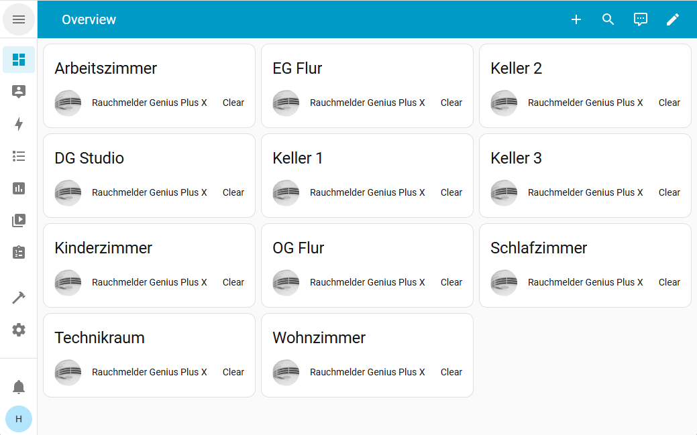
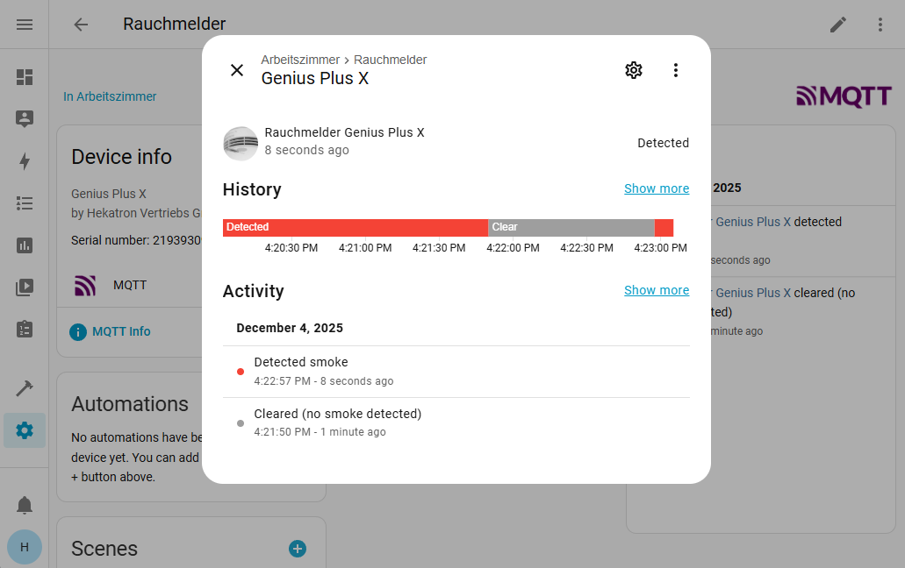
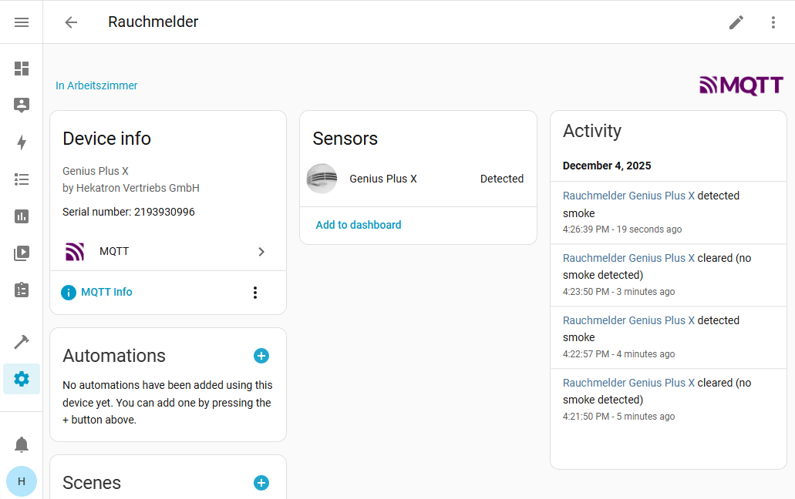
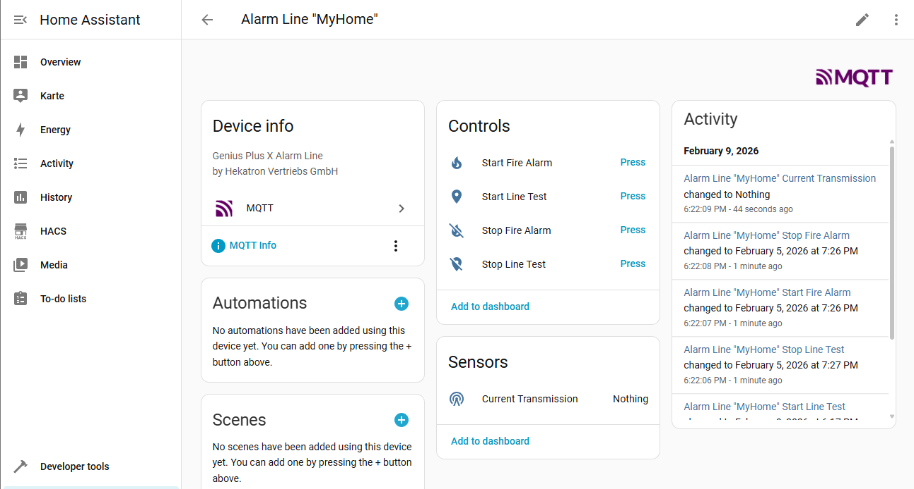
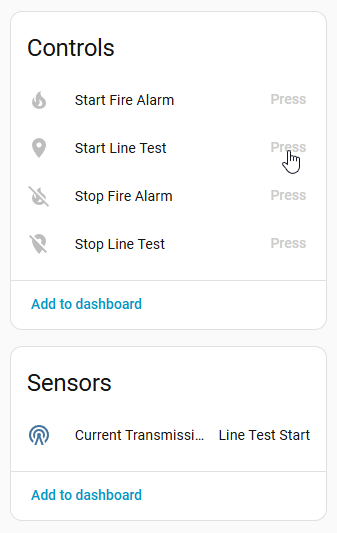

# Smart Home Integration

Genius Gateway offers two levels of smart home integration via MQTT, allowing you to choose between simple alarm notifications and full Home Assistant device integration with comprehensive automation capabilities.

| Approach | Description | Best for |
|----------|-------------|----------|
| [Simple Alarm Publishing](#simple-alarm-publishing) | Basic fire alarm notifications forwarded to your smart home system without individual device tracking. | Quick setup, simple alarm notifications for all smart home systems with MQTT interface |
| [Home Assistant Integration](#home-assistant-integration) |Full device integration with automatic discovery, individual detector tracking, and rich automation possibilities. | Home Assistant users, detailed monitoring, advanced automation scenarios |

| Feature | Simple Alarm Publishing | Home Assistant Integration |
|---------|:-----------------------:|:--------------------------:|
| **Setup Complexity** | :material-star::material-star::material-star:<br>Minimal - one topic | :material-star:<br>Moderate - add detectors |
| **Detector Configuration** | :material-star::material-star::material-star:<br>Not required | :material-star:<br>Required |
| **Device Tracking** | :material-close: | **:material-check:**<br>Individual Devices |
| **Location Information** | :material-close: | **:material-check:**<br>Customizable |
| **Automation Capabilities** | :material-star:<br>Basic - single trigger | :material-star::material-star::material-star:<br>Advanced - per detector |
| **Platform Support** | :material-star::material-star::material-star:<br>Any MQTT platform | :material-star::material-star:<br>Home Assistant optimized |
| **Unknown Detectors** | **:material-check:**<br>Supported | **:material-check:**<br>Supported |
| **Historical Data**<br>(besides Genius Gateway) | :material-star:<br>Limited | :material-star::material-star::material-star:<br>Full Home Assistant history |
| **Alarm Lines** | :material-close: | **:material-check:**<br>Individual Devices |
| **Line Test Triggering** | :material-close: | **:material-check:**<br>Remote Control |
| **Fire Alarm Triggering** | :material-close: | **:material-check:**<br>Remote Control |

## Simple Alarm Publishing

### Overview

Simple alarm publishing provides a straightforward way to integrate fire alarm detection into your smart home system. When any smoke detector in range triggers an alarm, Genius Gateway publishes a message to a central MQTT topic.

**Key Characteristics:**

- **Single topic** for all alarm events
- **No device configuration** required in Genius Gateway
- **Detects unknown detectors** within radio range (if enabled)
- **System agnostic** - compatible with any MQTT-capable smart home platform

### How It Works

1. **Detection**: Genius Gateway continuously monitors 868 MHz radio traffic for Genius Plus X alarm signals
2. **Processing**: When an alarm packet is detected, the gateway processes the alarm state
3. **Publishing**: Alarm information is published to the configured MQTT topic
4. **Counter**: The message includes how many detectors are currently in alarm state

See the [MQTT API - Global Alarm State Topic](../api/mqtt-topics.md#global-alarm-state-topic) for detailed payload format and examples.

### Configuration Requirements

To enable simple alarm publishing:

1. **[Configure MQTT broker connection](../setup/connections.md#mqtt)** - Set up connection to your MQTT broker
2. **[Enable Simple Alarm Publishing](../setup/connections.md#simple-alarm-publishing)** - Configure the alarm topic and enable publishing
3. **[(Optional) Enable unknown detector processing](gateway-settings.md#process-alerts-from-unknown-smoke-detectors)** - Allow detection of detectors not explicitly configured

!!! gg "Works with Known and Unknown Detectors"
    Simple Alarm Publishing works with or without smoke detectors configured in Genius Gateway. However, if no smoke detectors are configured, [processing alarms from unknown smoke detectors](gateway-settings.md#process-alerts-from-unknown-smoke-detectors) **must** be enabled for Genius Gateway to detect and forward fire alarms.

## Home Assistant Integration

### Key Benefits

- Automatic Setup
- Rich Entity Information
- Advanced Automations
- Configuration Synchronization

### Home Assistant's MQTT Discovery

The Home Assistant integration leverages [MQTT Discovery :material-open-in-new:](https://www.home-assistant.io/integrations/mqtt/#mqtt-discovery) to automatically register Genius Gateway components as individual devices and entities in Home Assistant. This integration supports two types of devices:

- **[Genius Devices (Smoke Detectors)](#genius-devices-smoke-detectors)** - Individual smoke detector monitoring with binary sensors
- **[Alarm Lines](#alarm-lines)** - Remote control and status monitoring with buttons and sensors

Home Assistant's MQTT Discovery allows devices to automatically register themselves by publishing configuration messages to specific topics. When Genius Gateway publishes discovery messages, Home Assistant automatically creates entities without any manual configuration.

### Configuration Requirements

To enable Home Assistant MQTT Discovery integration in Genius Gateway:

1. **[Configure MQTT broker connection](../setup/connections.md#mqtt)** - Set up connection (must be same broker as Home Assistant)
2. **[Enable Home Assistant Integration](../setup/connections.md#device-publishing)** - Enable MQTT Discovery and adjust the topic prefix if your Home Assistant uses a non-default discovery prefix
3. **[Add devices to Genius Gateway](../setup/configure-gateway.md)** - Register smoke detectors and/or alarm lines

Ensure MQTT Discovery is enabled in your Home Assistant configuration:

```yaml
# configuration.yaml
mqtt:
  broker: YOUR_BROKER_IP
  discovery: true  # This is usually enabled by default
  discovery_prefix: homeassistant  # Must match Genius Gateway prefix
```

## Genius Devices (Smoke Detectors)

### Overview

Each smoke detector registered in Genius Gateway is automatically published to Home Assistant as an individual device with a binary sensor entity. This provides rich functionality including:

- **Automatic device discovery** - No manual configuration in Home Assistant
- **Individual detector tracking** - Monitor each detector's state separately
- **Rich device information** - Model, manufacturer, serial numbers, location
- **Automation capabilities** - Create detector-specific automations
- **Historical data** - Track alarm history per detector
- **Dashboard integration** - Visual representation of detector network

### Home Assistant Visual Integration

**Overview Dashboard**


*Multiple Genius Plus X smoke detectors automatically discovered and displayed with their configured locations*

**Detector Detail View**


*Detailed view of a single detector showing real-time alarm state, manufacturer information, model, and serial number*

**Device Information**


*Complete device information with manufacturer details, model identification, and assigned area for automation purposes*

!!! abstract "Technical Details"
    See [MQTT API - Genius Devices](../api/mqtt-topics.md#genius-devices-smoke-detectors) for complete topic structure, payload formats, and configuration examples.

## Alarm Lines

### Overview

Each alarm line registered in Genius Gateway is automatically published to Home Assistant as an individual device with multiple entities for remote control and monitoring.

When Home Assistant Integration is enabled, each alarm line appears in Home Assistant with:

- **4 Button Entities** - Start/Stop line test, Start/Stop fire alarm
- **1 Sensor Entity** - Real-time transmission state monitoring

The Button Entities provides comparable functionality to the Web Interface for starting/stopping line tests or fire alarms, as described in [Alarm Lines Management](alarm-lines-management.md#alarm-line-actions).

### Home Assistant Visual Integration

**Alarm Line Device with Entities**


*Alarm line device with button controls for line test and fire alarm operations, plus transmission state sensor*

**Transmission State Sensor**

{ width="33%"}  
*Real-time transmission state sensor tracking current alarm line operations*

!!! abstract "Technical Details"
    See [MQTT API - Alarm Lines](../api/mqtt-topics.md#alarm-lines) for complete topic structure, payload formats, button configurations, and sensor states. Also see [Alarm Lines Management - MQTT Integration](alarm-lines-management.md#mqtt-integration) for operational details.

## Related Documentation

- **[Configure Gateway](../setup/configure-gateway.md)** - Step-by-step setup guide for both integration types
- **[Connections - MQTT](../setup/connections.md#mqtt)** - Detailed MQTT configuration including broker setup and authentication
- **[Gateway Settings](gateway-settings.md)** - Enable unknown detector processing and automatic alarm line discovery
- **[Device Management](device-management.md)** - Adding and managing smoke detectors in Genius Gateway
- **[Alarm Lines Management](alarm-lines-management.md)** - Configure alarm lines and understand MQTT integration capabilities
- **[MQTT API](../api/mqtt-topics.md)** - Complete MQTT topic structure and payload documentation
