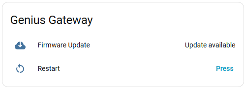
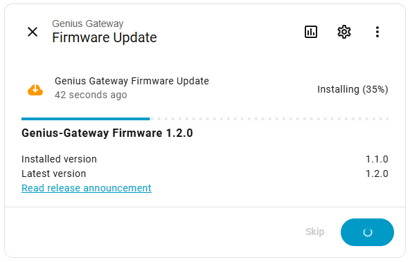
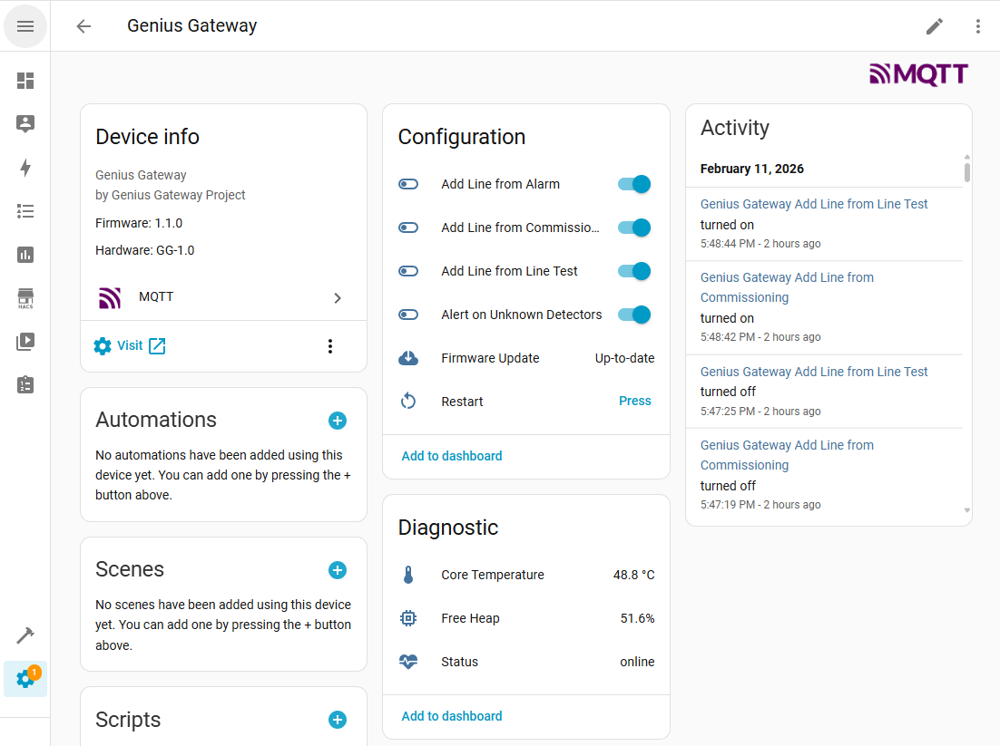

# Smart Home Integration

Genius Gateway offers two levels of smart home integration via MQTT, allowing you to choose between simple alarm notifications and full Home Assistant device integration with comprehensive automation capabilities.

| Approach | Description | Best for |
|----------|-------------|----------|
| [Simple Alarm Publishing](#simple-alarm-publishing) | Basic fire alarm notifications forwarded to your smart home system without individual device tracking. | Quick setup, simple alarm notifications for all smart home systems with MQTT interface |
| [Home Assistant Integration](#home-assistant-integration) |Full device integration with automatic discovery, individual detector tracking, and rich automation possibilities. | Home Assistant users, detailed monitoring, advanced automation scenarios |

| Feature | Simple Alarm Publishing | Home Assistant Integration |
|---------|:-----------------------:|:--------------------------:|
| **Setup Complexity** | :material-star::material-star::material-star:<br>Minimal - one topic | :material-star:<br>Moderate - add detectors |
| **Detector Configuration** | :material-star::material-star::material-star:<br>Not required | :material-star:<br>Required |
| **Device Tracking** | :material-close: | **:material-check:**<br>Individual Devices |
| **Location Information** | :material-close: | **:material-check:**<br>Customizable |
| **Automation Capabilities** | :material-star:<br>Basic - single trigger | :material-star::material-star::material-star:<br>Advanced - per detector |
| **Platform Support** | :material-star::material-star::material-star:<br>Any MQTT platform | :material-star::material-star:<br>Home Assistant optimized |
| **Unknown Detectors** | **:material-check:**<br>Supported | **:material-check:**<br>Supported |
| **Historical Data**<br>(besides Genius Gateway) | :material-star:<br>Limited | :material-star::material-star::material-star:<br>Full Home Assistant history |
| **Alarm Lines** | :material-close: | **:material-check:**<br>Individual Devices |
| **Line Test Triggering** | :material-close: | **:material-check:**<br>Remote Control |
| **Fire Alarm Triggering** | :material-close: | **:material-check:**<br>Remote Control |
| **Gateway Monitoring** | :material-close: | **:material-check:**<br>Device Status & Diagnostics |
| **Remote Gateway Control** | :material-close: | **:material-check:**<br>Restart & Settings |

## Simple Alarm Publishing

### Overview

Simple alarm publishing provides a straightforward way to integrate fire alarm detection into your smart home system. When any smoke detector in range triggers an alarm, Genius Gateway publishes a message to a central MQTT topic.

**Key Characteristics:**

- **Single topic** for all alarm events
- **No device configuration** required in Genius Gateway
- **Detects unknown detectors** within radio range (if enabled)
- **System agnostic** - compatible with any MQTT-capable smart home platform

### How It Works

1. **Detection**: Genius Gateway continuously monitors 868 MHz radio traffic for Genius Plus X alarm signals
2. **Processing**: When an alarm packet is detected, the gateway processes the alarm state
3. **Publishing**: Alarm information is published to the configured MQTT topic
4. **Counter**: The message includes how many detectors are currently in alarm state

See the [MQTT API - Global Alarm State Topic](../api/mqtt-topics.md#global-alarm-state-topic) for detailed payload format and examples.

### Configuration Requirements

To enable simple alarm publishing:

1. **[Configure MQTT broker connection](../setup/connections.md#mqtt)** - Set up connection to your MQTT broker
2. **[Enable Simple Alarm Publishing](../setup/connections.md#simple-alarm-publishing)** - Configure the alarm topic and enable publishing
3. **[(Optional) Enable unknown detector processing](gateway-settings.md#process-alerts-from-unknown-smoke-detectors)** - Allow detection of detectors not explicitly configured

!!! gg "Works with Known and Unknown Detectors"
    Simple Alarm Publishing works with or without smoke detectors configured in Genius Gateway. However, if no smoke detectors are configured, [processing alarms from unknown smoke detectors](gateway-settings.md#process-alerts-from-unknown-smoke-detectors) **must** be enabled for Genius Gateway to detect and forward fire alarms.

## Home Assistant Integration

### Key Benefits

- Automatic Setup
- Rich Entity Information
- Advanced Automations
- Configuration Synchronization

### Home Assistant's MQTT Discovery

The Home Assistant integration leverages [MQTT Discovery :material-open-in-new:](https://www.home-assistant.io/integrations/mqtt/#mqtt-discovery) to automatically register Genius Gateway components as individual devices and entities in Home Assistant. This integration supports three types of devices:

- **[Gateway Device](#gateway-device)** - Gateway monitoring and remote control with diagnostic sensors, buttons, and switches
- **[Smoke Detectors](#smoke-detectors)** - Individual smoke detector monitoring with binary sensors
- **[Alarm Lines](#alarm-lines)** - Remote control and status monitoring with buttons and sensors

Home Assistant's MQTT Discovery allows devices to automatically register themselves by publishing configuration messages to specific topics. When Genius Gateway publishes discovery messages, Home Assistant automatically creates entities without any manual configuration.

### Multiple Gateways on One Broker

Multiple Genius Gateway instances can share the same MQTT broker without entity conflicts. Every MQTT discovery config topic is scoped under the individual gateway's unique device identifier, so Home Assistant registers each gateway and its sub-devices (smoke detectors, alarm lines) independently.

!!! warning "Upgrading from an earlier firmware version"
    The discovery config topic format changed in a firmware update to include the gateway namespace. After upgrading, old retained discovery messages at the previous topic paths will remain in the broker until they expire or are manually cleared. To avoid duplicate entities in Home Assistant, send an empty retained message to each old config topic (or use your broker's retained-message cleanup feature) and remove the orphaned devices from Home Assistant.

### Configuration Requirements

To enable Home Assistant MQTT Discovery integration in Genius Gateway:

1. **[Configure MQTT broker connection](../setup/connections.md#mqtt)** - Set up connection (must be same broker as Home Assistant)
2. **[Enable Home Assistant Integration](../setup/connections.md#home-assistant-integration)** - Enable MQTT Discovery; optionally adjust the discovery prefix and device identity (device name, manufacturer, model)
3. **[Add devices to Genius Gateway](../setup/configure-gateway.md)** - Register smoke detectors and/or alarm lines

Ensure MQTT Discovery is enabled in your Home Assistant configuration:

```yaml
# configuration.yaml
mqtt:
  broker: YOUR_BROKER_IP
  discovery: true  # This is usually enabled by default
  discovery_prefix: homeassistant  # Must match Genius Gateway prefix
```

## Gateway Device

### Overview

The Genius Gateway itself is automatically published to Home Assistant as a device when Home Assistant Integration is enabled. This provides comprehensive monitoring and remote control capabilities for the gateway itself.

The gateway device registers with:

- **Device Information** - Manufacturer, model, firmware version, and web interface link
- **1 Status Sensor** - Online/Offline state
- **2 Diagnostic Sensors** - Real-time system health monitoring (free heap memory, core temperature)
- **1 Restart Button** - Remote restart capability
- **4 Configuration Switches** - Remote settings control
- **1 Update Entity** - Firmware update management with automatic version checking

This integration enables proactive monitoring, remote maintenance, and dynamic configuration without requiring physical access to the gateway.

### Entities Overview

| Entity Type | Name | Purpose | Update Interval | Category |
|-------------|------|---------|-----------------|----------|
| **Sensor** | Status | Device registration in Home Assistant | On connect | diagnostic |
| **Sensor** | Free Heap | Memory usage monitoring (percentage) | Every 60 seconds | diagnostic |
| **Sensor** | Core Temperature | Internal temperature monitoring (°C) | Every 60 seconds | diagnostic |
| **Button** | Restart | Trigger gateway restart remotely | On demand | - |
| **Switch** | Alert on Unknown Detectors | Enable/disable processing of unknown detectors | On change | config |
| **Switch** | Add Line from Commissioning | Auto-add lines from commissioning packets | On change | config |
| **Switch** | Add Line from Alarm | Auto-add lines from alarm packets | On change | config |
| **Switch** | Add Line from Line Test | Auto-add lines from line test packets | On change | config |
| **Update** | Firmware Update | Automatic version checking and OTA updates | Every 6 hours | - |

### Monitoring Capabilities

#### System Health Monitoring

**Free Heap Memory**
  
- Displays available heap memory as percentage of total heap
- Updated every 60 seconds
- Useful for detecting memory leaks or resource exhaustion
- Can trigger alerts when memory drops below threshold

**Core Temperature**

- Monitors ESP32 internal temperature sensor
- Updated every 60 seconds
- Helps identify thermal issues or inadequate cooling
- Can trigger alerts when temperature exceeds safe operating range

#### Device Status

The gateway automatically reports its online/offline status to Home Assistant:

- **Online** - Gateway connected to MQTT broker and operating normally
- **Offline** - Gateway disconnected (shown via MQTT Last Will and Testament)

### Remote Control Capabilities

#### Restart Button

Remote restart functionality eliminates the need for physical access to the gateway:

- **Use Case:** Apply configuration changes that require restart
- **Use Case:** Recover from transient issues without site visit
- **Use Case:** Scheduled maintenance/restart via automation

#### Configuration Switches

Four switches provide remote control of key gateway settings. For detailed explanations of each setting, see [Gateway Settings](gateway-settings.md):

- **[Alert on Unknown Detectors](gateway-settings.md#process-alerts-from-unknown-smoke-detectors)** - Control processing of alerts from unregistered smoke detectors
- **[Add Line from Commissioning](gateway-settings.md#add-alarm-line-from-commissioning)** - Auto-discover alarm lines during detector commissioning
- **[Add Line from Alarm](gateway-settings.md#add-alarm-line-from-alarm)** - Auto-discover alarm lines during alarm events
- **[Add Line from Line Test](gateway-settings.md#add-alarm-line-from-line-test)** - Auto-discover alarm lines during line tests

!!! info "Bidirectional Synchronization"
    All switch states are synchronized bidirectionally between Home Assistant and the gateway web interface. Changes made in either location are immediately reflected in the other.

#### Firmware Updates

The gateway includes automatic firmware update capability with Home Assistant integration:

- **Automatic Version Checking** - Gateway checks for new releases
- **Update Notification** - Home Assistant shows "Update Available" badge when new version is released
- **Release Notes** - Direct link to GitHub releases for changelog details
- **One-Click Installation** - Install updates directly from Home Assistant
- **Progress Tracking** - Monitor installation progress via Home Assistant
- **Automatic Restart** - Gateway restarts automatically after successful installation

!!! warning "Requirements"
    Firmware updates require an active internet connection. The gateway must be able to reach `github.com` and `objects.githubusercontent.com`.

{ width="50%" }  
*The Genius Gateway's Update Entity signalizing an available firmware update*

{ width="60%" }  
*The Home Assistant's built-in update capability, including version numbers, release names and live update progress*

### Home Assistant Visual Integration

The gateway device appears alongside smoke detectors and alarm lines in Home Assistant's device registry.


*The central Genius Gateway device with configuration options and system values, along with linked smoke detectors and alarm lines*

### Automation Examples

#### Low Memory Alert

Monitor heap memory and send notification when critically low:

```yaml
automation:
  - alias: "Gateway Low Memory Warning"
    trigger:
      - platform: numeric_state
        entity_id: sensor.genius_gateway_free_heap
        below: 30
    action:
      - service: notify.mobile_app
        data:
          title: "Gateway Memory Low"
          message: "Genius Gateway free heap: {{ states('sensor.genius_gateway_free_heap') }}%"
```

#### High Temperature Alert

Monitor core temperature and trigger alert if overheating:

```yaml
automation:
  - alias: "Gateway High Temperature Warning"
    trigger:
      - platform: numeric_state
        entity_id: sensor.genius_gateway_core_temperature
        above: 60
    action:
      - service: notify.mobile_app
        data:
          title: "Gateway Overheating"
          message: "Genius Gateway temperature: {{ states('sensor.genius_gateway_core_temperature') }}°C"
```

!!! abstract "Technical Details"
    See [MQTT API - Gateway Device](../api/mqtt-topics.md#gateway-device) for complete topic structure, payload formats, and detailed configuration examples.

## Smoke Detectors

### Overview

Each smoke detector registered in Genius Gateway is automatically published to Home Assistant as an individual sub-device. This provides rich functionality including:

- **Automatic device discovery** - No manual configuration in Home Assistant
- **Individual detector tracking** - Monitor each detector's state separately
- **Rich device information** - Model, manufacturer, serial number, location
- **Diagnostic entities** - Detailed readout data after acoustic service
- **Automation capabilities** - Create detector-specific automations
- **Historical data** - Track alarm history per detector

### Entities Overview

| Entity | Category | Available | Description |
|--------|----------|-----------|-------------|
| **Smoke Detector** (binary_sensor) | Control | Always | Alarm state `ON`/`OFF` |
| **Battery** (binary_sensor) | Diagnostic | After readout | Battery low fault |
| **Smoke Detector State** (binary_sensor) | Diagnostic | After readout | Internal device fault |
| **Radio Module State** (binary_sensor) | Diagnostic | After readout | Radio network fault |
| **Deinstallation Count** | Diagnostic | After readout | Lifetime deinstall count |
| **Last Service** | Diagnostic | After readout | Timestamp of last acoustic readout |
| **Radio Module Model** | Diagnostic | After readout | Model name (e.g. FM Basis X) |
| **Alarm Line ID** | Diagnostic | After readout | FM line identifier |
| **Alarm Line** | Diagnostic | After readout | Line character + number (e.g. A.0) |
| **Production Date** | Diagnostic | After readout | Smoke detector manufacturing date |
| **Radio Module Serial** | Diagnostic | After readout | Radio module serial number |
| **Alarms (Total)** | Diagnostic | After readout | Lifetime alarm count |
| **Alarms (3 Months)** | Diagnostic | After readout | Alarm count in last 3 months |
| **Radio Interference** | Diagnostic | After readout | Radio interference level (%) |

Diagnostic entities show as **unavailable** until the first acoustic readout is performed via the SmartSonic interface.

### Home Assistant Visual Integration

**Overview Dashboard**


*Multiple Genius Plus X smoke detectors automatically discovered and displayed with their configured locations*

**Detector Detail View**


*Detailed view of a single detector showing real-time alarm state, manufacturer information, model, and serial number*

**Device Information**


*Complete device information with manufacturer details, model identification, and assigned area for automation purposes*

!!! abstract "Technical Details"
    See [MQTT API - Smoke Detectors](../api/mqtt-topics.md#smoke-detectors) for complete topic structure, payload formats, and configuration examples.

## Alarm Lines

### Overview

Each alarm line registered in Genius Gateway is automatically published to Home Assistant as an individual device with multiple entities for remote control and monitoring.

When Home Assistant Integration is enabled, each alarm line appears in Home Assistant with:

- **4 Button Entities** - Start/Stop line test, Start/Stop fire alarm
- **1 Sensor Entity** - Real-time transmission state monitoring

The Button Entities provides comparable functionality to the Web Interface for starting/stopping line tests or fire alarms, as described in [Alarm Lines Management](alarm-lines-management.md#alarm-line-actions).

### Home Assistant Visual Integration

**Alarm Line Device with Entities**


*Alarm line device with button controls for line test and fire alarm operations, plus transmission state sensor*

**Transmission State Sensor**

{ width="33%"}  
*Real-time transmission state sensor tracking current alarm line operations*

!!! abstract "Technical Details"
    See [MQTT API - Alarm Lines](../api/mqtt-topics.md#alarm-lines) for complete topic structure, payload formats, button configurations, and sensor states. Also see [Alarm Lines Management - MQTT Integration](alarm-lines-management.md#mqtt-integration) for operational details.

## Related Documentation

- **[Configure Gateway](../setup/configure-gateway.md)** - Step-by-step setup guide for both integration types
- **[Connections - MQTT](../setup/connections.md#mqtt)** - Detailed MQTT configuration including broker setup and authentication
- **[Gateway Settings](gateway-settings.md)** - Enable unknown detector processing and automatic alarm line discovery
- **[Device Management](device-management.md)** - Adding and managing smoke detectors in Genius Gateway
- **[Alarm Lines Management](alarm-lines-management.md)** - Configure alarm lines and understand MQTT integration capabilities
- **[MQTT API](../api/mqtt-topics.md)** - Complete MQTT topic structure and payload documentation
