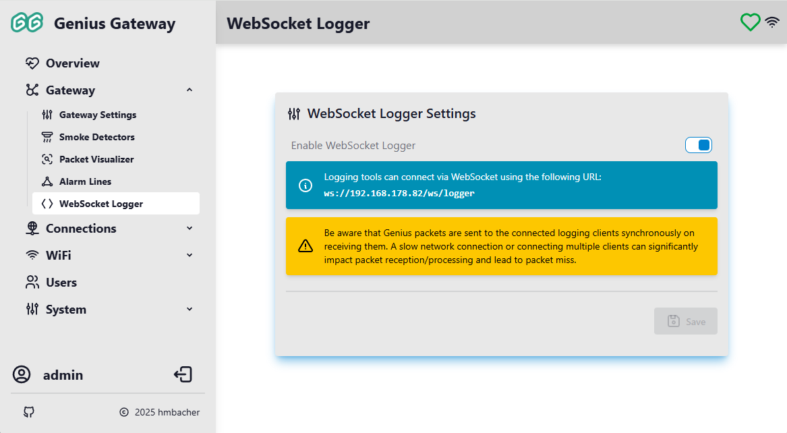

# WebSocket Logging Interface

The WebSocket Logger provides real-time streaming of RF packets from the CC1101 radio to connected clients via WebSocket protocol. This enables external tools and the built-in Packet Visualizer to receive and analyze packets as they are captured.

!!! info "Access Required"
    WebSocket Logger settings require **administrator** privileges to view and modify.

## Overview

The WebSocket Logger acts as a bridge between the gateway's RF packet reception and client applications that need real-time packet data. When enabled, all received packets are immediately streamed to connected WebSocket clients, providing live monitoring and analysis capabilities.



## :tabler-adjustments: WebSocket Logger Settings

### Enable WebSocket Logger

**Default:** Disabled

Controls whether the WebSocket logging service is active and accepting client connections.

**When enabled:**

- The WebSocket server accepts connections at `ws://[gateway-ip]/ws/logger`
- All received RF packets are streamed in real-time to connected clients
- The [Packet Visualizer](packet-visualizer.md) can display live packet data
- External tools can connect to receive raw packet streams
- An informational message displays the WebSocket connection URL

**When disabled:**

- The WebSocket server rejects all connection attempts
- No packet data is transmitted over WebSocket
- The [Packet Visualizer](packet-visualizer.md) cannot receive live packets (file import still works)
- Reduces system load when real-time monitoring is not needed

!!! warning "Performance Impact"
    Packets are sent to connected clients **synchronously** during packet reception. A slow network connection or multiple connected clients can significantly impact packet processing performance and may lead to packet loss. For best results, use a fast local network connection and limit the number of simultaneous clients. See [Performance Considerations](#performance-considerations) for details.

## WebSocket Connection

When the logger is enabled, clients can connect using:

```
ws://[gateway-ip-address]/ws/logger
```

### Connection Details

- **Protocol:** WebSocket (RFC 6455)
- **Data Format:** Binary (raw packet data structure)
- **Authentication:** Follows gateway security settings
- **Path:** `/ws/logger`

### Data Structure

Each WebSocket message contains the complete `cc1101_packet_t` structure (80 bytes total):

| Offset | Size<br>(incl. padding) | Type | Description |
|--------|------|------|-------------|
| 0 | 8 bytes | uint64_t | Packet reception timestamp (microseconds) |
| 8 | 64 bytes | uint8_t[64] | *RX FIFO buffer*<br>*Byte 8+ 0*: Packet length byte from CC1101 (number of bytes following, including status bytes)<br>*Byte 8+ 1 to byte 8+ length*: Actual packet data, see [Genius Plus X Packets](../reverse-engineering/protocol-analysis.md#genius-plus-x-packets)<br>*Byte 8+ length+1*: RSSI<br>*Byte 8+ length+2*: LQI/CRC   |
| 72 | 4 bytes | uint8_t* | Pointer to packet data within buffer (client-side: ignore/treat as reserved) |
| 76 | 4 bytes | size_t | Packet data length (number of data bytes, excluding status bytes) |

## Use Cases

### Built-in Packet Visualizer

The [Packet Visualizer](packet-visualizer.md) uses the WebSocket Logger internally to display live packet data with interpretation and highlighting. This is the primary use case for most users.

### External Analysis Tools

Developers and researchers can create custom tools that connect to the WebSocket to:

- Capture packet streams for offline analysis
- Implement custom packet filtering or alerting
- Integrate with other monitoring systems
- Perform protocol research and reverse engineering

### API Integration

For detailed information about WebSocket API usage and integration, see [WebSocket API](../api/websocket-api.md#wslogger-packet-stream).

## Performance Considerations

The WebSocket Logger is designed for diagnostic and development purposes. Consider the following when enabling it:

1. **Packet Processing Overhead:** Each received packet triggers a synchronous WebSocket send operation to all connected clients
2. **Network Latency:** Slow clients can block packet processing, causing the RX FIFO to overflow
3. **Multiple Clients:** Each additional client multiplies the synchronous send overhead
4. **Continuous Operation:** Consider disabling the logger when real-time monitoring is not needed

!!! tip "Optimal Usage"
    Enable the WebSocket Logger only when actively using the Packet Visualizer or external monitoring tools. Disable it during normal gateway operation to ensure optimal packet reception performance.

## Related Documentation

- [Packet Visualizer](packet-visualizer.md) - Built-in tool for real-time packet analysis
- [MQTT Topics](../api/mqtt-topics.md) - MQTT integration and message formats
- [Protocol Analysis](../reverse-engineering/protocol-analysis.md) - Packet structure and field definitions
- [Gateway Settings](gateway-settings.md) - Configure packet processing behavior