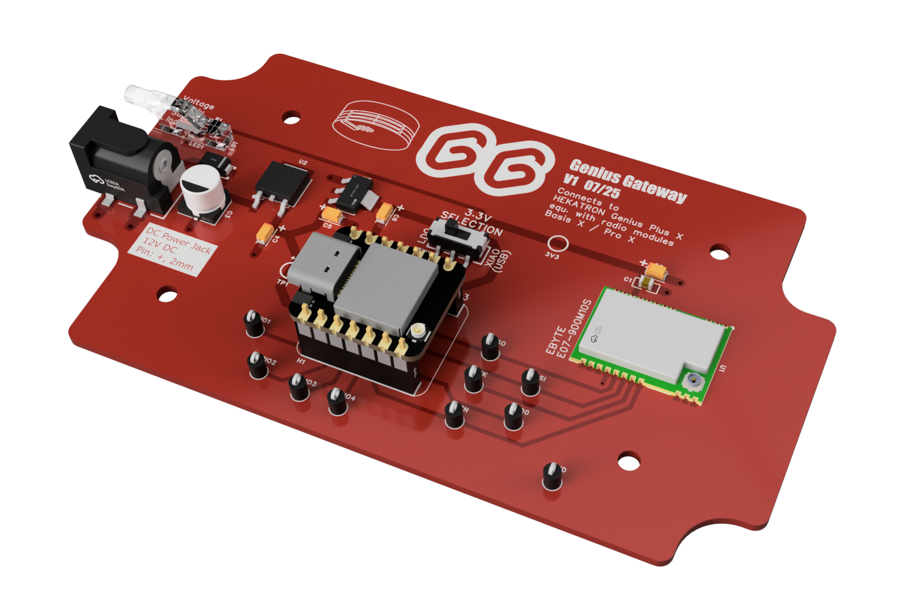
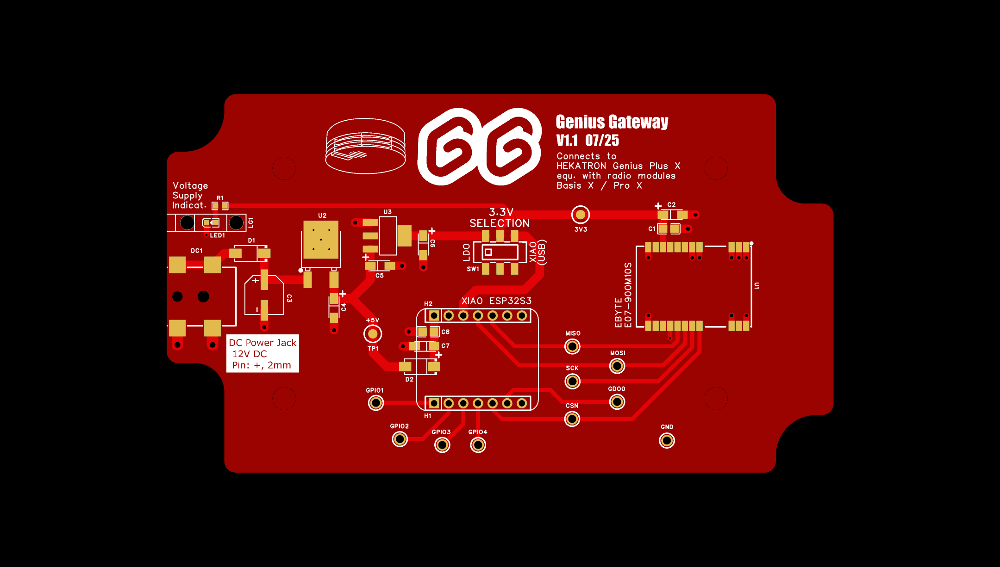
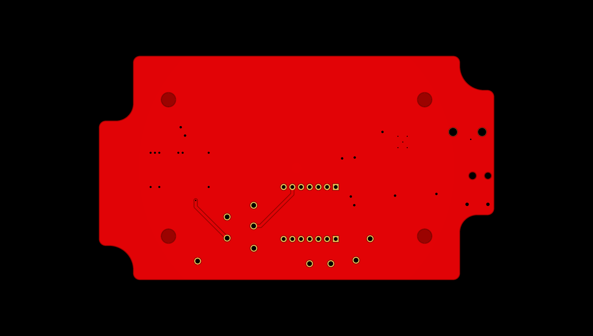

# Hardware

## Licensing

For legal aspects and licensing information, please refer to the [:material-arrow-right: License](../license.md#hardware-design) page.

## Experimental setup

As part of the reverse engineering and for testing purposes, a test setup was used with the following components:

1. **ESP32 Microcontroller**
    - [Espressif ESP32S3-DevKit-C-1-N8R2 :material-open-in-new:](https://docs.espressif.com/projects/esp-dev-kits/en/latest/esp32s3/esp32-s3-devkitc-1/index.html)
    - [SEED XIAO ESP32-S3 :material-open-in-new:](https://wiki.seeedstudio.com/xiao_esp32s3_getting_started/)
2. **CC1101 RF Transceiver**
    - [EBYTE E07-900MBL-01 :material-open-in-new:](https://www.fr-ebyte.com/products/E07-900MBL-01)
3. **Wiring**
    - A few jumper cables to connect the two development boards
    - Micro-USB and USB-C cables for power supply and UART access (flashing, device output)

All components are available online from leading electronics retailers at low prices.

## Final hardware

To achieve a robust setup, and since manufacturing PCBs is now possible at very low cost, it was a logical decision to design a custom PCB and integrate it into a suitable enclosure.

<<< IMAGE of the final assembly! >>>

Schematics and PCB layout were created using the free [EasyEDA Editor :material-open-in-new:](https://pro.easyeda.com/editor).  
PCB manufacturing and assembly were performed by [JLCPCB :material-open-in-new:](https://jlcpcb.com/).

### Schematics

-   
    
    **Schematics**  
    Overall Genius Gateway schematics

Download the schematic as a PDF: [:material-file-pdf-box: gg-schematic-main-v1.1.pdf](../assets/downloads/cae/schematics/gg-schematic-main-v1.1.pdf){ target=_blank }

Schematics are also available in various formats as part of the [:material-arrow-right: Design Files](./pcb.md#design-files).

### PCB Layout

-   
    
    PCB Layout Top Side

-   
    
    PCB Layout Bottom Side

PCB layout files are available in various formats as part of the [:material-arrow-right: Design Files](./pcb.md#design-files).

### Manufacturing

Download Gerber file bundle: [:material-zip-box: gg-gerber-v1.1.zip](../assets/downloads/cae/pcb/gg-gerber-v1.1.zip){ target=_blank }

PCB design-related files are available in various formats as part of the [:material-arrow-right: Design Files](./pcb.md#design-files).

### BOM

#### Electronic parts

1. PCB Assembly  
    Download the detailed EasyEDA BOM as an Excel file: [:material-file-excel-box: gg-pcb-bom-v1.1.xlsx](../assets/downloads/cae/pcb/gg-pcb-bom-v1.1.xlsx){ target=_blank }

2. [SEED XIAO ESP32-S3 :material-open-in-new:](https://wiki.seeedstudio.com/xiao_esp32s3_getting_started/) with soldered pin headers as plug-in module

3. CC1101 RF transceiver module [EBYTE E07-900M10S :material-open-in-new:](https://www.cdebyte.com/products/E07-900M10S) to be soldered to the PCB

4. Antenna pigtail cables   
    - 1x male SMA :material-arrow-left-right: IPX, delivered with [2.4 GHz rod antenna :material-open-in-new:](https://www.seeedstudio.com/2-4GHz-2-81dBi-Antenna-for-XIAO-ESP32C3-p-5475.html) (for WiFi network)
    - 1x female SMA :material-arrow-left-right: IPX, 10cm, e.g. [:material-arrow-right: this](https://de.aliexpress.com/item/1005001968783987.html?pdp_ext_f=%7B%22sku_id%22%3A%2212000034631936683%22%7D) (for [Hekatron Genius Plus X :material-open-in-new:](https://www.hekatron-brandschutz.de/produkte/rauchmelder/produkte/genius-plus-x){ target=_blank} network)

#### Other parts

1. Case
    - Option 1: [BOPLA XM 130804 G 7035 (Order no. 07413084) :material-open-in-new:](https://www.bopla.de/en/enclosure-technology/euromas-x/pc-crystal-clear-lid-1/enclosures-polycarbonate-crystal-clear-lid/xm-130804-g-7035)
    - Option 2: BOX4U 6U07130804437 (fully compatible to BOPLA case), e.g. at [Reichelt Elektronik :material-open-in-new:](https://www.reichelt.de/de/de/shop/produkt/industriegehaeuse_125_x_75_x_37_2mm_ip65_lichtgrau-340529)
    - 4 pcs. of PCB mounting screws for direct fastening into plastic material
2. External antennas
    - [2.4 GHz rod antenna :material-open-in-new:](https://www.seeedstudio.com/2-4GHz-2-81dBi-Antenna-for-XIAO-ESP32C3-p-5475.html) (for WiFi network)
    - 868 MHz antenna [TX868-JKD-20 :material-open-in-new:](https://www.cdebyte.com/products/TX868-JKD-20) (for [Hekatron Genius Plus X :material-open-in-new:](https://www.hekatron-brandschutz.de/produkte/rauchmelder/produkte/genius-plus-x){ target=_blank} network)
3. External power supply (12 VDC) with 5,5 mm x 2,1 mm DC plug

## Design Files

| File | Format | Comment |
|------|--------|---------|
| [:material-download: gg-easyeda-pro-v1.1.epro](../assets/downloads/cae/gg-easyeda-pro-v1.1.epro) | EasyEDA Pro | |
| [:material-download: gg-altium-designer-v1.1.zip](../assets/downloads/cae/gg-altium-designer-v1.1.zip) | Altium Designer | **:material-alert-circle-outline: Untested** |
| [:material-download: gg-mentor-pads-v1.1.zip](../assets/downloads/cae/gg-mentor-pads-v1.1.zip) | Mentor Graphics PADS | **:material-alert-circle-outline: Untested** |

## CAD

...