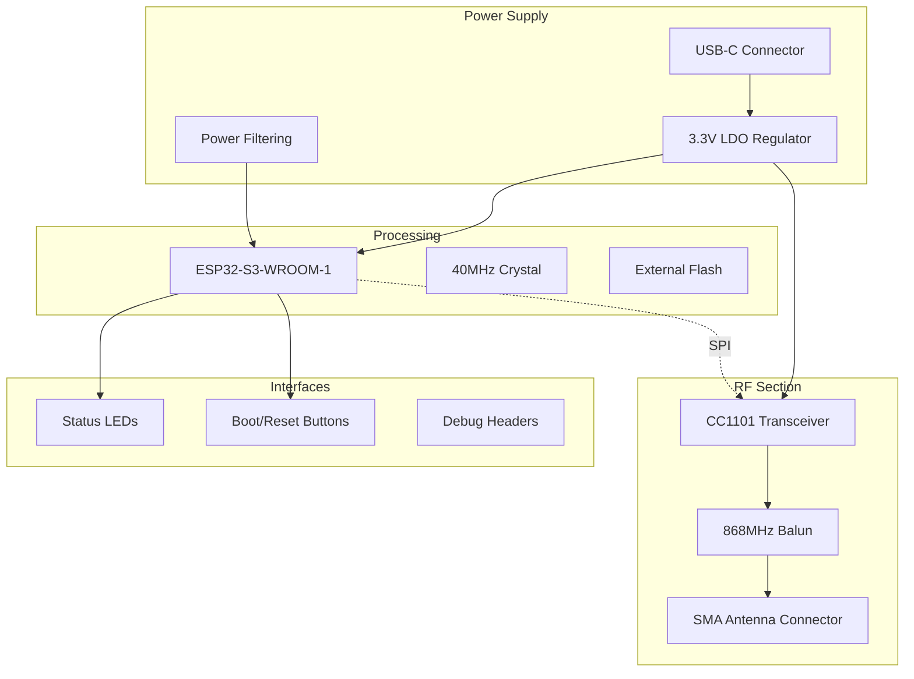

# Hardware Design

Complete hardware design documentation for the Genius Gateway.

## Design Overview

The Genius Gateway hardware is designed as a compact, cost-effective RF monitoring device that interfaces with Hekatron Genius Plus X smoke detection systems.

## Key Design Goals

**RF Performance**
- Sensitive 868 MHz reception for weak device signals
- Minimal noise figure and optimal antenna matching
- Wide dynamic range for various signal strengths

**System Integration**
- ESP32-S3 microcontroller with WiFi capability
- CC1101 sub-GHz transceiver for Genius protocol communication
- USB-C power and programming interface

**Reliability**
- Robust power supply design with protection circuits
- ESD protection on all external interfaces
- Professional-grade components for long-term operation

**Manufacturability**
- Standard component packages for automated assembly
- Single-sided PCB layout with minimal via usage
- Clear component markings and test points

## Hardware Architecture

## Documentation Structure

### [Gateway Overview](gateway-overview.md)
System-level hardware architecture and component selection rationale.

### [Schematics](schematics.md)
Complete schematic diagrams with detailed annotations and design notes.

### [PCB Layout](pcb-layout.md)
PCB design files, layout considerations, and manufacturing specifications.

### [Bill of Materials](bom.md)
Complete component list with part numbers, specifications, and sourcing information.

### [Case](case.md)
Compatible cases and enclosure options with mounting and assembly details.

## Design Files

The complete hardware design files are available in the `cae/` directory:

**KiCad Design Files**
- `GeniusGateway.kicad_pro` - Project configuration
- `GeniusGateway.kicad_sch` - Schematic design
- `GeniusGateway.kicad_pcb` - PCB layout
- `GeniusGateway.kicad_dru` - Design rule check

**Manufacturing Files**
- `Gerbers/` - Gerber files for PCB fabrication
- `Drill/` - NC drill files for via and mounting holes
- `Assembly/` - Pick-and-place files for automated assembly
- `3D/` - 3D renderings and mechanical drawings

**STEP Models**
- `GG_V1.step` - Complete 3D mechanical model
- Compatible with most CAD software for enclosure design

## Key Specifications

**Electrical Characteristics**
- Supply Voltage: 5V via USB-C or 3.3V direct
- Current Consumption: 80mA typical, 150mA peak
- Operating Temperature: -10°C to +60°C
- RF Sensitivity: -115 dBm at 868.35 MHz

**Physical Dimensions**
- PCB Size: 60mm × 40mm × 1.6mm
- Component Height: <8mm (excluding antenna connector)
- Mounting: 4× M3 mounting holes
- Enclosure: Optional 3D-printed or custom case

**Interface Connectors**
- USB-C: Power, programming, and serial communication
- SMA: 50Ω antenna connection for 868 MHz
- Headers: Debug interface and GPIO expansion

## Performance Validation

The hardware design has been validated through:

**RF Performance Testing**
- Sensitivity measurements using calibrated signal generator
- Antenna matching and VSWR optimization
- Spurious emission compliance testing

**Environmental Testing**  
- Temperature cycling from -20°C to +70°C
- Extended operation testing (>1000 hours)
- ESD immunity testing per IEC 61000-4-2

**EMC Compliance**
- Conducted and radiated emissions testing
- RF immunity testing in 868 MHz band
- Power supply noise and filtering verification

## Licensing

The hardware design is released under:

**Creative Commons Attribution-ShareAlike 4.0 International (CC BY-SA 4.0)**

You are free to:
- **Share**: Copy and redistribute the material in any medium or format
- **Adapt**: Remix, transform, and build upon the material for any purpose

Under the following terms:
- **Attribution**: You must give appropriate credit and indicate if changes were made
- **ShareAlike**: If you remix or transform the material, you must distribute under the same license

## Design Evolution

**Version History**
- **v1.0**: Initial design with ESP32-WROOM-32 and external CC1101 module
- **v1.1**: Migration to ESP32-S3-WROOM-1 with improved RF layout
- **v1.2**: Enhanced power supply filtering and ESD protection
- **v2.0**: Integrated CC1101 design with optimized antenna matching

**Future Enhancements**
- PoE (Power over Ethernet) option for permanent installations
- External antenna diversity for improved reception
- Integration with additional sub-GHz transceivers
- Industrial temperature range components

## Next Steps

- **[Gateway Overview](gateway-overview.md)** - Understand the system-level design approach
- **[Schematics](schematics.md)** - Review detailed circuit designs and component selection
- **[Case](case.md)** - Explore enclosure options and mounting solutions