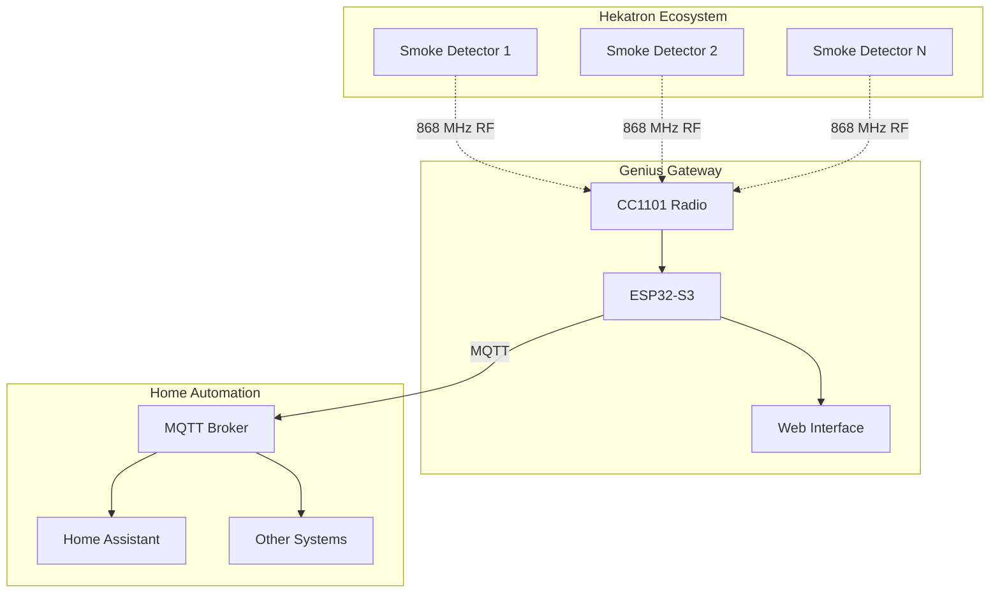

# ESP32 Genius Gateway

-   :material-smoke-detector:{ .lg .middle } __Hekatron Integration__

    ---

    Reverse-engineered gateway for Hekatron Genius Plus X smoke detection systems with real-time monitoring and control

    [:octicons-arrow-right-24: Getting started](quick-start.md)

-   :material-wifi:{ .lg .middle } __MQTT & Home Assistant__

    ---

    Seamless integration with Home Assistant and other MQTT-based home automation systems

    [:octicons-arrow-right-24: MQTT Setup](setup/mqtt-homeassistant.md)

-   :material-web:{ .lg .middle } __Web Interface__

    ---

    Modern responsive web interface for device management, packet visualization, and system configuration

    [:octicons-arrow-right-24: Features overview](features/index.md)

-   :material-chip:{ .lg .middle } __Hardware Design__

    ---

    Complete open-source hardware design with schematics, PCB layout, and assembly documentation

    [:octicons-arrow-right-24: Hardware docs](hardware/index.md)

## What is the Genius Gateway?

The **ESP32 Genius Gateway** is a reverse-engineered interface for Hekatron Genius Plus X smoke detection systems. It enables real-time monitoring, MQTT integration, and web-based management of Genius smoke detectors without requiring proprietary Hekatron gateways.

### Key Features

**🔍 Protocol Reverse Engineering**
: Complete analysis and implementation of the proprietary Genius communication protocol

**📡 RF Communication**  
: CC1101-based 868 MHz radio interface compatible with FM Basis Radio Modules

**🌐 Web Interface**
: Modern Svelte-based responsive web interface for device management and monitoring

**📊 Real-time Monitoring**
: Live packet visualization, alarm states, and device status monitoring

**🏠 Home Automation**
: MQTT integration with Home Assistant and other automation platforms

**⚙️ Open Source**
: Complete hardware and software designs available under open licenses

## Quick Start

Get your Genius Gateway up and running in minutes:

1. **[Hardware Setup](setup/hardware.md)** - Assemble or order the gateway hardware
2. **[Firmware Installation](setup/firmware.md)** - Flash the firmware to your ESP32
3. **[Configuration](setup/configuration.md)** - Configure WiFi and basic settings
4. **[MQTT Integration](setup/mqtt-homeassistant.md)** - Connect to Home Assistant

## Architecture Overview

## Project Status

!!! success "Production Ready"
    The Genius Gateway is actively used in production environments and provides stable, reliable operation.

**Current Version**: v0.6.0  
**Hardware**: ESP32-S3 with CC1101 radio module  
**Protocol Support**: Hekatron Genius Plus X (FM Basis Radio Module)  
**License**: Hardware: CC BY-SA 4.0, Software: LGPL v3 (backend) / MIT (frontend)

## Community & Support

- **GitHub**: [hmbacher/genius-gw-svelte](https://github.com/hmbacher/genius-gw-svelte)
- **Issues**: Report bugs and request features on GitHub
- **Discussions**: Join the community discussion for help and sharing

!!! warning "Disclaimer"
    This is a reverse-engineered implementation not affiliated with Hekatron. Use at your own risk and ensure compliance with local regulations regarding RF communication and fire safety systems.