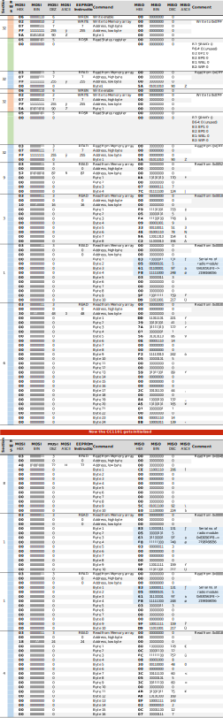
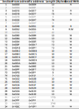

# EEPROM Analysis

!!! warning
    The analysis of the EEPROM and the SPI communication between MSP430 and EEPROM has only been rudimentary so far. It is neither complete, nor in-depth, nor verified in any way. All the following information is merely a superficial snapshot.

## Recorded Communication

### Interpretation

The interpretation of the EEPROM commands was done using the [Datasheet :material-open-in-new:](https://www.st.com/resource/en/datasheet/m95512-w.pdf){ target=_blank }. It explains read and write sequences, so that an interpretation of the raw data could be done from the recorded UART traffic with the help of [Protocol Decoders](protocol-captures.md#decoders).

### Data

The following shows and evaluates 2 traces. Further EEPROM traces are part of the [Trace Files](./protocol-captures.md#trace-files).

The [Memory Map](#memory-map) shows the memory areas referenced in the traces (*Section* column).

The traces and the memory map can also be downloaded as [:material-download: Excel detail](../assets/downloads/logic-analyzer/eeprom-traces.xlsx).

#### Trace 1

##### Summary

```
 1. Write  1 byte  to   address 0x07FF
 2. Read   1 byte  from address 0x07FF
 3. Write  1 byte  to   address 0x07FF
 4. Read   1 byte  from address 0x07FF
 5. Read   4 bytes from address 0x0052
 6. Read   8 bytes from address 0x0010
 7. Read  10 bytes from address 0x0000 / incl. serial no. of radio module
 8. Read  24 bytes from address 0x0030
 9. Read  10 bytes from address 0x0048
10. Read  10 bytes from address 0x0000 / incl. serial no. of radio module
11. Read  10 bytes from address 0x0000 / incl. serial no. of radio module
12. Read  16 bytes from address 0x0018
```

##### Details

{ width="100%" }

#### Trace 2

##### Summary

```
 1. Write 22 bytes to address 0x169C / incl. serial no. of smoke detector,
                                       date, time, unknown UART data
 2. Write  4 bytes to address 0x0052
 3. Write 10 bytes to address 0x0080
 4. Write 10 bytes to address 0x008A
 5. Write 10 bytes to address 0x0094
 6. Write 10 bytes to address 0x009E
 7. Write 10 bytes to address 0x00A8
 8. Write 10 bytes to address 0x00B2
 9. Write 10 bytes to address 0x00BC
10. Write 10 bytes to address 0x00C6
11. Write 10 bytes to address 0x00D0
12. Write 10 bytes to address 0x00DA
13. Write 10 bytes to address 0x00E4
14. Write 10 bytes to address 0x00EE
15. Write  8 bytes to address 0x00F8
16. Write  2 bytes to address 0x0100
17. Write 10 bytes to address 0x0102
18. Write 10 bytes to address 0x010C
19. Write 10 bytes to address 0x0116
20. Write 10 bytes to address 0x0120
21. Write 10 bytes to address 0x012A
22. Write 10 bytes to address 0x0134
```

##### Details

{ width="100%" }

### Findings

1. Every write access to the EEPROM follows this sequence:
    - WREN - Write Enable (preparation for writing)
    - WRITE - Write the data
    - RDSR - Read Status Register (verify the write operation)

2. Only a more comprehensive analysis, particularly the interplay between EEPROM accesses, RF transceiver communication (via SPI), and smoke detector communication (via UART), can provide insights into the data stored in the EEPROM.

## Memory Map

The analysis of the communication with the EEPROM so far has resulted in the following memory map: 

{ width="75%" }