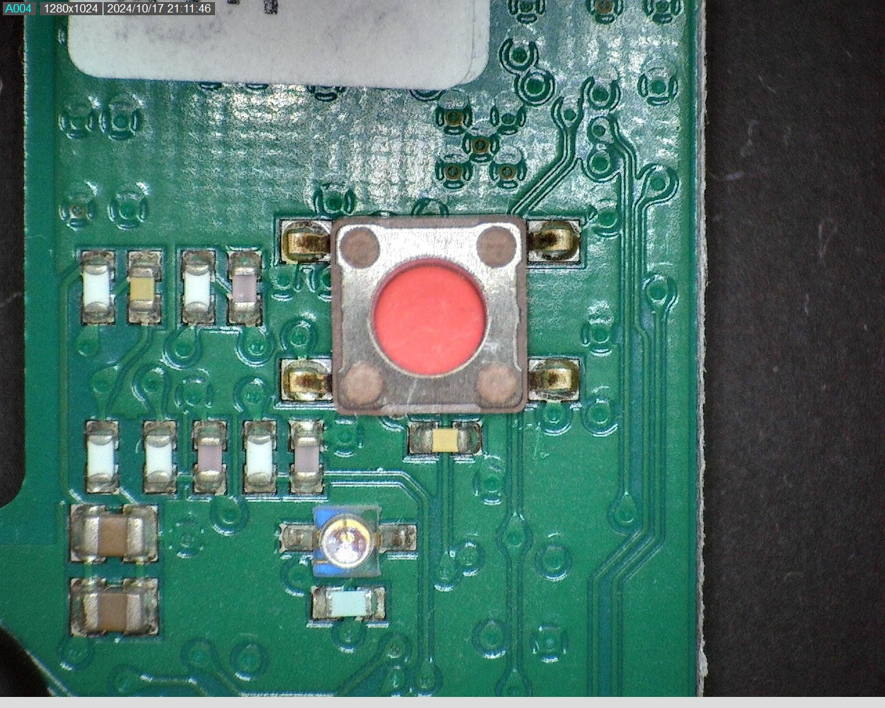
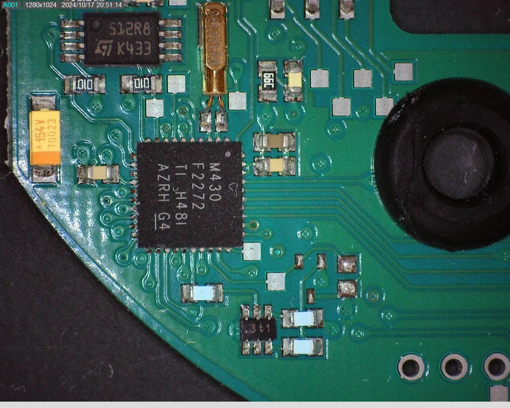
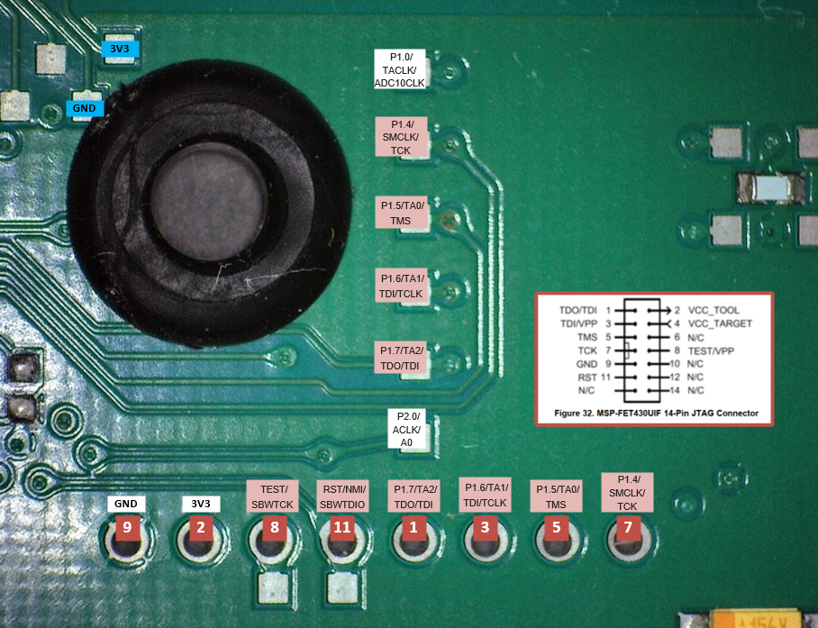
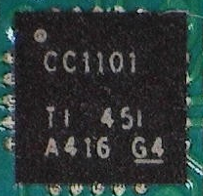
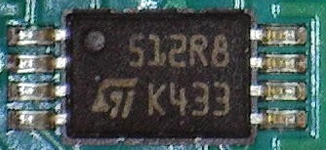
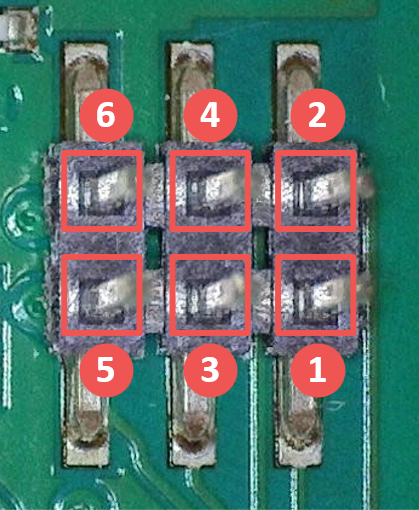

# FM Basis X - PCB

The FM Basis X PCB is plugged onto the smoke detector. A 6-pin header connects the PCB to the smoke detector.

## PCB Images

-   
    
    **RF Transceiver**  
    Texas Instruments CC1101 with 26 MHz crystal and antenna frontend

-   
    
    **Push button**  
    Push button for regular functions like line test, commissioning and others

-   ")
    
    **RF Section, EEPROM and pin header**  
    RF transceiver and antenna area, serial EEPROM and 6-pin header (board-to-board connector to smoke detector)

-   
    
    **RF Transceiver & pin header**  
    Pin and signal names for CC1101 and the 6-pin board-to-board connector

-   
    
    **Microcontroller**  
    Texas instruments MSP430 low-power microcontroller with decoupling capacitors and crystal

-   ")
    
    **Microcontroller & EEPROM signals**  
    Most relevant pin and signal names for MCU, EEPROM and interconnection (SPI, UART)

-   
    
    **JTAG Connection**  
    SMD and TH pads with JTAG signals for programming

-   
    
    **JTAG Signals**  
    JTAG related signal names and pin assignments

## Components

### Microcontroller

The PCB is equipped with a [Texas Instruments MSP430F2272  :material-open-in-new:](https://www.ti.com/product/MSP430F2272){ target=_blank } ultra-low-power microcontroller.

{ width="100" }

#### Key features

| Feature | Specification |
|---------|---------------|
| :material-speedometer: **Frequency** | 16 MHz |
| :material-memory: **Flash Memory** | 32KB + 256B |
| :material-chip: **RAM** | 1KB |
| :material-lightning-bolt: **Supply Voltage** | 1.8V - 3.6V |
| :material-battery-heart: **Active Power** | 270 µA @ 1MHz |
| :material-sleep: **Standby Power** | 0.7 µA |
| :material-power-off: **Off Mode** | 0.1 µA |
| :material-timer: **Wake-up Time** | < 1 µs |
| :material-package-variant: **Package** | 40-pin VQFN |

!!! warning "JTAG Access Limitation"
    The microcontroller offers a JTAG interface for programming and debugging.

    Unfortunately I could not access the microcontroller via JTAG connection. Very likely the JTAG fuse was blown after flashing the device by the manufacturer.

#### Links

- [Product page :material-open-in-new:](https://www.ti.com/product/MSP430F2272){ target=_blank }
- [Datasheet :material-open-in-new:](https://www.ti.com/lit/gpn/msp430f2272){ target=_blank }
- [User guide :material-open-in-new:](https://www.ti.com/lit/pdf/slau144){ target=_blank }

### RF Transceiver

The PCB is equipped with a [Texas Instruments CC1101  :material-open-in-new:](https://www.ti.com/product/CC1101){ target=_blank } low-power Sub-1 GHz wireless transceiver.

{ width="100" }

#### Key features

| Feature | Specification |
|---------|---------------|
| :material-protocol: **Protocols** | Proprietary, Wireless M-Bus |
| :material-waveform: **Modulation scheme** | (G)MSK, 2(G)FSK, 4(G)FSK, ASK, OOK |
| :material-radio: **Frequency bands** | 300-348, 387-464, 779-928 MHz |
| :material-send: **TX power (max)** | 12 dBm |
| :material-antenna: **Sensitivity (best)** | -116 dBm |
| :material-current-ac: **RX current (lowest)** | 14.3 mA |
| :material-speedometer: **Data rate (max)** | 0.6 Mbps |
| :material-package-variant: **Package** | 20-pin VQFN |

!!! info "RF Configuration Details"
    The specific CC1101 configuration for the Genius Plus X smoke detector network are described under [:octicons-arrow-right-24: FM Basis X - RF](fm-basis-x-rf.md).

#### Links

- [Product page :material-open-in-new:](https://www.ti.com/product/CC1101){ target=_blank }
- [Datasheet :material-open-in-new:](https://www.ti.com/lit/gpn/cc1101){ target=_blank }

### EEPROM

The PCB is equipped with a [STMicroelectronics M95512 :material-open-in-new:](https://www.st.com/en/memories/m95512-w.html){ target=_blank } 512 Kbit SPI bus EEPROM.

{ width="100" }

#### Key features

| Feature | Specification |
|---------|---------------|
| :material-connection: **Interface** | SPI bus compatible |
| :material-memory: **Memory array** | 512-Kbit (64-Kbyte) |
| :material-file-document: **Page size** | 128 bytes |
| :material-clock-fast: **Write time** | Byte/Page Write within 5 ms |
| :material-shield-lock: **Write protect** | quarter array, half array, whole memory array |
| :material-speedometer: **High-speed clock** | 16 MHz |
| :material-refresh: **Write cycles** | more than 4 million |
| :material-database-clock: **Data retention** | more than 200-year |
| :material-package-variant: **Package** | 8-pin TSSOP8 |

#### Links

- [Product page :material-open-in-new:](https://www.st.com/en/memories/m95512-w.html){ target=_blank }
- [Datasheet :material-open-in-new:](https://www.st.com/resource/en/datasheet/m95512-w.pdf){ target=_blank }

### Board-to-board connection

The PCB is equipped with a standard 6-pin header (2x3) through which the connection to the smoke detector is established.

{ width="100" }

| Pin-# | Purpose |
|:-----:|:--------|
| 1 | **GND** Ground |
| 2 | **3V3** 3.3 VDC power supply  |
| 3 | **UART-RX** Receive signal line (Radio module <-- Smoke detector) |
| 4 | **UART-TX** Transmit signal line (Radio module --> Smoke detector) |
| 5 | ***Unknown*** This line is connected to MSP430's pin no. 8, which is a multipurpose pin (GPIO, Analog Input, Timer related function). Its exact function is unknown, but it may possibly be used to signal a fire alarm to the radio module (in addition to or instead of via UART). |
| 6 | ***N.C.*** *No connection could be found.* |

