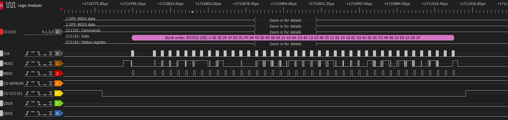

# RF Configuration

This section describes the radio frequency settings and configuration parameters used by the Hekatron Genius Plus X communication system.

## Analysis Method

The CC1101 RF transceiver is connected to the microcontroller via SPI. Consequently, configuration and control are primarily based on this connection.

To determine the specific CC1101 parameters, it was necessary to analyze the SPI communication using a digital oscilloscope. Built-in analysis functions (for serial interfaces like SPI or UART) facilitate the analysis work. However, the most comfortable evaluation is with a logic analyzer, which is specialized for this type of analysis.

The CC1101 transceiver datasheet describes commands for writing and reading configuration and status registers. This allows identification of read and write actions within the recorded communication. Furthermore, using the information in the CC1101 datasheet, one can determine which registers are written or read and what data is written or read.

Once the individual configuration registers and the data being written are identified, the datasheet information can be used to determine their meaning and effect.

### Startup Sequence

When the radio module is plugged into the smoke detector, it receives power. Unlike the smoke detectors, which have permanent power supply (batteries cannot be removed), the radio modules have no internal power supply. Consequently, all necessary configurations occur after plugging in the radio module.

Immediately after the CC1101 chip reset, a series of individual registers are written and read. Immediately thereafter, the decisive configuration is performed using burst write.

{ width="100%" }

<em>Figure 1: Logic analyzer capture showing CC1101 burst write initialization sequence</em>

### Initial Burst Write

The following table shows the complete register initialization sequence captured from the SPI communication:

| Register | Address | Value | Purpose |
|----------|---------|-------|---------|
| IOCFG2 | 0x00 | 0x0E | **GDO2 Pin Configuration**: `0x0E` = RX FIFO threshold signal. Pin asserts when RX FIFO is filled at or above threshold (32 bytes). Pin goes high when data available for reading. |
| IOCFG1 | 0x01 | 0x2E | **GDO1 Pin Configuration**: `0x2E` = High impedance (3-state). Pin is disabled and presents high impedance to external circuits. Not used in this application. |
| IOCFG0 | 0x02 | 0x24 | **GDO0 Pin Configuration**: `0x24` = WOR_EVNT0 signal. Pin pulses high when Wake-on-Radio EVENT0 timeout occurs, enabling low-power periodic wake-up functionality. |
| FIFOTHR | 0x03 | 0x47 | **FIFO Thresholds**: `0x47` = Bits[7]=0 (ADC retention disabled), Bits[5:4]=01 (Close in RX timeout), Bits[3:0]=0111 = TX threshold: 33 bytes free, RX threshold: 32 bytes filled. |
| SYNC1 | 0x04 | 0xD3 | **Sync Word High Byte**: `0xD3` = Upper 8 bits of 16-bit sync word (0xD391). Used for packet detection and synchronization. |
| SYNC0 | 0x05 | 0x91 | **Sync Word Low Byte**: `0x91` = Lower 8 bits of 16-bit sync word (0xD391). Combined with SYNC1 forms unique packet identifier. |
| PKTLEN | 0x06 | 0xFF | **Fixed Packet Length**: `0xFF` = 255 bytes maximum packet length. Only used in fixed packet length mode (not active here due to variable length mode). |
| PKTCTRL1 | 0x07 | 0x04 | **Packet Control 1**: `0x04` = Bits[7:5]=000 (PQT=0), Bit[3]=0 (no address check), Bit[2]=1 (append status bytes), Bits[1:0]=00 (no address check). Status bytes (RSSI, LQI, CRC) appended to received packets. |
| PKTCTRL0 | 0x08 | 0x45 | **Packet Control 0**: `0x45` = Bit[6]=1 (data whitening ON), Bit[4]=0 (normal packet format), Bit[2]=1 (CRC calculation/check ON), Bits[1:0]=01 (variable packet length mode). First byte indicates packet length. |
| ADDR | 0x09 | 0x00 | **Device Address**: `0x00` = Node address 0. Not used since address checking is disabled in PKTCTRL1. |
| CHANNR | 0x0A | 0x00 | **Channel Number**: `0x00` = Channel 0. Base frequency used without channel spacing offset. |
| FSCTRL1 | 0x0B | 0x06 | **Frequency Synthesizer Control**: `0x06` = IF frequency = (26MHz/1024) × 6 = 152.34 kHz. Sets intermediate frequency for receiver. |
| FSCTRL0 | 0x0C | 0x00 | **Frequency Offset**: `0x00` = No frequency offset. Base frequency used without additional offset. |
| FREQ2 | 0x0D | 0x21 | **Frequency Control High**: `0x21` = FREQ[23:16] bits. Combined frequency word = 0x21656A = 2188650₁₀ → f = (26MHz/65536) × 2188650 = 868.035 MHz |
| FREQ1 | 0x0E | 0x65 | **Frequency Control Middle**: `0x65` = FREQ[15:8] bits. Part of 24-bit frequency control word for 868.035 MHz carrier frequency. |
| FREQ0 | 0x0F | 0x6A | **Frequency Control Low**: `0x6A` = FREQ[7:0] bits. Completes 24-bit frequency word: 0x21656A → 868.035 MHz carrier frequency. |
| MDMCFG4 | 0x10 | 0xCA | **Modem Config 4**: `0xCA` = Bits[7:6]=11 (CHANBW_E=3), Bits[5:4]=00 (CHANBW_M=0) → BW = 26MHz/(8×(4+0)×2³) = 101.56 kHz, Bits[3:0]=1010 (DRATE_E=10) |
| MDMCFG3 | 0x11 | 0x83 | **Modem Config 3**: `0x83` = DRATE_M = 131₁₀. Data rate = ((256+131)×2¹⁰×26MHz)/(2²⁸) = 38.383 kBaud. Combined with MDMCFG4 for complete data rate calculation. |
| MDMCFG2 | 0x12 | 0x13 | **Modem Config 2**: `0x13` = Bit[7]=0 (DEM_DCFILT_OFF), Bits[6:4]=001 (MOD_FORMAT=GFSK), Bit[3]=0 (Manchester disabled), Bits[2:0]=011 (SYNC_MODE=30/32 sync word bits detected). |
| MDMCFG1 | 0x13 | 0x23 | **Modem Config 1**: `0x23` = Bit[7]=0 (FEC disabled), Bits[6:4]=010 (NUM_PREAMBLE=4 bytes), Bits[1:0]=11 (CHANSPC_E=3). Channel spacing exponent for frequency hopping. |
| MDMCFG0 | 0x14 | 0x99 | **Modem Config 0**: `0x99` = CHANSPC_M = 153₁₀. Channel spacing = ((256+153)×2³×26MHz)/(2¹⁸) = 199.95 kHz. Used for multi-channel operation. |
| DEVIATN | 0x15 | 0x35 | **Frequency Deviation**: `0x35` = Bits[6:4]=011 (DEVIATION_E=3), Bits[2:0]=101 (DEVIATION_M=5). Deviation = (8+5)×2³×26MHz/2¹⁷ = 47.61 kHz for GFSK modulation. |
| MCSM2 | 0x16 | 0x11 | **Main Radio Control 2**: `0x11` = Bits[4:3]=10 (RX_TIME_RSSI), Bits[2:0]=001 (RX_TIME=1). Timeout for RX termination based on RSSI, carrier sense timeout = 1 × 0.1803 ms. |
| MCSM1 | 0x17 | 0x02 | **Main Radio Control 1**: `0x02` = Bits[5:4]=00 (CCA_MODE=always), Bits[3:2]=00 (RXOFF_MODE=IDLE), Bits[1:0]=10 (TXOFF_MODE=RX). After TX, automatically go to RX mode. |
| MCSM0 | 0x18 | 0x14 | **Main Radio Control 0**: `0x14` = Bits[5:4]=01 (FS_AUTOCAL=from IDLE to RX/TX), Bits[3:2]=01 (PO_TIMEOUT=149-155 μs), Bits[1:0]=00 (PIN_CTRL disabled). Auto-calibration on state transitions. |
| FOCCFG | 0x19 | 0x16 | **Frequency Offset Compensation**: `0x16` = Bits[5:3]=010 (FOC_PRE_K=3K), Bits[2]=1 (FOC_POST_K=K/2), Bits[1:0]=10 (FOC_LIMIT=±BW/8). Compensates ±12.7 kHz frequency offset with 3K pre-sync gain, K/2 post-sync gain. |
| BSCFG | 0x1A | 0x6C | **Bit Synchronization Config**: `0x6C` = Bits[7:6]=01 (BS_PRE_KI=2KI), Bits[5:4]=10 (BS_PRE_KP=3KP), Bits[3:2]=11 (BS_POST_KI=KI), Bits[1:0]=00 (BS_POST_KP=KP). Clock recovery with 2KI/3KP pre-sync, KI/KP post-sync gains. |
| AGCCTRL2 | 0x1B | 0x03 | **AGC Control 2**: `0x03` = Bits[7:6]=00 (MAX_DVGA_GAIN=all gain settings), Bits[5:3]=000 (MAX_LNA_GAIN=maximum), Bits[2:0]=011 (MAGN_TARGET=33 dB). AGC targets 33 dB channel amplitude with full gain range. |
| AGCCTRL1 | 0x1C | 0x4A | **AGC Control 1**: `0x4A` = Bit[6]=1 (AGC_LNA_PRIORITY=1), Bits[5:4]=00 (CARRIER_SENSE_REL_THR=disabled), Bits[3:0]=1010 (CARRIER_SENSE_ABS_THR=-6 dB). LNA gain adjusted first, carrier sense at -6 dBm absolute threshold. |
| AGCCTRL0 | 0x1D | 0x91 | **AGC Control 0**: `0x91` = Bits[7:6]=10 (HYST_LEVEL=medium), Bits[5:4]=01 (WAIT_TIME=16 samples), Bits[3:2]=00 (AGC_FREEZE=never), Bits[1:0]=01 (FILTER_LENGTH=16 samples). Medium hysteresis, 16-sample averaging. |
| WOREVT1 | 0x1E | 0x0C | **WOR Event0 Timeout High**: `0x0C` = EVENT0[15:8] = 12₁₀. Combined with WOREVT0: EVENT0 = 0x0CF3 = 3315₁₀. WOR period = 3315 × 2⁵ × 0.9765 ms = 103.4 seconds between wake-ups. |
| WOREVT0 | 0x1F | 0xF3 | **WOR Event0 Timeout Low**: `0xF3` = EVENT0[7:0] = 243₁₀. Completes 16-bit timeout: 0x0CF3 = 3315₁₀ × 32 × 0.9765 ms = 103.4 second sleep periods for power saving. |
| WORCTRL | 0x20 | 0x49 | **WOR Control**: `0x49` = Bit[7]=0 (RC_PD=normal), Bits[6:4]=100 (EVENT1=16), Bit[3]=1 (RC_CAL=enabled), Bits[2:0]=001 (WOR_RES=2⁵ periods). RC oscillator calibration enabled, 32-period resolution, EVENT1 timeout. |
| FREND1 | 0x21 | 0x56 | **Frontend RX Config**: `0x56` = Bits[7:6]=01 (LNA_CURRENT), Bits[5:4]=01 (LNA2MIX_CURRENT), Bits[3:2]=01 (LODIV_BUF_CURRENT_RX), Bits[1:0]=10 (MIX_CURRENT). Optimized RX frontend current settings for sensitivity/power balance. |
| FREND0 | 0x22 | 0x10 | **Frontend TX Config**: `0x10` = Bits[7:4]=0001 (LODIV_BUF_CURRENT_TX), Bits[2:0]=000 (PA_POWER=0). PA power table index 0, optimized TX LO buffer current for power efficiency. |
| FSCAL3 | 0x23 | 0xE9 | **Frequency Synthesizer Cal 3**: `0xE9` = Bits[7:6]=11 (FSCAL3[7:6]), Bits[5:4]=10 (CHP_CURR_CAL_EN), Bits[3:0]=1001 (FSCAL3[3:0]). VCO calibration values for 868 MHz operation, charge pump current enabled. |
| FSCAL2 | 0x24 | 0x2A | **Frequency Synthesizer Cal 2**: `0x2A` = Bit[5]=1 (VCO_CORE_H_EN=high performance VCO), Bits[4:0]=01010 (FSCAL2[4:0]=10). High VCO current for stable 868 MHz synthesis with calibration value 10. |
| FSCAL1 | 0x25 | 0x00 | **Frequency Synthesizer Cal 1**: `0x00` = Bits[5:0]=000000 (FSCAL1[5:0]=0). Frequency synthesizer calibration result value 0, indicates optimal VCO calibration for target frequency. |
| FSCAL0 | 0x26 | 0x1F | **Frequency Synthesizer Cal 0**: `0x1F` = Bits[6:0]=0011111 (FSCAL0[6:0]=31). Frequency synthesizer calibration result value 31, fine-tunes VCO for precise 868.035 MHz operation. |

!!! warning "Dynamic Configuration Changes"
    While the burst write establishes the base configuration, some registers may be modified during runtime based on operational requirements. Parameters like power levels (PATABLE), WOR settings (WORCTRL), and calibration values (FSCAL registers) can be dynamically adjusted by the firmware to optimize performance or adapt to changing conditions.

## Configuration

### Key RF Parameters

Based on the register analysis, the following key parameters were determined:

| Parameter | Value | Calculation/Source |
|-----------|-------|-------------------|
| **Carrier Frequency** | 868.035400390625 MHz | FREQ = 0x21656A = 2188650₁₀ f = (26MHz/65536) × 2188650 |
| **Modulation** | GFSK | MDMCFG2[6:4] = 001 |
| **Sync Word** | 0xD391 | SYNC1=0xD3, SYNC0=0x91 |
| **Data Rate** | 38.383483886719 kBaud | DRATE_E=10, DRATE_M=131 Rate = ((256+131)×2¹⁰×26MHz)/(2²⁸) |
| **Frequency Deviation** | ±47.607421875 kHz | DEVIATION_E=3, DEVIATION_M=5 Dev = (8+5)×2³×26MHz/2¹⁷ |
| **Channel Bandwidth** | 101.5625 kHz | CHANBW_E=3, CHANBW_M=0 BW = 26MHz/(8×(4+0)×2³) |
| **Sync Mode** | 30/32 bits | MDMCFG2[2:0] = 011 |
| **Preamble Length** | 4 bytes | MDMCFG1[6:4] = 010 |
| **Packet Format** | Variable length | PKTCTRL0[1:0] = 01 |
| **CRC Enable** | ON | PKTCTRL0[2] = 1 |
| **Data Whitening** | ON | PKTCTRL0[6] = 1 |
| **Address Check** | Disabled | PKTCTRL1[1:0] = 00 |
| **Status Append** | Enabled | PKTCTRL1[2] = 1 |
| **Channel Spacing** | 199.951171875 kHz | CHANSPC_E=3, CHANSPC_M=153 Spacing = ((256+153)×2³×26MHz)/(2¹⁸) |
| **Manchester Encoding** | Disabled | MDMCFG2[3] = 0 |

### Power

The power amplifier (PA) configuration is set through the PATABLE and FREND0 registers:

| Register | Address | Value | Purpose |
|----------|---------|-------|---------|
| PATABLE[0] | 0x3E | 0x03 | **PA Power Level 0**: `0x03` = Minimum output power (~-30 dBm). Used for very short range communication or testing modes. |
| PATABLE[1] | 0x3E | 0x0F | **PA Power Level 1**: `0x0F` = Low output power (~-20 dBm). Used for close-proximity device communication within same room. |
| PATABLE[2] | 0x3E | 0x1E | **PA Power Level 2**: `0x1E` = Medium-low output power (~-15 dBm). Used for moderate range indoor communication. |
| PATABLE[3] | 0x3E | 0x27 | **PA Power Level 3**: `0x27` = Medium output power (~-10 dBm). Standard power level for normal indoor operation. |
| PATABLE[4] | 0x3E | 0x50 | **PA Power Level 4**: `0x50` = Medium-high output power (~-6 dBm). Used for extended indoor range or light outdoor use. |
| PATABLE[5] | 0x3E | 0x81 | **PA Power Level 5**: `0x81` = High output power (~0 dBm). Used for maximum indoor range or outdoor communication. |
| PATABLE[6] | 0x3E | 0xCB | **PA Power Level 6**: `0xCB` = Very high output power (~+5 dBm). Used for long-range outdoor communication. |
| PATABLE[7] | 0x3E | 0xC2 | **PA Power Level 7**: `0xC2` = Maximum output power (~+10 dBm). Highest power setting for maximum range, used sparingly to preserve battery. |
| FREND0 | 0x22 | 0x17 | **Frontend TX Config**: `0x17` = Bits[7:4]=0001 (LODIV_BUF_CURRENT_TX), Bits[2:0]=111 (PA_POWER=7). |

!!! note "Power Configuration"
    `FREND0` selects `PATABLE[7]` for maximum transmit power during normal operation.

### Wake-on-Radio (WOR)

The radio module uses Wake-on-Radio to minimize power consumption. The system alternates between active periods (`EVENT0`) and sleep periods, with automatic calibration during startup.

!!! warning "Analysis Scope"
    The parameters below are derived from the initial burst write configuration only. WOR functionality and operational behavior have not been extensively investigated since they are not utilized by the Genius Gateway implementation, which operates in continuous receive mode for real-time monitoring.

| Parameter | Value | Behavior/Function |
|-----------|-------|-------------------|
| **Sleep Period (EVENT0)** | 103.376 seconds | Device enters low-power sleep mode for ~1 minute 43 seconds between communication windows. Reduces average current consumption significantly. |
| **Wake Duration** | ~5-10 ms | Active listening window where device monitors for incoming transmissions. Short duration minimizes power usage while maintaining responsiveness. |
| **Duty Cycle** | ~0.01% | Extremely low duty cycle (active <0.01% of time) enables months of battery operation while maintaining network connectivity. |
| **Calibration Mode** | Automatic | RC oscillator automatically calibrates during startup and periodically during operation to maintain accurate timing despite temperature variations. |
| **Backup Timeout (EVENT1)** | 1654 seconds | Secondary timeout (16× EVENT0) provides backup wake-up mechanism if primary timer fails. Ensures device doesn't sleep indefinitely. |
| **RSSI Timeout** | 0.1803 ms | Carrier sense timeout during wake periods. If signal detected, device stays active longer to receive complete packet transmission. |
| **RC Oscillator Mode** | Always Active | RC oscillator remains powered during sleep (RC_PD=0) to maintain accurate WOR timing. Trades slight power increase for timing reliability. |
| **WOR Signal Output** | GDO0 Pin | GDO0 configured as WOR_EVNT0 output (`0x24`) - pulses high when EVENT0 timeout occurs, can be used by microcontroller for wake-up coordination. |
| **Timing Resolution** | 32 Periods | WOR_RES=001 sets 2⁵ = 32 period resolution for wake-up timing, balancing power consumption with timing accuracy. |
