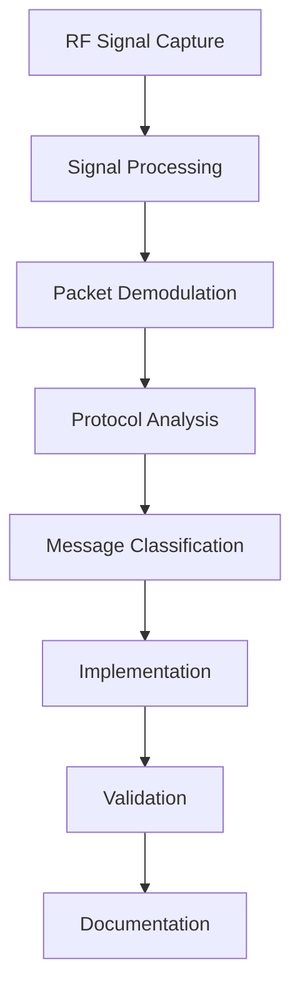

# Reverse Engineering

Understanding the Hekatron Genius Plus X communication protocol through analysis and experimentation.

## Overview

The reverse engineering effort focused on understanding the proprietary RF communication protocol used by Hekatron Genius Plus X smoke detectors. This section documents the methodology, tools, and findings from this analysis.

## Motivation

The goal was to enable monitoring and integration of Hekatron smoke detectors without relying on proprietary gateways or cloud services. This required:

- **Protocol Understanding**: Decoding the message formats and communication patterns
- **RF Analysis**: Understanding the physical layer characteristics 
- **Message Classification**: Identifying different types of communications
- **State Management**: Tracking device states and alarm conditions

## Key Findings

The analysis revealed several important characteristics:

**Physical Layer**
- Frequency: 868.35 MHz (European SRD band)
- Modulation: 2-FSK (Binary Frequency Shift Keying)
- Data Rate: ~4.8 kbps
- Packet Structure: Variable length with CRC protection

**Protocol Layer**
- Message-based communication with device addressing
- Multiple message types for alarms, status, and commissioning
- Time-synchronized transmission slots to avoid collisions
- Mesh-like forwarding for extended range coverage

**Security Considerations**
- No encryption detected in communication
- Device authentication based on serial number validation
- Replay attack protection through sequence numbering

## Analysis Process

## Documentation Structure

The reverse engineering documentation is organized into several detailed sections:

### [Genius Components](genius-components.md)
Analysis of smoke detector and radio module PCB components and architecture.

### [RF Configuration](rf-configuration.md)  
RF settings, frequencies, and radio module configuration details.

### [Protocol Analysis](protocol-analysis.md)
High-level protocol overview, communication patterns, and timing analysis.

## Validation Methods

The reverse-engineered protocol implementation was validated through:

**Passive Monitoring**
- Long-term observation of device communications
- Correlation of RF messages with physical device actions
- Statistical analysis of message patterns and timing

**Controlled Testing**
- Triggering test alarms and observing RF traffic
- Device commissioning and decommissioning procedures
- Battery replacement and status reporting validation

**Cross-Reference Validation**
- Comparing findings with official Hekatron documentation (where available)
- Analysis of multiple device generations and firmware versions
- Validation across different installation environments

## Implementation Challenges

Several challenges were encountered during the analysis:

**Signal Quality**
- Weak signals requiring sensitive RF front-end design
- Interference from other 868 MHz band users
- Timing-critical packet reception and processing

**Protocol Complexity**
- Variable packet lengths and formats
- Context-dependent message interpretation
- Device state synchronization requirements  

**Limited Documentation**
- No official protocol specifications available
- Reverse engineering from RF captures only
- Device behavior inference from limited observations

## Ongoing Research

The protocol analysis is an ongoing effort with several areas for future investigation:

**Advanced Features**
- OTA firmware update mechanisms (if present)
- Advanced commissioning and configuration options
- Integration with Hekatron's official gateways

**Protocol Extensions**
- Newer device generations and protocol versions
- Mesh networking algorithms and topology management
- Power management and sleep cycle optimization

**Security Analysis**
- Potential vulnerabilities in the communication protocol
- Authentication and authorization mechanisms
- Message integrity and authenticity verification

## Ethical Considerations

This reverse engineering effort follows responsible disclosure principles:

- **Passive Analysis**: No interference with normal system operation
- **Non-Disruptive**: Gateway operates as a monitoring-only device
- **Safety Focus**: No compromise of fire safety functionality
- **Open Research**: Findings shared for educational and integration purposes

!!! warning "Legal and Safety Notice"
    This reverse engineering is conducted for interoperability purposes under applicable reverse engineering exceptions. Users must ensure compliance with local regulations regarding RF monitoring and fire safety systems.

## Next Steps

- **[Protocol Analysis](protocol-analysis.md)** - Dive into the detailed protocol specifications
- **[Hardware Design](../hardware/index.md)** - See how the RF analysis informed hardware design decisions
- **[Implementation](../features/index.md)** - Learn how the protocol knowledge is implemented in the gateway