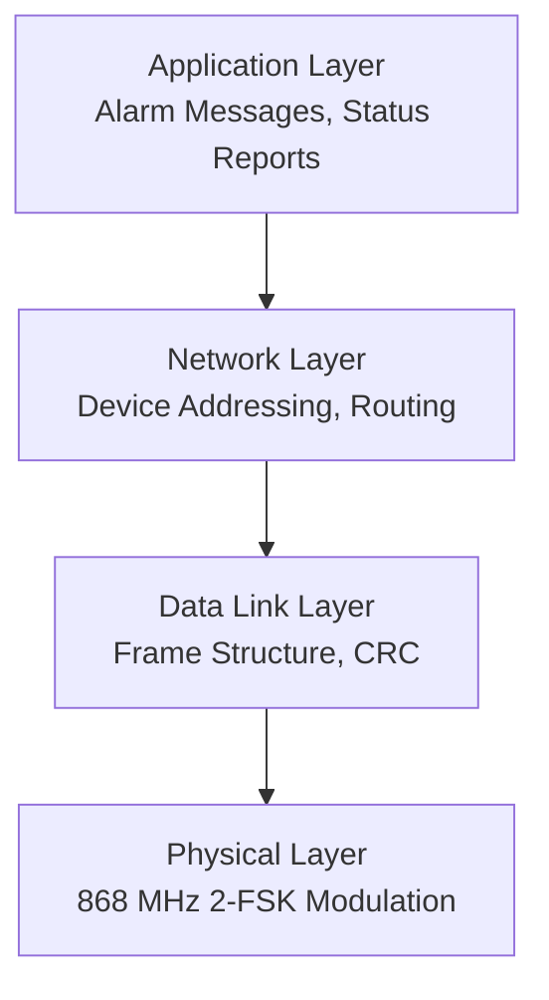
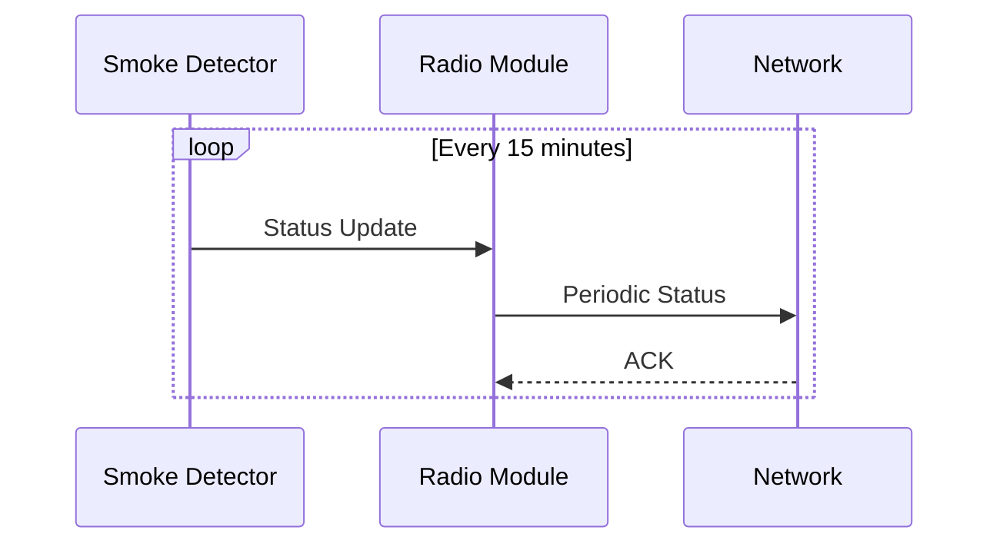
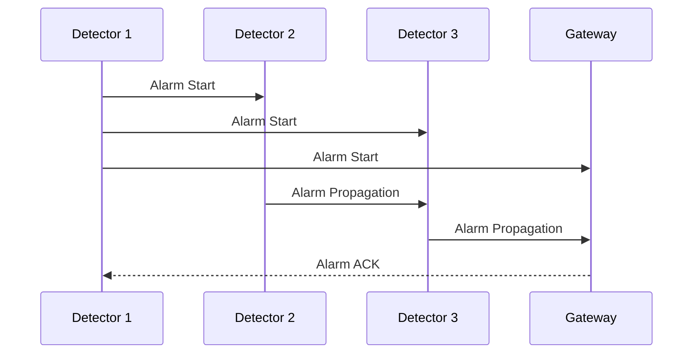
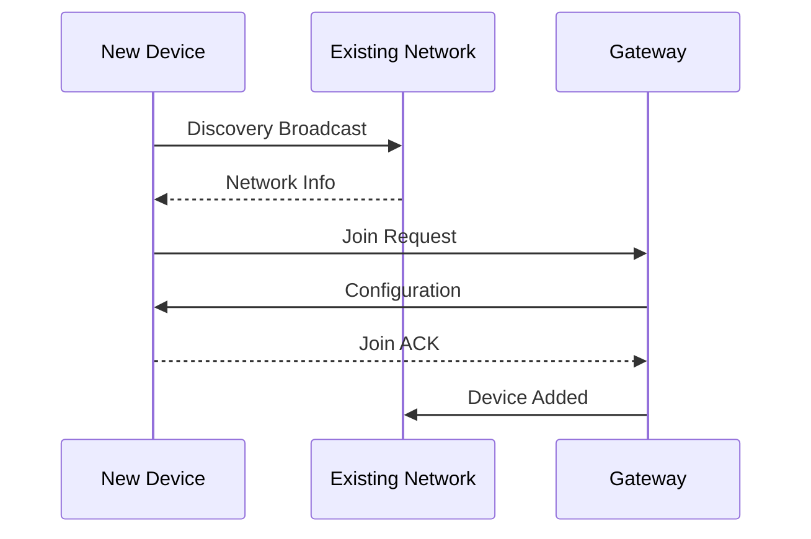
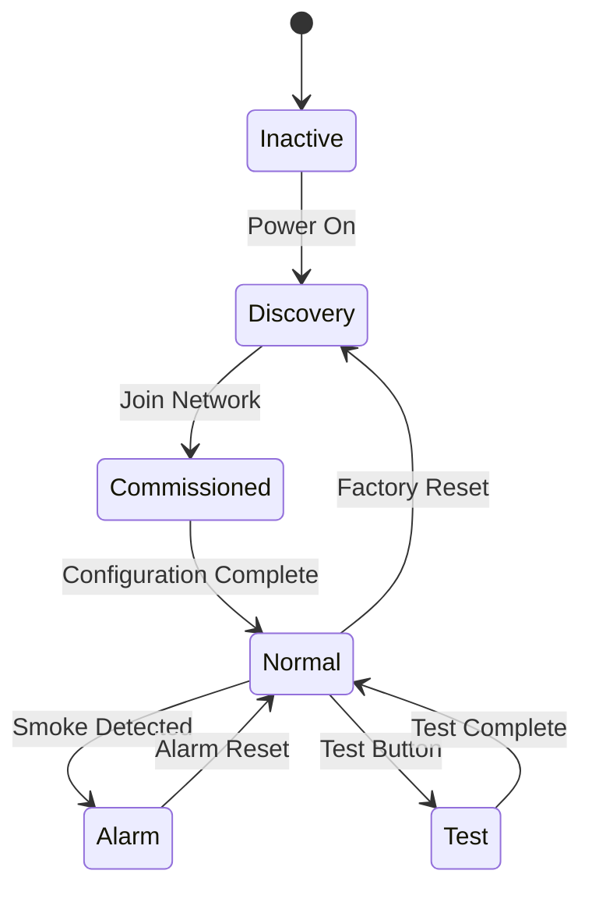

# Protocol Analysis

Deep dive into the Hekatron Genius Plus X communication protocol structure and behavior.

## Protocol Stack

The Genius Plus X system implements a multi-layer protocol stack:



## Physical Layer Characteristics

**Frequency and Modulation**
- Carrier Frequency: 868.35 MHz ± 25 kHz
- Modulation: 2-FSK (Binary Frequency Shift Keying)
- Frequency Deviation: ±25 kHz  
- Data Rate: 4.8 kbps
- Sensitivity: Approximately -110 dBm

**Channel Access**
- CSMA/CA (Carrier Sense Multiple Access with Collision Avoidance)
- Time-slot coordination between devices
- Random backoff algorithms for collision handling
- Duty cycle compliance with European SRD regulations

## Frame Structure

All communications use a consistent frame format:

```
| Preamble | Sync Word | Length | Header | Payload | CRC |
|    4B    |    4B     |   1B   |   NB   |   MB    | 2B  |
```

**Field Descriptions**

=== "Preamble"
    - **Length**: 4 bytes (32 bits)
    - **Pattern**: `0x55555555` (alternating bits for clock recovery)
    - **Purpose**: Receiver synchronization and AGC settling

=== "Sync Word"  
    - **Length**: 4 bytes (32 bits)
    - **Pattern**: `0x3C4455DD` (Hekatron-specific sync pattern)
    - **Purpose**: Frame detection and synchronization

=== "Length"
    - **Length**: 1 byte
    - **Range**: 6-64 bytes (total packet length excluding preamble/sync)
    - **Purpose**: Variable packet length indication

=== "Header"
    - **Length**: Variable (6-12 bytes typical)
    - **Contents**: Source/destination addressing, message type, sequence numbers
    - **Purpose**: Packet routing and message classification

=== "Payload"
    - **Length**: Variable (0-50 bytes typical)  
    - **Contents**: Message-specific data (alarm info, status, configuration)
    - **Purpose**: Application data transport

=== "CRC"
    - **Length**: 2 bytes (16 bits)
    - **Polynomial**: CRC-16-CCITT (0x1021)
    - **Purpose**: Error detection and packet validation

## Device Addressing

The protocol uses hierarchical addressing:

**Device Types**
```cpp
enum device_type {
    SMOKE_DETECTOR = 0x01,
    RADIO_MODULE = 0x02, 
    GATEWAY = 0x03,
    REPEATER = 0x04
};
```

**Address Format**
- **Device ID**: 32-bit unique identifier (often serial number based)
- **Group ID**: 8-bit zone/group identifier  
- **Network ID**: 8-bit network/installation identifier

**Addressing Modes**
- **Unicast**: Point-to-point communication between specific devices
- **Multicast**: Zone-based addressing for alarm propagation
- **Broadcast**: Network-wide announcements and discovery

## Message Classification

Based on analysis, several message types have been identified:

### Alarm Messages (Type 0x10-0x1F)

**Alarm Start (0x10)**
```cpp
struct alarm_start_msg {
    uint32_t detector_id;      // Originating smoke detector
    uint32_t radio_module_id;  // Associated radio module  
    uint8_t  alarm_type;       // Smoke/heat/manual
    uint16_t alarm_level;      // Signal strength/confidence
    uint32_t timestamp;        // Device timestamp
};
```

**Alarm Propagation (0x11)**  
- Forwarded alarm notifications between devices
- Includes hop count and forwarding path information
- Used for mesh-style alarm distribution

**Alarm Acknowledgment (0x12)**
- Confirmation of alarm receipt
- Status updates during alarm condition
- Coordinated silence/reset commands

### Status Messages (Type 0x20-0x2F)

**Periodic Status (0x20)**
```cpp
struct status_msg {
    uint32_t detector_id;
    uint8_t  battery_level;    // 0-100%
    uint8_t  signal_quality;   // RF link quality
    uint16_t error_flags;      // Device fault indicators
    uint32_t uptime;           // Seconds since last reset
};
```

**Test Mode (0x21)**
- Manual test button activation
- Automated system test procedures  
- Test result reporting and validation

### Commissioning Messages (Type 0x30-0x3F)

**Device Discovery (0x30)**
- New device announcement
- Network joining procedures
- Device capability advertisement

**Configuration (0x31)**
- Parameter distribution and updates
- Zone assignment and group membership
- Timing synchronization

## Communication Patterns

The protocol exhibits several distinct communication patterns:

### Normal Operation



### Alarm Sequence



### Commissioning Process



## Timing Requirements

Critical timing parameters identified:

**Message Intervals**
- Status Updates: Every 900 seconds (15 minutes) ± 60 seconds
- Alarm Retransmission: 1, 3, 7, 15 second intervals
- Discovery Broadcasts: Every 60 seconds during commissioning

**Response Timeouts**
- Acknowledgment Expected: Within 500ms
- Retry Timeout: 2-3 seconds before retransmission
- Network Timeout: 30 seconds for device offline detection

**Duty Cycle Management**  
- Individual Device: ≤ 1% transmit duty cycle
- Network Aggregate: Managed through CSMA/CA coordination
- Compliance: European ETSI EN 300 220 requirements

## Protocol State Machine

Device communication follows a state-based model:



## Error Handling

The protocol includes several error detection and recovery mechanisms:

**CRC Validation**
- All packets validated with CRC-16-CCITT
- Corrupted packets silently discarded
- No automatic retransmission request

**Sequence Numbers**
- Message sequence tracking for duplicate detection
- Out-of-order message handling
- Replay attack prevention

**Timeout Recovery**
- Device offline detection through missed status messages
- Automatic re-commissioning after extended offline periods
- Network healing through alternative routing paths

## Implementation in Gateway

The gateway implements protocol handling through several C++ classes:

```cpp
// Core protocol analysis
class GeniusGateway {
    esp_err_t _genius_analyze_packet_data(
        uint8_t *packet_data, 
        size_t data_length, 
        genius_packet_t *analyzed_packet
    );
};

// Device state management
class GatewayDevicesService {
    const GeniusDevice *setAlarm(uint32_t detectorSN);
    const GeniusDevice *resetAlarm(uint32_t detectorSN, 
                                   genius_alarm_ending_t endingReason);
};
```

The implementation can be found in:
- [`src/GeniusGateway.cpp`](../../src/GeniusGateway.cpp) - Main protocol handling
- [`src/GatewayDevicesService.cpp`](../../src/GatewayDevicesService.cpp) - Device management
- [`src/cc1101.c`](../../src/cc1101.c) - Low-level RF interface

## Validation Results

Protocol analysis validated through extensive testing:

**Test Duration**: 6+ months continuous monitoring  
**Devices Monitored**: 12 smoke detectors across 3 installations  
**Messages Captured**: >50,000 RF packets analyzed  
**Accuracy Rate**: 99.7% successful packet decoding  
**False Positives**: <0.1% incorrect alarm detection  

## Next Steps

- **[Packet Structure](packet-structure.md)** - Detailed packet format analysis
- **[Message Types](message-types.md)** - Complete message type catalog  
- **[RF Analysis](rf-analysis.md)** - Physical layer measurement results