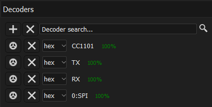

# Protocol Captures

Logic analyzer traces for CC1101 communication, as well as UART and EEPROM communication, can be found here.

## Peripheral Interfaces

The radio module's microcontroller communicates with three peripheral devices using two serial interfaces.

The MSP430 communicates with the [CC1101 RF transceiver](fm-basis-x-pcb.md#rf-transceiver) and the [EEPROM](fm-basis-x-pcb.md#eeprom) via a shared [SPI bus :material-open-in-new:](https://en.wikipedia.org/wiki/Serial_Peripheral_Interface){ target=_blank }.

The MSP430 communicates via the [6-pin header](fm-basis-x-pcb.md#board-to-board-connection) with the smoke detector's microcontroller over a [2-wire UART :material-open-in-new:](https://en.wikipedia.org/wiki/Universal_asynchronous_receiver-transmitter){ target=_blank }.

## Logic Analyzer

### Measurement Device

For recording the serial communication, I used the [DSLogic U3Pro16 :material-open-in-new:](https://www.dreamsourcelab.com/shop/logic-analyzer/dslogic-u3pro16/){ target=_blank } logic analyzer, which was very well suited for this task.

### Software

The logic analyzers from [DreamSourceLab :material-open-in-new:](https://www.dreamsourcelab.com/){ target=_blank } use the freely available open-source software [DSView :material-open-in-new:](https://www.dreamsourcelab.com/download/){ target=_blank } ([:material-github: GitHub Repository :material-open-in-new:](https://github.com/DreamSourceLab/DSView){ target=_blank }) for visualizing and exporting traces. DSView can also be used *without* a logic analyzer to load and analyze traces.

DSView is a clone of the open-source tool [PulseView (sigrok) :material-open-in-new:](https://sigrok.org/wiki/PulseView){ target=_blank } ([:material-github: GitHub Repository :material-open-in-new:](https://github.com/sigrokproject/pulseview){ target=_blank }).

#### Decoders

The performance of an analysis tool like DSView or PulseView is largely determined by the number and analysis scope of supported buses and protocols. Multi-layer protocol decoder stacks significantly facilitate evaluation.

The following decoders should be installed for evaluating the trace files:

## Trace files

| File | Content | CC1101 | EEPROM | UART |
|:-----|:--------|:------:|:------:|:----:|
| [:material-download: startup_new-rm.dsl](../assets/downloads/logic-analyzer/startup_new-rm.dsl){ target=_blank } | Radio module is plugged onto the smoke detector. | :material-check-bold: | :material-check-bold: | :material-check-bold: |
| [:material-download: mounting-to-base.dsl](../assets/downloads/logic-analyzer/mounting-to-base.dsl){ target=_blank } | Interface communication when the smoke detector (with attached radio module) is twisted into the base. | :material-check-bold: | :material-check-bold: | :material-check-bold: |
| [:material-download: comissioning-master.dsl](../assets/downloads/logic-analyzer/comissioning-master.dsl){ target=_blank } | Interface communication of the radio module that initiates commissioning. | :material-check-bold: | :material-check-bold: | :material-check-bold: |
| [:material-download: comissioning-slave.dsl](../assets/downloads/logic-analyzer/comissioningslave.dsl){ target=_blank } | Interface communication of the radio module that participates in commissioning. | :material-check-bold: | :material-check-bold: | :material-check-bold: |
| [:material-download: linetest-start-stop.dsl](../assets/downloads/logic-analyzer/linetest-start-stop.dsl){ target=_blank } | Alarm line test is started and stopped. | :material-check-bold: | | |
| [:material-download: firealarm-start-stop.dsl](../assets/downloads/logic-analyzer/firealarm-start-stop.dsl){ target=_blank } | Fire alarm is triggered and ended on a smoke detector. | :material-check-bold: | | |

