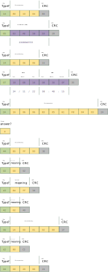

# UART Analysis

Analysis of the UART communication has not yet been completed.

However, the [Trace files](./protocol-captures.md#trace-files) contain some recorded UART communication.

There seems to be some kind of header byte, specifying the purpose/meaning of the transmission.

At the end of every transmission, an error recognition byte (XOR) is appended.

In some transmissions, known structures and values can be found, such as serial numbers, time, and date.

{ width="75%" .off-glb }

