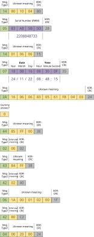

# UART Analysis

The radio module and the smoke detector's microcontroller exchange data over a 2-wire
UART on the [6-pin header](fm-basis-x-pcb.md#board-to-board-connection). The smoke detector
is the **host**: it polls the radio module with short command frames, and the radio module
answers each command with a response frame. Recorded UART communication is available in the
[Trace files](./protocol-captures.md#trace-files).

## Frame format

Every frame — in both directions — has the same structure:

```
+--------+--------+------------------------+--------+
|  TYPE  |  LEN   |   payload (LEN-1 B)     |  XOR   |
+--------+--------+------------------------+--------+
```

<div class="pckt-table" markdown>

| Field | Size | Description |
|:-----:|:----:|:------------|
| TYPE | 1 | Frame type / purpose. Commands from the detector use low values (`0x01`–`0x13`); responses from the radio module use `0xAx`. |
| LEN | 1 | Number of bytes that follow, *including* the checksum — so the whole frame is `LEN + 2` bytes long. |
| payload | LEN-1 | Command arguments or response data. |
| XOR | 1 | Error-detection byte: an XOR over the preceding bytes of the frame. |

</div>

Frames are delimited by timing: a gap of more than roughly 0.8 s between bytes resets the
receiver to the start of a new frame.

## Commands and responses

The detector issues **read/query** commands; each is answered by a matching `0xAx`
response. None of the observed commands writes data or triggers a radio transmission.

<div class="pckt-table" markdown>

| Cmd | Resp | Purpose |
|:---:|:----:|:--------|
| `0x01` | `0xA1` | Report the radio module's firmware version |
| `0x02` | `0xA2` | Report a status flag |
| `0x0A` | `0xA6` | Read the configuration block |
| `0x0E` | `0xA7` | Report the number of stored node records |
| `0x0F` | `0xA8` | Read stored node record *N* (record index in the payload) |
| `0x10` | `0xA9` | Read the module identity / serial number |
| `0x13` | `0xAA` | Read a block of the [EEPROM](eeprom-analysis.md) |

</div>

In addition, the radio module reports link quality to the detector with a `0xA4` response
after a range / connection test.

## Payloads

- **Version (`0xA1`)** — the firmware version of the radio module.
- **Status (`0xA2`)** — a status flag byte.
- **Record count (`0xA7`)** — the number of commissioned peer modules stored in the
  module's [node database](eeprom-analysis.md).
- **Record read (`0xA8`)** — a single node record (a peer serial number and its associated
  data) from the database, selected by the index sent with `0x0F`.
- **Identity (`0xA9`)** — the module's own serial number.
- **Config / EEPROM block (`0xA6` / `0xAA`)** — raw bytes from the module's
  [EEPROM](eeprom-analysis.md) configuration and storage regions.

Known structures visible in the payloads include serial numbers, the current time
(hour / minute / second), version bytes, and error-detection (XOR) at the end of each
transmission.

{ width="75%" .off-glb }
