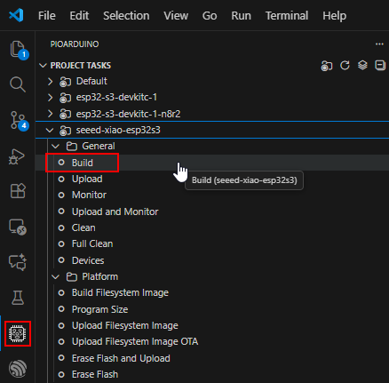
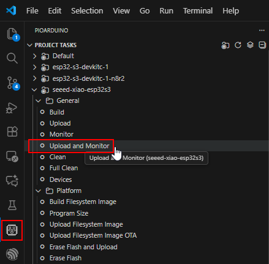

# Setup

## Hardware Setup

Wähle entweder das [:material-arrow-right: experimentelle Setup](../hardware.md#experimental-setup), um die Funktionen von Genius Gateway zu testen, oder die [:material-arrow-right: Genius Gateway Platine](../hardware.md#final-hardware), um Genius Gateway in Betrieb zu nehmen.

## Software bauen und installieren

### IDE und Plugins

Das Projekt basiert auf dem [PlatformIO :material-open-in-new:](https://platformio.org/){ target=_blank } Build System. Leider unterstützt PlatformIO [Espressif Arduino 3.x :material-open-in-new:](https://github.com/espressif/arduino-esp32){ target=_blank } nicht. 

Glücklicherweise gibt es [piorduino :material-open-in-new:](https://github.com/pioarduino){ target=_blank }: a community-maintained fork of the PlatformIO IDE for Visual Studio Code that provides support for Espressif microcontrollers, especially the newer ESP32 boards and the latest Arduino Core for them.

1. Download and install [Microsoft VSCode :material-open-in-new:](https://code.visualstudio.com/){ target=_blank }.
2. Install [Pioarduino IDE (pioarduino) :material-open-in-new:](https://marketplace.visualstudio.com/items?itemName=pioarduino.pioarduino-ide&ssr=false#review-details){ target=_blank } extension from within VSCode.

### GitHub-Projekt clonen

1. Clone the project to your local environment  
    ```bash
    git clone https://github.com/hmbacher/genius-gateway.git
    ```

2. Open the project in VSCode  
    ```bash
    cd genius-gateway
    vscode .
    ```

### Konfiguration

#### Target board 

Choose the board you are working with in `platformio.ini` file by (un)commenting the appropriate `default_envs` options:  
```ini
[platformio]
description = Genius Gateway - A gateway for Hekatron Genius Plus X smoke detectors
data_dir = data
extra_configs = 
	factory_settings.ini
	features.ini
    config.ini
;default_envs = esp32-s3-devkitc-1
;default_envs = esp32-s3-devkitc-1-n8r2
default_envs = seeed-xiao-esp32s3
```

!!! note "No PSRAM used"
    Da PSRAM nicht notwendig ist bzw. von Genius Gateway nicht verwendet wird, ist es nicht notwendig Varianten von `esp32-s3-devkitc-1` anzulegen (z.B. `esp32-s3-devkitc-1-n8r2`).

#### SPI bus wiring

Abhängig vom technischen Aufbau müssen ggf. die SPI Bus-relevanten Signalleitungen angepasst werden. Das erfolgt über die Datei `config.ini`:  
```ini
[config]
build_flags = 
  ; --- Espressif ESP32S3 DevKit-C 1 ---
  ; -D CONFIG_CSN_GPIO=45   ; blue
  ; -D CONFIG_MISO_GPIO=11  ; yellow
  ; -D CONFIG_GDO0_GPIO=47  ; gray
  ; -D CONFIG_MOSI_GPIO=13  ; brown
  ; -D CONFIG_SCK_GPIO=12   ; white
  ; -D GPIO_TEST1=21
  ; -D GPIO_TEST2=14
  ; --- XIAO ESP32S3 & Genius Gateway PCB 1.0 ---
  -D CONFIG_CSN_GPIO=5
  -D CONFIG_MISO_GPIO=8
  -D CONFIG_GDO0_GPIO=6
  -D CONFIG_MOSI_GPIO=9
  -D CONFIG_SCK_GPIO=7
  -D GPIO_TEST1=1
  -D GPIO_TEST2=2
  -D GPIO_TEST3=3
  -D GPIO_TEST4=4
  ; Common
  -D HOST_ID=1
```

#### More build options

Die Datei platformio.ini ist die Hauptdatei zur Steuerung des Software Builds. Sie referenziert auf drei weitere Dateien, deren Inhalt vom Build-System ausgewertet werden:
- `features.ini`
- `factory-settings.ini`
- `config.ini`

!!! critical
    In den aufgelisteten Dateien können Einstellungen vorgenommen werden, die sich auf den Build und den späteren Funktionsumfang des Genius Gateway auswirken.

    Für den regulären Funktionsumfang müssen keine Anpassungen, über die oben hinaus beschriebenen, vorgenommen werden.

### Build

#### Build Software

Starten Sie den *Build* Task für entsprechende project environment (target device):  

{ .off-glb }

### Flash Software

Make sure you have properly connected the board to your computer via USB cable. A serial device must appear in the systems devices.

Start the *Upload and Monitor* Task and pick the right serial interface if asked:  

{ .off-glb }

After the device has been successfully flashed, it will restart and you will see its serial output in VSCode's terminal window.

## Grundkonfiguration von Genius Gateway

Nach der ersten Inbetriebnahme besitzt das Gerät die in [factory_settings.ini :material-open-in-new:](https://github.com/hmbacher/genius-gateway/blob/main/factory_settings.ini){ target=_blank } hinterlegten Einstellungen.

Das Gerät erzeugt ein eigenes WiFi Netzwerk mit der SSID `Genius-Gateway-XXX` und dem Passwort `genius-gateway`. Über die IP-Adresse [192.168.4.1 :material-open-in-new:](http://192.168.4.1) kann auf die Genius Gateway Web-Oberfläche zugegriffen werden.

Das Standard-Kennwort für den `admin`-Account lautet `admin`.

### WiFi-Settings

Genius Gateway kann [:material-arrow-right: in ein vorhandenes WiFi-Netzwerk integriert werden](../features/settings.md#wi-fi-configuration).

### User

Standardmäßig sind zwei Benutzer angelegt. Ein `admin`-Account mit erweiterten Rechten und ein `guest`-Account mit verminderten Rechten.

Es können [:material-arrow-right: weitere Benutzer](../features/settings.md#user-interface-settings) mit eigenem Benutzernamen und Passwort angelegt werden.

### MQTT

Für die Integration in ein Smart Home-System muss der [:material-arrow-right: lokale MQTT-Broker angegeben](../features/settings.md#mqtt-configuration) werden.
