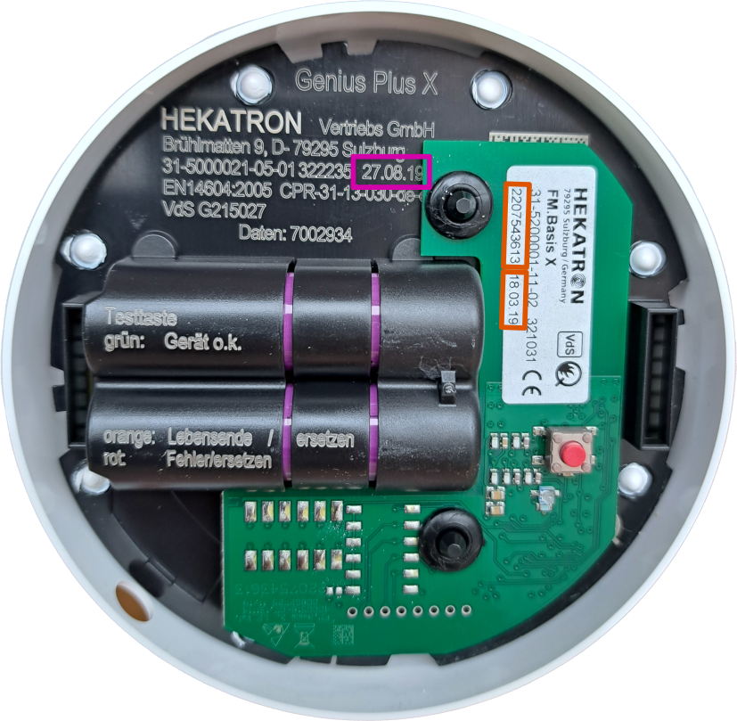
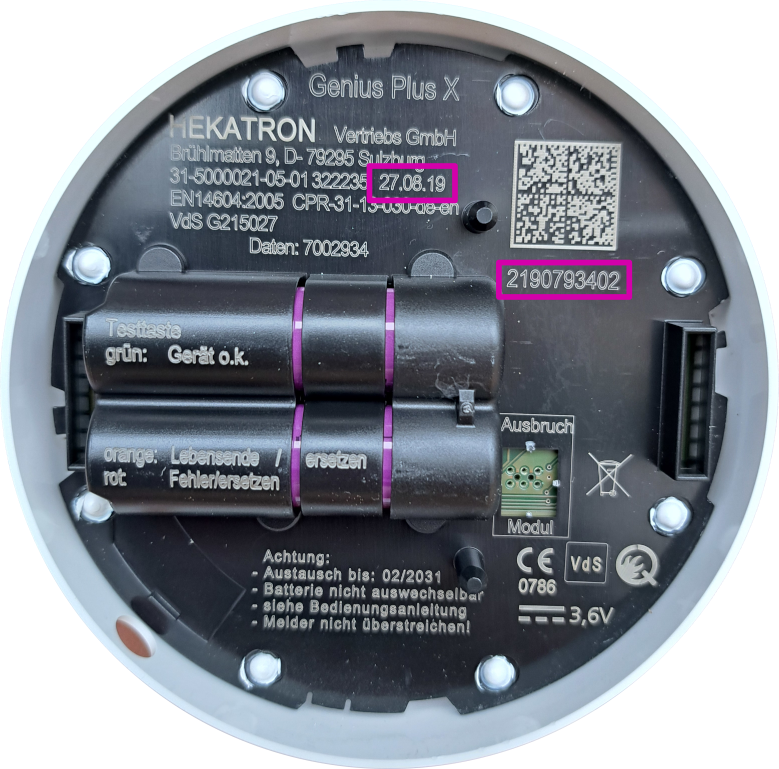
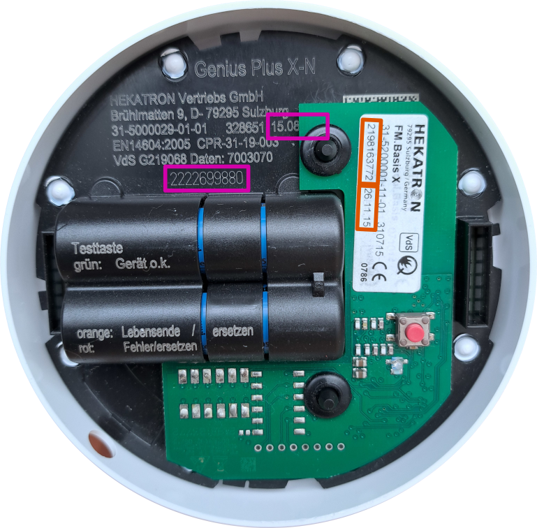

# Configure Genius Gateway

## Integration Level

### Basic Function

The simplest setup that can detect fire alarms from nearby radio-networked Genius Plus X smoke detectors and forward them to a smart home system without explicit configuration of smoke detectors and alarm lines in Genius Gateway is:

- [Basic configuration](general-setup.md) ([WiFi](wifi.md), [MQTT broker](connections.md#mqtt)) has been 
performed
- Processing of alarms from unknown smoke detectors is enabled in the [Gateway Settings](../features/gateway-settings.md#process-alerts-from-unknown-smoke-detectors)
- [Simple Alarm Publishing](connections.md#simple-alarm-publishing) via a central topic is configured

### Advanced Integration (Home Assistant Compatible)

If existing radio-networked Genius Plus X smoke detectors are to be integrated as devices in Home Assistant, they must be [added in Genius Gateway](#adding-smoke-detectors).

More details about the possibilities in interaction with Home Assistant are described in [Smart Home Integration](../features/smart-home-integration.md).

Changes to the configuration in Genius Gateway (e.g., adjusting the location) are also synchronized to Home Assistant.

### Alarm Line Functions

Additional functions are available when [alarm lines are configured](#adding-alarm-lines) in Genius Gateway:

- [Line tests](../features/alarm-lines-management.md#start-line-test)
- [Fire alarm tests](../features/alarm-lines-management.md#trigger-fire-alarm)

## Adding Smoke Detectors

### Importing Smoke Detectors

If smoke detectors were previously configured and exported with Genius Gateway, they can be [imported](../features/device-management.md#importing-configuration) again.

### Manually Adding Smoke Detectors

To add smoke detectors, proceed as follows:

1. Twist the smoke detector out of the socket.
2. [Determine the serial number and production date](#determining-serial-numbers-and-production-dates) of the radio module and the smoke detector and write them down
3. [Add the smoke detector](../features/device-management.md#manually-adding-a-new-detector) in the Genius Gateway web interface

Repeat these steps for each smoke detector that should be integrated into Home Assistant.

### Determining Serial Numbers and Production Dates

The Genius Plus X smoke detectors come in two variants, which can be distinguished by the color of the batteries:

- Purple batteries: [older version](#older-smoke-detector-version)
- Blue batteries: [newer version](#newer-smoke-detector-version)

#### Older Smoke Detector Version

On the older smoke detector version, the serial number of the smoke detector is unfortunately covered by the radio module. To read the serial number, the radio module must be temporarily removed.

Meaning of the markings:

- Serial number and production date of the smoke detector
- Serial number and production date of the radio module

-   
    
    **Older detector with mounted radio module**  
    The radio module covers the smoke detector's serial number.

-   
    
    **Older detector without radio module**  
    As soon as the radio module is removed, the smoke detector's serial number is revealed.

!!! danger "New Commissioning Required"
    When the radio module is removed from the smoke detector, the radio module loses its association with an alarm line. After reading the serial number of the smoke detector and correctly placing the radio module back on the smoke detector, commissioning for alarm line formation must be performed again according to the manufacturer's instructions.

#### Newer Smoke Detector Version

On the newer smoke detector version, the serial number of the smoke detector can be read without removing the radio module.

Meaning of the markings:

- Serial number and production date of the smoke detector
- Serial number and production date of the radio module

-   
    
    **Newer detector with mounted radio module**  
    The serial number is perfectly readable on the newer detector version.

-   
    
    **Newer detector with revealed production date**  
    To read the production date more easily, the radio module can be slightly lifted without interrupting the connection between radio module and smoke detector.

!!! warning "Radio Module Must Remain Securely Connected"
    If the radio module has been lifted too much so that the connection to the smoke detector was interrupted, the radio module has also lost its association with an alarm line. This can be recognized by the fact that the test button of the radio module lights up green-yellow-red after screwing it back into the socket.

    In this case, commissioning for alarm line formation must be performed again according to the manufacturer's instructions.

## Adding Alarm Lines

There are three ways to configure alarm lines:

1. [Import from a backup](#import) (not recommended)
2. [Manual addition](#manually-adding-alarm-lines) (not recommended)
3. [Alarm line discovery](#alarm-line-discovery) (recommended)

### Import

!!! warning "Import Alarm Lines Only in Exceptional Cases"
    Alarm lines should only be imported for testing and development purposes, as after import it cannot be guaranteed that the actual alarm lines still correspond to those previously configured.

[Importing alarm lines](../features/alarm-lines-management.md#importing-alarm-lines-from-file) is done through the web interface.

### Manually Adding Alarm Lines

!!! warning "Manually Add Alarm Lines Only in Exceptional Cases"
    Alarm lines should only be manually added for testing and development purposes, as after creation it cannot be guaranteed that the actual alarm lines correspond to those manually specified.

[Manually adding alarm lines](../features/alarm-lines-management.md#manually-registering-a-new-alarm-line) is done through the web interface.

### Alarm Line Discovery

This is the safest method to determine and save the currently existing alarm line (or alarm lines).

1. Log in to the Genius Gateway web interface.
2. Make sure that automatic addition of alarm lines from all received packet types is enabled in the [Gateway Settings](../features/gateway-settings.md).
3. Switch to [Alarm Line Management](../features/alarm-lines-management.md) in the web interface.
4. Initiate a line test on one of the installed smoke detectors for an existing alarm line according to the manufacturer's operating instructions:
    - Twist a smoke detector of an alarm line out of the socket
    - Shortly press (< 5 seconds) the red control button on the radio module
    
    All reachable and functional smoke detectors will now begin to signal the test. Let the line test run until the new alarm line is visible in the web interface.
5. Abort the line test:
    - Shortly press the red control button again
    - Twist the smoke detector back into the socket
6. [Edit the alarm line](../features/alarm-lines-management.md#editing-an-alarm-line) and give it a meaningful name.

Repeat the procedure if multiple alarm lines should be configured.
