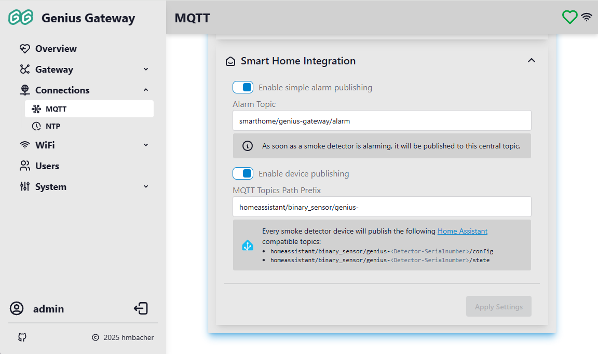

# Connections

The Connections pages configure external network services that the Genius Gateway can integrate with, including MQTT for smart home integration and NTP for accurate time synchronization.

## :tabler-topology-star-3: MQTT

MQTT (Message Queuing Telemetry Transport) is a lightweight messaging protocol ideal for IoT devices and smart home integration. The Genius Gateway can publish device states and alarm events to an MQTT broker for integration with home automation systems like Home Assistant.

### MQTT Status

The MQTT status section displays self-explaning real-time connection information.

### :tabler-adjustments-alt: General Settings

Click the **General Settings** collapsible section to configure MQTT connection parameters.

!!! info "Administrator Access Required"
    MQTT settings can only be modified by users with administrator privileges.

#### Connection Settings

**Enable MQTT**

Toggle to enable or disable MQTT functionality. When disabled, no MQTT connections or publishing occur.

**URI**

The MQTT broker URI including protocol and port. Supported formats:

- **Unencrypted**, for example
    - `mqtt://broker.hivemq.com` or
    - `mqtt://broker.hivemq.com:1883` or
    - `mqtt://192.168.1.100:1883`
- **Encrypted (TLS/SSL)**, for example
    - `mqtts://mqtt.example.com` or
    - `mqtts://mqtt.example.com:8883` or

Common MQTT ports:

- **1883** for unencrypted MQTT (use `mqtt://` protocol)
- **8883** for MQTT over TLS/SSL (use `mqtts://` protocol)

!!! info "Validation"
    The URI must include the protocol (`mqtt://` or `mqtts://`) and a valid hostname or IP address.

**Username**

Optional username for MQTT broker authentication. Leave empty if the broker doesn't require authentication.

**Password**

Optional password for MQTT broker authentication. Leave empty if the broker doesn't require authentication.

!!! warning "Password Storage"
    Passwords are stored unencrypted in the device's file system. Ensure physical access to the device is restricted.

**Client ID**

Unique identifier for this MQTT client. Each device connecting to the same broker must have a unique client ID.

**Keep Alive**

MQTT keep-alive interval in seconds (1-600). The device sends a ping to the broker if no other messages are sent within this interval to maintain the connection.

**Publish Message Interval**

Minimum interval between published MQTT messages in milliseconds (0-1000).

!!! info "Disable Rate Limiting"
    0 = no rate limiting. Messages will be sent immediately.

This rate limiting may be used to prevent overwhelming the broker with rapid updates, if necessary.

**Clean Session**

When enabled, the broker discards all information about previous sessions when the client connects.

- **Enabled** (checked): Start with a clean slate, no retained messages or subscriptions
- **Disabled** (unchecked): Resume previous session with retained messages and subscriptions

!!! tip "Session Persistence"
    Genius Gateway does not rely on the MQTT broker's persistence function, as it publishes the state of all smoke detectors to the broker on every reconnect.

    It is therefore recommended to enable this feature to ensure a consistent state and stable connection at all times.

**Applying Changes**

Click **Apply Settings** to save and apply the MQTT configuration. The device will reconnect to the MQTT broker with the new settings.

### :tabler-smart-home: Smart Home Integration

The Smart Home Integration section provides two MQTT publishing modes specifically designed for home automation systems.

!!! info "Administrator Access Required"
    Smart home integration settings can only be modified by users with administrator privileges.

#### Simple Alarm Publishing

**Enable simple alarm publishing**

Toggle to enable/disable publishing alarm events to a central topic.

**Alarm Topic**

MQTT topic where alarm state is published when *any* smoke detector triggers an alarm.

??? info "Valid MQTT Topic Syntax"
    - 1-64 characters
    - no wildcards `+` or `#`
    - cannot start or end with `/`
    - no double slashes `//`
    - no special characters except `/`, `-`, and `_`

!!! abstract "Global Alarm State Topic"
    More details to this [Global Alarm State Topic](../api/mqtt-topics.md#global-alarm-state-topic), like its specific payload format, can be found in the [MQTT API](../api/mqtt-topics.md).

#### Device Publishing

**Enable device publishing**

Toggle to enable/disable publishing individual detector configurations and states with [Home Assistant MQTT Discovery :material-open-in-new:](https://www.home-assistant.io/integrations/mqtt/#mqtt-discovery){ target=_blank } support.

**MQTT Topics Path Prefix**

Topic prefix used for all detector device publications. 

??? info "Valid MQTT Topic Syntax"
    - 1-64 characters
    - no wildcards `+` or `#`
    - cannot start or end with `/`
    - no double slashes `//`
    - no special characters except `/`, `-`, and `_`

!!! warning "Home Assistant compatibility"
    The Topic path must also comply with the [Home Assistant MQTT Discovery Messages :material-open-in-new:](https://www.home-assistant.io/integrations/mqtt/#discovery-messages){ target=_blank } requirements.

Below the topic input field, the derived configuration and state topics are displayed.

!!! abstract "Global Alarm State Topic"
    More details to this [Home Assistant Auto-Discovery](h../api/mqtt-topics.md#home-assistant-auto-discovery) related MQTT Topics, like their specific payload format, can be found in the [MQTT API](../api/mqtt-topics.md).

**Applying Changes**

Click **Apply Settings** to save the smart home integration configuration. The button is:

- **Disabled** when no changes are pending or validation errors exist
- **Enabled** when valid changes are ready to apply

Changes take effect immediately after applying.

#### Related Documentation

Integration with Home Assistant and other smart home systems is described in more detail in [Smart Home Integration](../features/smart-home-integration.md).

## :tabler-clock-check: Network Time (NTP)

Network Time Protocol (NTP) synchronizes the device's internal clock with internet time servers, ensuring accurate timestamps for logs, alarms, and event recording.

### NTP Status

The status section displays various time synchronization information, updated every 5 seconds.

### Change NTP Settings

Click the **Change NTP Settings** collapsible section to configure NTP parameters.

!!! info "Administrator Access Required"
    NTP settings can only be modified by users with administrator privileges.

#### Enable NTP

Toggle checkbox to enable or disable NTP time synchronization.

#### Server

NTP server hostname or IPv4 address.

- **Format**: Valid domain name or IPv4 address (3-64 characters)
- **Default**: `pool.ntp.org` (public NTP pool server)

#### Pick Time Zone

Select your local timezone from the dropdown list. The device uses this to convert UTC time to your local time.

!!! info "Daylight Saving Time"
    The selected timezone automatically handles daylight saving time transitions where applicable.

#### Applying Changes

Click **Apply Settings** to save and apply the NTP configuration. The device will apply the new timezone and NTP server settings immediately and begin time synchronization.
