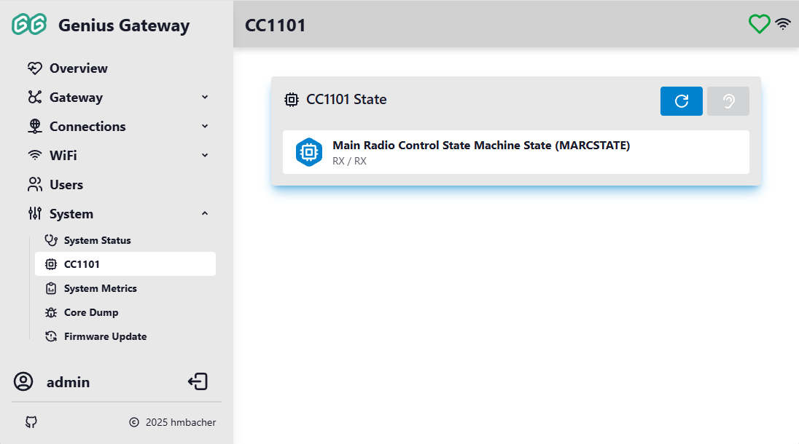
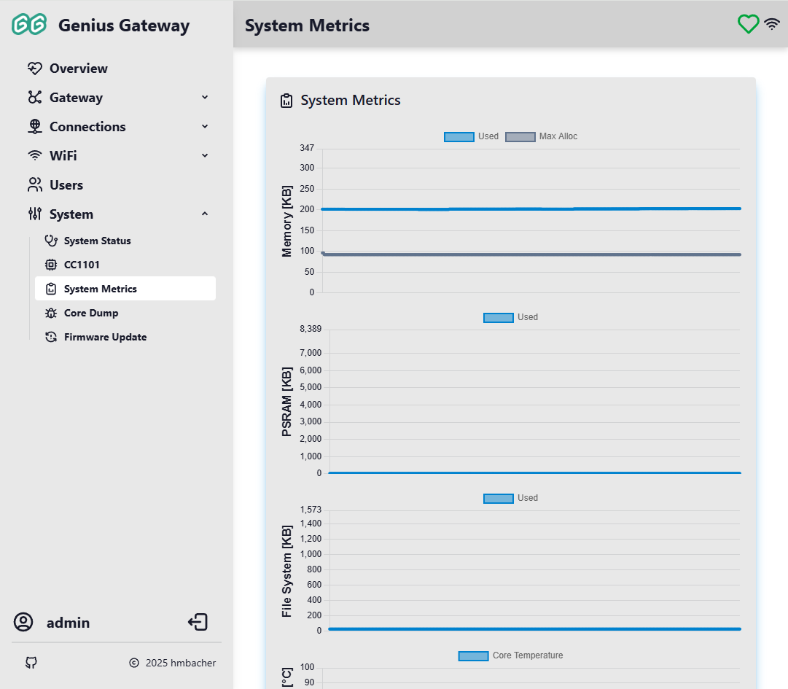
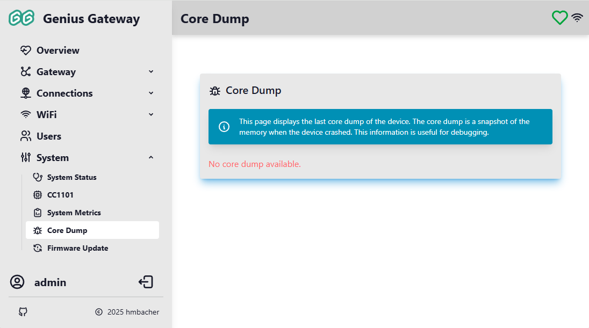

# System

The System pages provide comprehensive information about the Genius Gateway's hardware status, performance metrics, diagnostic tools, and firmware management capabilities.

## :tabler-stethoscope: System Status

The System Status page displays detailed information about the gateway's current operating state, hardware configuration, and resource utilization. This information updates in real-time via WebSocket connection.

### System Information

The status page displays a lot of self-explaning system related information.

### Device Management Actions

At the bottom of the System Status page, several management actions are available:

#### :tabler-reload: Restart

Performs a software restart of the device. The device will reboot and reconnect to the network automatically.

#### :tabler-refresh-dot: Factory Reset

Resets all settings to factory defaults, including:
- WiFi configuration
- User accounts
- MQTT settings
- Device and alarm line configurations
- All other custom settings

!!! danger "Permanent Action"
    Factory reset cannot be undone. All configuration data will be permanently erased. The device will restart with default system settings (from `factory_settings.ini`) and not Genius PLus X related configuration.

## :tabler-cpu: CC1101

The CC1101 page displays the current state of the CC1101 radio transceiver chip used for communication with smoke detectors. This page is only accessible to administrators and only available if the CC1101 controller feature is enabled.

### Main Radio Control State Machine State (MARCSTATE)

The CC1101 chip operates in various states during normal operation. The page displays the current state in the format `STATE / NAME`, where STATE represents the functional state group and NAME represents the specific MARCSTATE value.

- **SLEEP / SLEEP**: Low-power sleep mode
- **IDLE / IDLE**: Radio is idle and ready
- **XOFF / XOFF**: Crystal oscillator off
- **MANCAL / VCOON_MC**: Voltage-controlled oscillator on (manual calibration)
- **MANCAL / REGON_MC**: Regulator on (manual calibration)
- **MANCAL / MANCAL**: Manual calibration in progress
- **FS_WAKEUP / VCOON**: Voltage-controlled oscillator on
- **FS_WAKEUP / REGON**: Regulator on
- **CALIBRATE / STARTCAL**: Starting calibration
- **SETTLING / BWBOOST**: Bandwidth boost during settling
- **SETTLING / FS_LOCK**: Frequency synthesizer lock
- **SETTLING / IFADCON**: IF ADC on during settling
- **CALIBRATE / ENDCAL**: Ending calibration
- **RX / RX**: Receiving mode (normal listening state)
- **RX / RX_END**: End of receive
- **RX / RX_RST**: Receive reset
- **TXRX_SETTLING / TXRX_SWITCH**: Switching from transmit to receive
- **RXFIFO_OVERFLOW / RXFIFO_OVERFLOW**: Receive buffer overflow (data loss)
- **FSTXON / FSTXON**: Frequency synthesizer ready for transmission
- **TX / TX**: Transmitting mode
- **TX / TX_END**: End of transmit
- **RXTX_SETTLING / RXTX_SWITCH**: Switching from receive to transmit
- **TXFIFO_UNDERFLOW / TXFIFO_UNDERFLOW**: Transmit buffer underflow

### Actions

#### :tabler-reload: Update CC1101 State

Click the :tabler-reload: **Update** button to refresh the current CC1101 state from the chip.

#### :tabler-ear: Set CC1101 to RX State

Click the :tabler-ear: **Listen** button to command the CC1101 chip to enter receive (RX) mode. This button is disabled if:
- The chip is already in RX state
- An SPI communication error occurred

!!! warning "Not for regular use"
    The CC1101 chip should typically be in RX state (`RX/RX`) during normal operation to receive packets from smoke detectors. If the chip is in an unexpected state, you can try to return to RX mode.

### Error Conditions

If an error occurs, the state display will show:

- **Red indicator**: Error condition detected
- **Error message**: Description of the problem (e.g., "SPI error while obtaining state" or "Invalid state")

## :tabler-report-analytics: System Metrics

The System Metrics page provides real-time graphical visualization of system performance over time.

Metrics collection begins when the web interface connects to the device and continues while it remains open, with data displayed as line charts. Charts update automatically as new data arrives via WebSocket.

!!! tip "Performance Monitoring"
    Monitor these metrics to identify resource constraints, memory leaks, or thermal issues. Sudden spikes or trends may indicate problems that need attention.

### Memory (Heap) Usage

Line chart showing:

- **Used**: Amount of heap memory currently allocated (primary line)
- **Max Alloc**: Maximum contiguous block available for allocation (secondary line)

Y-axis scale adjusts to the total heap size.

### PSRAM Usage

Line chart showing PSRAM utilization over time.

!!! info
    This chart is only displayed if PSRAM is available on the device.

### File System Usage

Line chart showing the amount of flash storage used by the file system over time.

### Core Temperature

Line chart showing the ESP32 chip temperature in degrees Celsius over time. Useful for monitoring thermal performance and detecting overheating conditions.

## :tabler-bug: Core Dump

The Core Dump page allows you to download diagnostic information captured when the device experiences a crash or exception. This data can be helpful for debugging firmware issues.

### Core Dump Information

A core dump is a snapshot of the device's memory at the moment of a crash, including:

- Register states
- Stack trace
- Memory contents
- Exception cause

### Downloading Core Dumps

If a core dump is available:

1. Click the **Download Core Dump (coredump.bin)** button to download the core dump file to your computer
2. This file can be analyzed using [ESP-IDF tools :material-open-in-new:](https://docs.espressif.com/projects/esp-idf/en/v5.2/esp32/api-guides/core_dump.html) to determine the crash cause

!!! info
    If no core dump is available, the message "No core dump available." is displayed.

## :tabler-refresh-alert: Firmware Update

The Firmware Update page provides two methods for updating the gateway firmware: downloading releases from GitHub or manually uploading firmware files.

!!! info "Administrator Access Required"
    Firmware update features are only accessible to users with administrator privileges.

### Upload Firmware

The Upload Firmware section allows manual installation of firmware files from your local computer.

#### Firmware Validation

The upload service performs several validation checks to ensure firmware safety:

- **File Type Verification**: Only `.bin` (firmware binary) and `.md5` (checksum) files are accepted
- **Firmware Size Check**: Minimum size of 1 MB required (for the `.bin` file) to be recognized as valid firmware
- **Target Hardware Validation**: The firmware header is checked to ensure it matches the device's chip type (ESP32, ESP32-S2, ESP32-C3, or ESP32-S3)

    !!! warning "Target Compatibility"
        Firmware compiled for a different ESP32 chip variant will be rejected during upload. For example, firmware built for ESP32-S3 cannot be uploaded to an ESP32-S2 device.

- **MD5 Checksum**: If an `.md5` file is uploaded before the firmware, the binary is verified against the checksum during upload

#### Supported File Types

- **.bin**: Compiled firmware binary file (minimum 1 MB)
- **.md5**: MD5 checksum file (32-character hex string)

The `.md5` file should contain only the 32-character MD5 hash of the corresponding `.bin` file.

#### Uploading Firmware

To upload firmware manually:

1. **(Optional) Upload MD5 checksum first**:
    - Click **Choose File** and select the `.md5` file
    - The checksum is stored and will be used to verify the firmware

2. **Upload the firmware binary**:
    - Click **Choose File** and select the `.bin` file
    - A confirmation dialog appears: "Are you sure you want to overwrite the existing firmware with a new one?"
    - Click **Upload** to confirm and begin the installation

3. **Firmware Installation**:
    - The device validates the firmware header
    - If an MD5 checksum was provided, the firmware is verified against it
    - The firmware is written to the device's flash memory
    - Upon successful completion, the device automatically restarts and executes the newly installed firmware

!!! danger "Failure Recovery"
    If the firmware validation or flashing fails or the device becomes unresponsive after an update:
    
    - **After upload**: If validation fails (wrong chip type, MD5 mismatch), the upload is rejected and the current firmware remains active
    - **During flashing**: If persisting the new firmware to flash memory fails, the current firmware remains active after restart
    - **After restart**: If the new firmware crashes or fails to boot properly, the device will likely enter a boot loop. Then a manual recovery is required, i.e. flashing a working firmware via USB using the [build and flash instructions](general-setup.md#flash-software).
    
    !!! warning "No Automatic Rollback"
        The firmware does not implement automatic rollback to the previous version. Always test new firmware builds on a development device before updating production devices.
