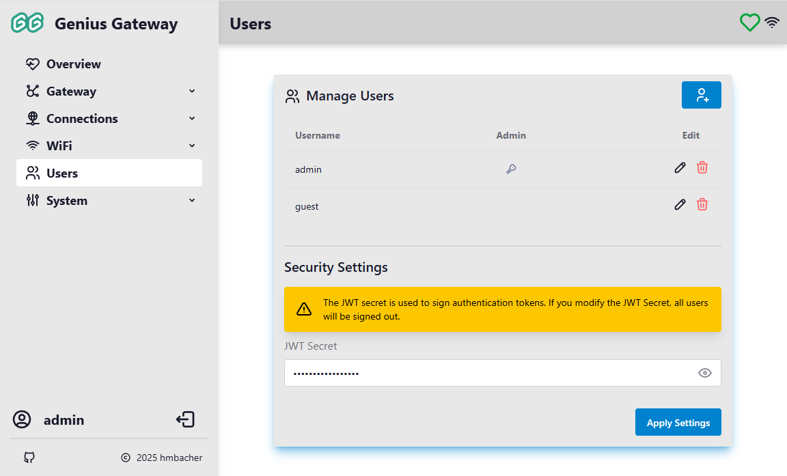
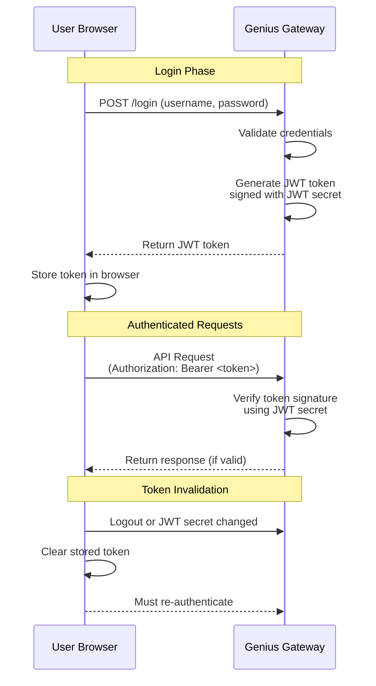

# Users

The Users page allows administrators to manage user accounts and configure security settings for the Genius Gateway. Each user can have different privilege levels, and authentication is secured using JWT (JSON Web Token) technology.

!!! info "Administrator Access Required"
    The Users page is only accessible to users with administrator privileges. Non-admin users are automatically redirected to the home page.

## :tabler-users: Manage Users

The user management section displays all configured users in a table format and provides controls for adding, editing, and deleting user accounts.

### User List

The user table displays the following information for each user:

- **Username**: The user's login name
- **Admin**: Displays a :tabler-key: key icon if the user has administrator privileges
- **Edit**: Action buttons for modifying or removing the user

### Adding a User

To create a new user account:

1. Click the :tabler-user-plus: button in the top-right corner of the user list
2. The "Add User" dialog opens

    

3. Configure the user details:

    ***Username***  

    Enter a unique username (3-32 characters) for the new account.
    
    !!! warning
        The username cannot be changed after creation.

    **Password**  
    Enter a password for the user.
    
    !!! warning
        The password field can be left empty if desired, though this is not recommended for security reasons.

    **Is Admin?**  
    Check this box to grant administrator privileges to the user. Administrators have full access to all gateway features and settings, including user management.

4. Click **Save** to create the user

After saving, the new user appears in the user list and can immediately log in with the configured credentials.

### Editing a User

To modify an existing user account:

1. Click the :tabler-pencil: **Edit** button next to the user you want to modify
2. The "Edit User" dialog opens with the current settings

    

3. Modify the desired settings:

    **Username**  
    The username field is displayed but cannot be modified for existing users.

    **Password**  
    Enter a new password to change the user's credentials. Leave the field unchanged to keep the current password.

    **Is Admin?**  
    Check or uncheck this box to change the user's administrator privileges.

4. Click **Save** to apply the changes

!!! warning "Privilege Changes"
    Changes to administrator privileges take effect immediately. If you remove admin privileges from your own account while logged in, you will lose access to the Users page and other admin-only features until you log in with an admin account.

### Deleting a User

!!! danger "Permanent Action"
    Deleting a user is permanent and cannot be undone. The user will be immediately logged out if currently connected.

To remove a user account:

1. Click the :tabler-trash: **Delete** button next to the user you want to remove
2. A confirmation dialog appears
3. Click **Yes** to confirm deletion, or **Abort** to cancel

The user account is immediately removed and can no longer be used to access the gateway.

## :tabler-key: Security Settings

The Security Settings section allows you to configure the JWT (JSON Web Token) secret used for authentication token signing.

### JWT Secret

The JWT secret is a cryptographic key used to sign and verify authentication tokens. This ensures that tokens cannot be forged or tampered with.

**Default Value:** A random string generated during factory setup

To change the JWT secret:

1. Enter a new value in the **JWT Secret** field
2. Click **Apply Settings** to save the change

!!! warning "Sign-Out Warning"
    If you modify the JWT Secret, all users will be signed out immediately. All active sessions will be invalidated, and users must log in again with their credentials.

### Best Practices

- **Protect the JWT Secret**: Never share or expose the JWT secret. It should be treated as a highly sensitive credential.
- **Use Strong Secrets**: The JWT secret should be a long, random string to ensure maximum security.
- **Change After Setup**: Consider changing the default JWT secret during initial setup to ensure unique security for your gateway.
- **Regular Updates**: For enhanced security, consider changing the JWT secret periodically (this will require all users to log in again).

## Authentication Flow

The token-based authentication provides secure access control without requiring passwords to be sent with every request.

When a user logs in to the Genius Gateway:

1. The user provides their username and password
2. The gateway validates the credentials against the user database
3. If valid, a JWT token is generated and signed with the JWT secret
4. The token is sent to the user's browser and included in all subsequent requests
5. The gateway verifies the token signature on each request to ensure authenticity

