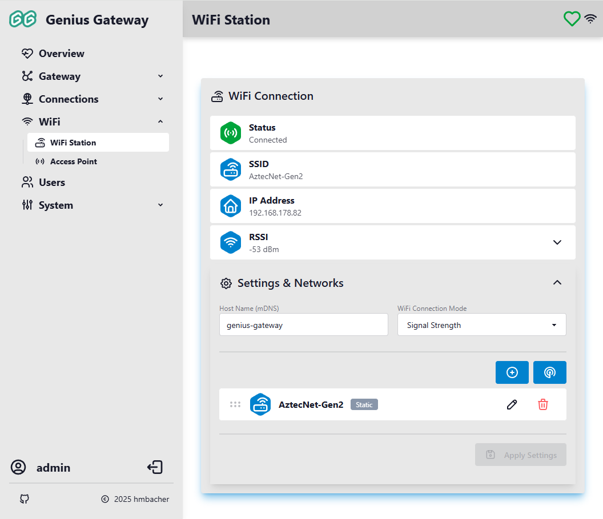
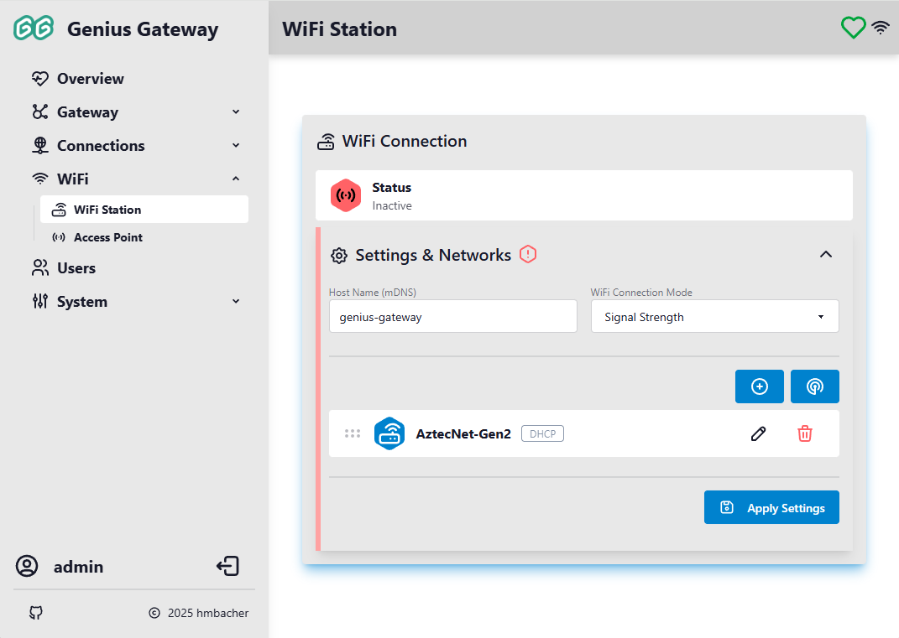
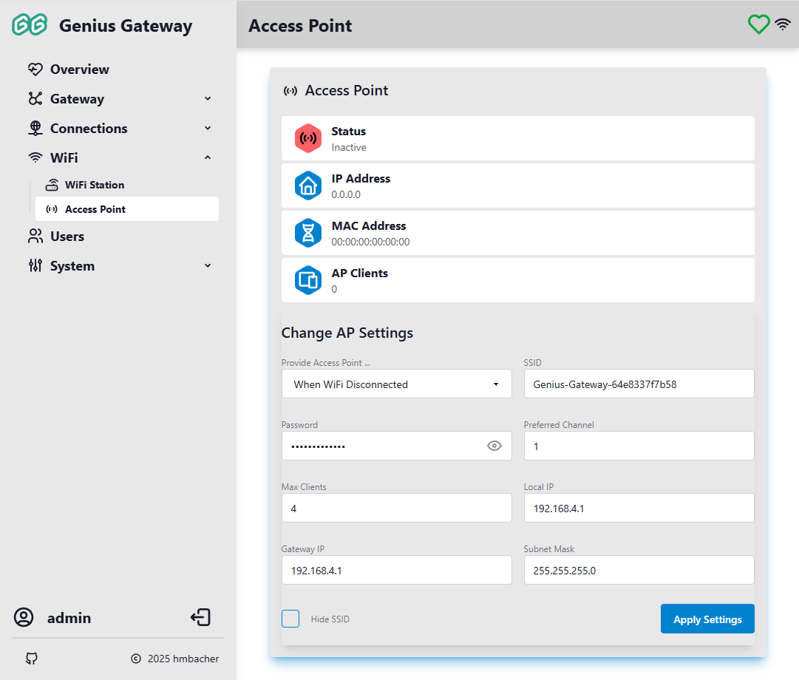

# WiFi Configuration

The WiFi configuration allows you to connect the Genius Gateway to your local network and optionally provide an Access Point for initial setup or fallback connectivity. This page covers both WiFi Station (client) mode and Access Point mode configuration.

## :tabler-router: WiFi Station

The WiFi Station mode connects the Genius Gateway to your existing WiFi network as a client device. This is the primary mode for integrating the gateway into your home network.

### :tabler-router: WiFi Connection

When you access the WiFi Station page, you'll see the current connection status at the top of the page.

#### Not Connected

When the gateway is not connected to any WiFi network, the status shows as "Inactive":

#### Connected

When successfully connected to a WiFi network, the status shows detailed connection information:

### :tabler-settings: Settings & Networks

!!! info "Access Requirements"
    WiFi settings can only be modified by users with administrator privileges.

The Settings & Networks section allows you to configure the hostname and manage known WiFi networks.

#### Host Name (mDNS)

**Format:** 3-32 characters

The hostname is used for mDNS (multicast DNS) resolution, allowing you to access the gateway using a friendly name like `http://hostname.local` instead of an IP address.

#### WiFi Connection Mode

The connection mode determines how the gateway selects which network to connect to when multiple networks are available:

- **Offline**: WiFi connection is disabled
- **Signal Strength**: Automatically connects to the network with the strongest signal
- **Priority (Sequence)**: Connects to networks based on the order in the list (drag-and-drop to reorder)

    !!! tip "Priority Mode"
        When using Priority mode with multiple networks configured, arrange the networks according to their priority (most important first) using the drag-and-drop handles.

### Initial Configuration

When no WiFi networks are configured, you'll see a message:

> **No WiFi networks configured yet.**  
> Scan for available networks or add one manually.

Use the **Scan** or **Add** buttons to configure your first network.

### Adding WiFi Networks

The gateway supports up to 5 configured WiFi networks. You can add networks in two ways:

#### Scanning for Networks

1. Click the :tabler-radar-2: **Scan** button in the top-right corner
2. The gateway scans for available WiFi networks

    

3. After scanning completes, a list of discovered networks appears

    

4. Click on a network from the list to proceed with configuration
5. The "Add network" dialog opens with the SSID pre-filled

!!! warning "Network Limit"
    If you already have 5 networks configured, you'll see a message: "You have reached the maximum number of networks. Please delete one to add another."

#### Manual Entry

1. Click the :tabler-circle-plus: **Add** button in the top-right corner
2. The "Add network" dialog opens

    

3. Configure the network parameters:

    **SSID**  
    Enter the network name (case-sensitive)

    **Password**  
    Enter the WiFi password (if the network is secured)

    !!! warning "Password Storage"
        WiFi passwords are stored unencrypted in the device's file system. Ensure physical access to the device is restricted.

    **Use Static IP**  
    Enable this option to configure a static IP address instead of using DHCP

    **Static IP Configuration** (only when "Use Static IP" is enabled):

    - **Local IP**: The static IP address to assign to the gateway
    - **Gateway IP**: The network gateway address
    - **Subnet Mask**: The network subnet mask
    - **DNS IP 1**: Primary DNS server address
    - **DNS IP 2**: Secondary DNS server address (optional)

4. Click **Save** to add the network

The new network appears in the list with a badge indicating either "Static" or "DHCP" configuration.

### Managing Networks

Each configured network in the list displays:

- :tabler-grip-horizontal: **Drag handle**: Reorder networks (only visible when Connection Mode is set to "Priority")
- **SSID**: Network name
- **Configuration badge**: Shows "Static" (static IP) or "DHCP" (automatic IP)
- :tabler-pencil: **Edit button**: Modify network settings
- :tabler-trash: **Delete button**: Remove the network from the list

#### Editing a Network

1. Click the :tabler-pencil: **Edit** button next to the network you want to modify
2. The "Edit network" dialog opens with current settings
3. Modify the desired parameters
4. Click **Save** to apply changes

#### Deleting a Network

1. Click the :tabler-trash: **Delete** button next to the network you want to remove
2. A confirmation dialog appears: "Are you sure you want to delete network '[SSID]'?"
3. Click **Delete** to confirm removal

#### Reordering Networks (Priority Mode)

When Connection Mode is set to "Priority (Sequence)":

1. Click and hold the :tabler-grip-horizontal: **grip handle** on the left side of a network entry
2. Drag the network to the desired position
3. Release to drop the network in its new position
4. The gateway will attempt to connect to networks in the displayed order

### Applying Settings

After making changes to the hostname, connection mode, or network list:

1. The **Apply Settings** button becomes enabled
2. Click **Apply Settings** to save your configuration
3. A notification confirms: "Wi-Fi settings updated."
4. If WiFi connection settings changed, you may see: "Reconnecting shortly as new WiFi settings will be applied in X seconds."

!!! warning "Connection Changes"
    When changing WiFi settings, the gateway will reconnect to apply the new configuration. This may cause a brief disconnection.

## :tabler-access-point: Access Point

The Access Point mode allows the Genius Gateway to create its own WiFi network, enabling direct connection from your devices. This is useful for initial setup when no WiFi credentials are known, or as a fallback when the primary WiFi connection is unavailable.

### Access Point Status

The status section displays current Access Point information:

#### Status

The AP status can be:

- **Active** (green): Access Point is running and accepting connections
- **Inactive** (red): Access Point is disabled
- **Lingering** (yellow): Access Point is in the process of shutting down

#### Status Information

When the Access Point is active, the following information is displayed:

- **IP Address**: The gateway's IP address on the AP network (typically `192.168.4.1`)
- **MAC Address**: The Access Point's MAC address
- **AP Clients**: Number of devices currently connected to the Access Point

### Access Point Settings

!!! info "Access Requirements"
    Access Point settings can only be modified by users with administrator privileges.

#### Provide Access Point ...

This setting controls when the Access Point is available:

- **Always**: Access Point is permanently enabled
- **When WiFi Disconnected**: Access Point activates only when the gateway cannot connect to any configured WiFi network (fallback mode)
- **Never**: Access Point is permanently disabled

!!! tip "Recommended Setting"
    "When WiFi Disconnected" is recommended for most users, as it provides automatic fallback connectivity while conserving resources when WiFi station is connected.

#### SSID

**Format:** 2-32 characters

The network name (SSID) that will be broadcast by the Access Point. Choose a unique name to identify your gateway's network.

#### Password

The WiFi password required to connect to the Access Point. Leave empty for an open (unsecured) network.

!!! warning "Security"
    For security reasons, it's strongly recommended to set a password for your Access Point.

!!! warning "Password Storage"
    WiFi passwords are stored unencrypted in the device's file system. Ensure physical access to the device is restricted.

#### Preferred Channel

**Range:** 1-13

The WiFi channel number the Access Point will use. If experiencing interference, try changing to a different channel. Channels 1, 6, and 11 are commonly recommended as they don't overlap.

#### Max Clients

**Range:** 1-8

The maximum number of devices that can simultaneously connect to the Access Point. Lower values reduce resource usage.

#### Local IP

**Format:** Valid IPv4 address

The IP address the gateway will use on the Access Point network. Standard configuration is `192.168.4.1`.

#### Gateway IP

**Format:** Valid IPv4 address

The gateway IP address for the Access Point network. This is typically the same as the Local IP (`192.168.4.1`).

#### Subnet Mask

**Format:** Valid IPv4 address

The subnet mask for the Access Point network. Standard configuration is `255.255.255.0`.

### Applying Access Point Settings

After modifying Access Point settings:

1. Click the **Apply Settings** button at the bottom of the form
2. All fields are validated:
    - SSID must be 2-32 characters
    - Channel must be 1-13
    - Max Clients must be 1-8
    - All IP addresses must be valid IPv4 format
3. If validation passes, a notification confirms: "Access Point settings updated."
4. If validation fails, error messages appear below the invalid fields in red text

!!! info "Configuration Tips"
    - Use the default IP configuration (`192.168.4.1`) unless you have specific networking requirements
    - Set Max Clients to match your expected usage to optimize performance
    - Choose a channel with minimal interference from nearby networks
